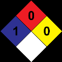
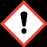
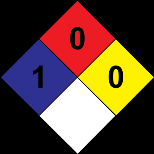

corona 

## Sección 1: IDENTIFICACIÓN DEL PRODUCTO

> **Nota de trazabilidad:** Elemento visual sin texto identificable.
> Imagen en Sección 1: IDENTIFICACIÓN DEL PRODUCTO.
> Información relacionada en la sección correspondiente.

> **Nota de trazabilidad:** Elemento visual sin texto identificable.
> Imagen en Sección 1: IDENTIFICACIÓN DEL PRODUCTO.
> Información relacionada en la sección correspondiente.

> **Nota de trazabilidad:** Elemento visual sin texto identificable.
> Imagen en Sección 1: IDENTIFICACIÓN DEL PRODUCTO.
> Información relacionada en la sección correspondiente.

> **Nota de trazabilidad:** Elemento visual sin texto identificable.
> Imagen en Sección 1: IDENTIFICACIÓN DEL PRODUCTO.
> Información relacionada en la sección correspondiente.

> **Nota de trazabilidad:** Elemento visual sin texto identificable.
> Imagen en Sección 1: IDENTIFICACIÓN DEL PRODUCTO.
> Información relacionada en la sección correspondiente.

> **Nota de trazabilidad:** Pictograma(s) GHS: SGA.
> Imagen en Sección 1: IDENTIFICACIÓN DEL PRODUCTO.
> Información relacionada en la sección correspondiente.

> **Nota de trazabilidad:** Pictograma(s) GHS: SGA.
> Imagen en Sección 1: IDENTIFICACIÓN DEL PRODUCTO.
> Información relacionada en la sección correspondiente.

**1.1 Identificador SGA del producto:** PINTURA PRIMERA MANO & ACABADO **1.2 Uso recomendado del producto químico y restricciones:** Usos pertinentes: Pintura decorativa Usos desaconsejados: Todo aquel uso no especificado en este epígrafe ni en el epígrafe 7.3 **1.3 Datos sobre el proveedor:** CORLANC S.A.S. Carrera 48 N° 72 sur 01 Avenida Las Vegas 055450 Sabaneta - Antioquia - Colombia Tfno.: +57-4-3787800 materialesypinturascorona@corona.com.co https://www.corona.co **1.4 Número de teléfono para emergencias:** 

## Sección 2: IDENTIFICACIÓN DEL PELIGRO O PELIGROS

> **Nota de trazabilidad:** Elemento visual sin texto identificable.
> Imagen en Sección 2: IDENTIFICACIÓN DEL PELIGRO O PELIGROS.
> Información relacionada en la sección correspondiente.

> **Nota de trazabilidad:** Diamante NFPA 704: Salud 1 / Inflamabilidad 0 / Inestabilidad 0.
> Imagen en Sección 2: IDENTIFICACIÓN DEL PELIGRO O PELIGROS.
> Información relacionada en la sección correspondiente.

**2.1 Clasificación de la sustancia o de la mezcla: NFPA:** Salud: 1 Inflamabilidad: 0 Inestabilidad: 0 Especiales: No relevante **SGA:** La clasificación del producto se ha realizado conforme con al decreto 1496 de 2018, por el cual se adopta el Sistema Globalmente Armonizado de Clasificación y Etiquetado de Productos Químicos y se dictan otras disposiciones en materia de seguridad química. Carc. 2: Carcinogenicidad, Categoría 2, H351 Sens. Cut. 1: Sensibilización cutánea, Categoría 1, H317 **2.2 Elementos de las etiquetas del SGA, incluidos los consejos de prudencia: NFPA:** + **SGA: Atención** y **Indicaciones de peligro:** Carc. 2: H351 - Susceptible de provocar cáncer Sens. Cut. 1: H317 - Puede provocar una reacción cutánea alérgica **Consejos de prudencia:** 

P101: Si se necesita consultar a un médico, tener a mano el recipiente o la etiqueta del producto P102: Mantener fuera del alcance de los niños P201: Procurarse las instrucciones antes del uso P261: Evitar respirar polvos/humos/gases/ nieblas/vapores/aerosoles P280: Usar guantes/ropa de protección/equipo de protección para los ojos/la cara P302+P352: EN CASO DE CONTACTO CON LA PIEL: Lavar con abundante agua P308+P313: EN CASO DE exposición demostrada o supuesta: consultar a un médico P501: Eliminar el contenido/recipiente mediante el sistema de recogida selectiva habilitado en su municipio **Sustancias que contribuyen a la clasificación** 

Dioxido de titanio; Mezcla de: 5-cloro-2-metil-2H-isotiazol-3-ona [EC no. 247-500-7] y 2-metil-2H-isotiazol-3-ona [EC no. 220-2396] (3:1) **2.3 Otros peligros que no conducen a una clasificación:** 

## Sección 4: PRIMEROS AUXILIOS

## Sección 3: COMPOSICIÓN/INFORMACIÓN SOBRE LOS COMPONENTES

Los síntomas como consecuencia de una intoxicación pueden presentarse con posterioridad a la exposición, por lo que, en caso de duda, exposición directa al producto químico o persistencia del malestar solicitar atención médica, mostrándole la FDS de este producto. 

**Por inhalación:** 

Se trata de un producto que no contiene sustancias clasificadas como peligrosas por inhalación, sin embargo, en caso de síntomas de intoxicación sacar al afectado de la zona de exposición y proporcionarle aire fresco. Solicitar atención médica si los síntomas se agravan o persisten. 

**Por contacto con la piel:** 

Quitar la ropa y los zapatos contaminados, aclarar la piel o duchar al afectado si procede con abundante agua fría y jabón neutro. En caso de afección importante acudir al médico. Si el producto produce quemaduras o congelación, no se debe quitar la ropa debido a que podría empeorar la lesión producida si esta se encuentra pegada a la piel. En el caso de formarse ampollas en la piel, éstas nunca deben reventarse ya que aumentaría el riesgo de infección. 

**Por contacto con los ojos:** 

Enjuagar los ojos con abundante agua a temperatura ambiente al menos durante 15 minutos. Evitar que el afectado se frote o cierre los ojos. En el caso de que el accidentado use lentes de contacto, éstas deben retirarse siempre que no estén pegadas a los ojos, de otro modo podría producirse un daño adicional. En todos los casos, después del lavado, se debe acudir al médico lo más rápidamente posible con la FDS del producto. 

**Por ingestión/aspiración:** 

En caso de ingestión, solicitar asistencia médica inmediata mostrando la FDS de este producto. 

**4.2 Síntomas/efectos más importantes, agudos o retardados:** 

Los efectos agudos y retardados son los indicados en las secciones 2 y 11. 

- **4.3 Indicación de la necesidad de recibir atención médica inmediata y, en su caso, de tratamiento especial:** No relevante 

## Sección 5: MEDIDAS DE LUCHA CONTRA INCENDIOS

> **Nota de trazabilidad:** Elemento visual sin texto identificable.
> Imagen en Sección 5: MEDIDAS DE LUCHA CONTRA INCENDIOS.
> Información relacionada en la sección correspondiente.

> **Nota de trazabilidad:** Elemento visual sin texto identificable.
> Imagen en Sección 5: MEDIDAS DE LUCHA CONTRA INCENDIOS.
> Información relacionada en la sección correspondiente.

> **Nota de trazabilidad:** Elemento visual sin texto identificable.
> Imagen en Sección 5: MEDIDAS DE LUCHA CONTRA INCENDIOS.
> Información relacionada en la sección correspondiente.

**5.1 Medios de extinción apropiados:** 

Producto no inflamable bajo condiciones normales de almacenamiento, manipulación y uso. En caso de inflamación como consecuencia de manipulación, almacenamiento o uso indebido emplear preferentemente extintores de polvo polivalente (polvo ABC). NO SE RECOMIENDA emplear agua a chorro como agente de extinción. 

- **5.2 Peligros específicos del producto químico:** 

Como consecuencia de la combustión o descomposición térmica se generan subproductos de reacción que pueden resultar altamente tóxicos y, consecuentemente, pueden presentar un riesgo elevado para la salud. 

- SECCIÓN 6: MEDIDAS QUE DEBEN TOMARSE EN CASO DE VERTIDO ACCIDENTAL **6.1 Precauciones personales, equipo protector y procedimiento de emergencia:** Aislar las fugas siempre y cuando no suponga un riesgo adicional para las personas que desempeñen esta función. Ante la exposición potencial con el producto derramado se hace obligatorio el uso de elementos de protección personal (ver sección 8). Evacuar la zona y mantener a las personas sin protección alejadas. 

- **6.2 Precauciones relativas al medio ambiente:** 

Producto no clasificado como peligroso para el medioambiente. Mantener el producto alejado de los desagües y de las aguas superficiales y subterráneas. 

- **6.3 Métodos y materiales para la contención y limpieza de vertidos:** 

Se recomienda: 

Absorber el vertido mediante arena o absorbente inerte y trasladarlo a un lugar seguro. No absorber en serrín u otros absorbentes combustibles. Para cualquier consideración relativa a la eliminación consultar la sección 13. 

## Sección 7: MANIPULACIÓN Y ALMACENAMIENTO

> **Nota de trazabilidad:** Elemento visual sin texto identificable.
> Imagen en Sección 7: MANIPULACIÓN Y ALMACENAMIENTO.
> Información relacionada en la sección correspondiente.

> **Nota de trazabilidad:** Elemento visual sin texto identificable.
> Imagen en Sección 7: MANIPULACIÓN Y ALMACENAMIENTO.
> Información relacionada en la sección correspondiente.

> **Nota de trazabilidad:** Elemento visual sin texto identificable.
> Imagen en Sección 7: MANIPULACIÓN Y ALMACENAMIENTO.
> Información relacionada en la sección correspondiente.

> **Nota de trazabilidad:** Elemento visual sin texto identificable.
> Imagen en Sección 7: MANIPULACIÓN Y ALMACENAMIENTO.
> Información relacionada en la sección correspondiente.

> **Nota de trazabilidad:** Elemento visual sin texto identificable.
> Imagen en Sección 7: MANIPULACIÓN Y ALMACENAMIENTO.
> Información relacionada en la sección correspondiente.

> **Nota de trazabilidad:** Elemento visual sin texto identificable.
> Imagen en Sección 7: MANIPULACIÓN Y ALMACENAMIENTO.
> Información relacionada en la sección correspondiente.

> **Nota de trazabilidad:** Elemento visual sin texto identificable.
> Imagen en Sección 7: MANIPULACIÓN Y ALMACENAMIENTO.
> Información relacionada en la sección correspondiente.

> **Nota de trazabilidad:** Elemento visual sin texto identificable.
> Imagen en Sección 7: MANIPULACIÓN Y ALMACENAMIENTO.
> Información relacionada en la sección correspondiente.

## Sección 6: MEDIDAS QUE DEBEN TOMARSE EN CASO DE VERTIDO ACCIDENTAL

## Sección 8: CONTROLES DE EXPOSICIÓN/PROTECCIÓN PERSONAL

> **Nota de trazabilidad:** Pictograma EPP: Protección respiratoria — Máscara autofiltrante para gases y vapores. Uso obligatorio.
> Imagen en Sección 8: CONTROLES DE EXPOSICIÓN/PROTECCIÓN PERSONAL.
> Información relacionada en la sección correspondiente.

> **Nota de trazabilidad:** Pictograma EPP: Protección de manos — Guantes no desechables de protección química. Uso obligatorio.
> Imagen en Sección 8: CONTROLES DE EXPOSICIÓN/PROTECCIÓN PERSONAL.
> Información relacionada en la sección correspondiente.

> **Nota de trazabilidad:** Pictograma EPP: Protección ocular y facial — Pantalla facial. Uso obligatorio en caso de riesgo de salpicaduras.
> Imagen en Sección 8: CONTROLES DE EXPOSICIÓN/PROTECCIÓN PERSONAL.
> Información relacionada en la sección correspondiente.

> **Nota de trazabilidad:** Elemento visual sin texto identificable.
> Imagen en Sección 8: CONTROLES DE EXPOSICIÓN/PROTECCIÓN PERSONAL.
> Información relacionada en la sección correspondiente.

> **Nota de trazabilidad:** Elemento visual sin texto identificable.
> Imagen en Sección 8: CONTROLES DE EXPOSICIÓN/PROTECCIÓN PERSONAL.
> Información relacionada en la sección correspondiente.

**8.1 Parámetros de control:** 

## Sustancias cuyos valores límite de exposición profesional han de controlarse en el ambiente de trabajo (ACGIH): Identificación Dioxido de titanio TLV-TWA CAS: 13463-67-7 TLV-STEL ~~a~~ **8.2 Controles técnicos apropiados:** 

|Identificación Valores límite ambientales Dioxido de titanio TLV-TWA 10 mg/m³ CAS: 13463-67-7 TLV-STEL **Controles técnicos apropiados:** ~~a~~|
|---|
|A.- Medidas de protección individual, como equipo de protección personal (EPP)|
|Como medida de prevención se recomienda la utilización de equipos de protección individual básicos. Para más información sobre|
|los equipos de protección individual (almacenamiento, uso, limpieza, mantenimiento, clase de protección,…) consultar el folleto|
|informativo facilitado por el fabricante del EPP. Las indicaciones contenidas en este punto se refieren al producto puro. Las|
|medidas de protección para el producto diluido podrán variar en función de su grado de dilución, uso, método de aplicación, etc.|
|Para determinar la obligación de instalación de duchas de emergencia y/o lavaojos en los almacenes se tendrá en cuenta la|
|normativa referente al almacenamiento de productos químicos aplicable en cada caso. Para más información ver epígrafes 7.1 y|
|7.2.|
|Toda la información aquí incluida es una recomendación siendo necesario su concreción por parte de los servicios de prevención|
|de riesgos laborales al desconocer las medidas de prevención adicionales que la empresa pudiese disponer.|
|B.- Protección respiratoria.|
|Pictograma EPP Observaciones|
|Reemplazar cuando se detecte olor o sabor del contaminante en el interior de la|
|Máscara autofiltrante para gases y vapores máscara o adaptador facial. Cuando el contaminante no tiene buenas propiedades de|
|aviso se recomienda el uso de equipos aislantes. Proteccion obligatoria|
|del las vias|
|respiratorias|
|C.- Protección específica de las manos.|
|Pictograma EPP Observaciones Guantes NO desechables de protección química El tiempo de paso (Breakthrough Time) indicado por el fabricante ha de ser superior al del tiempo de uso del producto. No emplear cremas protectoras despues del contacto del producto con la piel. Proteccion obligatoria de la manos ~~CU~~|
|Dado que el producto es una mezcla de diferentes materiales, la resistencia del material de los guantes no se puede calcular de|
|antemano con total fiabilidad y por lo tanto tiene que ser controlados antes de su aplicación.|
|D.- Protección ocular y facial|
|Pictograma EPP Observaciones|
|Pantalla facial Limpiar a diario y desinfectar periódicamente de acuerdo a las instrucciones del fabricante. Se recomienda su uso en caso de riesgo de salpicaduras.|
|Proteccion obligatoria|
|de la cara|
|E.- Protección corporal|
|Pictograma EPP Observaciones Prenda de protección frente a riesgos químicos Uso exclusivo en el trabajo. Limpiar periódicamente de acuerdo a las instrucciones del fabricante. Protección obligatoria del cuerpo Calzado de seguridad contra riesgo químico Reemplazar las botas ante cualquier indicio de deterioro. Proteccion obligatoria de los pies ~~oO~~ ~~(J~~|

Como medida de prevención se recomienda la utilización de equipos de protección individual básicos. Para más información sobre los equipos de protección individual (almacenamiento, uso, limpieza, mantenimiento, clase de protección,…) consultar el folleto informativo facilitado por el fabricante del EPP. Las indicaciones contenidas en este punto se refieren al producto puro. Las medidas de protección para el producto diluido podrán variar en función de su grado de dilución, uso, método de aplicación, etc. Para determinar la obligación de instalación de duchas de emergencia y/o lavaojos en los almacenes se tendrá en cuenta la normativa referente al almacenamiento de productos químicos aplicable en cada caso. Para más información ver epígrafes 7.1 y 7.2. 

## ~~coon~~ 

F.- Medidas complementarias de emergencia 

|Medida de emergencia|Normas|Medida de emergencia|Normas|
|---|---|---|---|
|Ducha de emergencia|ANSI Z358-1 ISO 3864-1:2011, ISO 3864-4:2011|Lavaojos|DIN 12 899 ISO 3864-1:2011, ISO 3864-4:2011|

**Controles de la exposición del medio ambiente:** 

En virtud de la legislación comunitaria de protección del medio ambiente se recomienda evitar el vertido tanto del producto como de su envase al medio ambiente. Para información adicional ver epígrafe 7.1.D 

## Sección 9: PROPIEDADES FÍSICAS Y QUÍMICAS Y CARACTERÍSTICAS DE SEGURIDAD

> **Nota de trazabilidad:** Elemento visual sin texto identificable.
> Imagen en Sección 9: PROPIEDADES FÍSICAS Y QUÍMICAS Y CARACTERÍSTICAS DE SEGURIDAD.
> Información relacionada en la sección correspondiente.

> **Nota de trazabilidad:** Elemento visual sin texto identificable.
> Imagen en Sección 9: PROPIEDADES FÍSICAS Y QUÍMICAS Y CARACTERÍSTICAS DE SEGURIDAD.
> Información relacionada en la sección correspondiente.

> **Nota de trazabilidad:** Elemento visual sin texto identificable.
> Imagen en Sección 9: PROPIEDADES FÍSICAS Y QUÍMICAS Y CARACTERÍSTICAS DE SEGURIDAD.
> Información relacionada en la sección correspondiente.

|**9.1**|**Información de propiedades físicas y químicas básicas:**|**Información de propiedades físicas y químicas básicas:**|**Información de propiedades físicas y químicas básicas:**|
|---|---|---|---|
||Para completar la información ver la ficha técnica/hoja de especificaciones del producto.|Para completar la información ver la ficha técnica/hoja de especificaciones del producto.||
||**Aspecto físico:**|||
||Estado físico a 20 ºC:|Líquido||
||Aspecto:|Denso||
||Color:||Blanco|
||Olor:|Inodoro||
||Umbral olfativo:|No relevante *|No relevante *|
||**Volatilidad:**|||
||Temperatura de ebullición a presión atmosférica:|102 ºC||
||Presión de vapor a 20 ºC:|2342 Pa||
||Presión de vapor a 50 ºC:|12337,57 Pa  (12,34 kPa)||
||Tasa de evaporación a 20 ºC:|No relevante *|No relevante *|
||**Caracterización del producto:**|||
||Densidad a 20 ºC:|1371,4 kg/m³||
||Densidad relativa a 20 ºC:|1,371||
||Viscosidad dinámica a 20 ºC:|No relevante *|No relevante *|
||Viscosidad cinemática a 20 ºC:|No relevante *|No relevante *|
||Viscosidad cinemática a 40 ºC:|No relevante *|No relevante *|
||Concentración:|53 g/L  (sustancia activa)||
||pH:|8,5 - 9,5|8,5 - 9,5|
||Densidad de vapor a 20 ºC:|No relevante *|No relevante *|
||Coeficiente de reparto n-octanol/agua a 20 ºC:|No relevante *|No relevante *|
||Solubilidad en agua a 20 ºC:|No relevante *|No relevante *|
||Propiedad de solubilidad:|No relevante *|No relevante *|
||Temperatura de descomposición:|No relevante *|No relevante *|
||Punto de fusión/punto de congelación:|No relevante *|No relevante *|
||Propiedades explosivas:|No relevante *|No relevante *|
||Propiedades comburentes:|No relevante *|No relevante *|
||**Inflamabilidad:**|||
||Punto de inflamación:|No inflamable (>93 ºC)|No inflamable (>93 ºC)|
||Inflamabilidad (sólido, gas):|No relevante *|No relevante *|
||Temperatura de auto-inflamación:|204 ºC||
||Límite de inflamabilidad inferior:|No relevante *|No relevante *|
||Límite de inflamabilidad superior:|No relevante *|No relevante *|
||*No relevante debido a la naturaleza del producto, no aportando información característica de su peligrosidad.|||

## Sección 11: INFORMACIÓN TOXICOLÓGICA

> **Nota de trazabilidad:** Elemento visual sin texto identificable.
> Imagen en Sección 11: INFORMACIÓN TOXICOLÓGICA.
> Información relacionada en la sección correspondiente.

> **Nota de trazabilidad:** Elemento visual sin texto identificable.
> Imagen en Sección 11: INFORMACIÓN TOXICOLÓGICA.
> Información relacionada en la sección correspondiente.

> **Nota de trazabilidad:** Elemento visual sin texto identificable.
> Imagen en Sección 11: INFORMACIÓN TOXICOLÓGICA.
> Información relacionada en la sección correspondiente.

## Sección 10: ESTABILIDAD Y REACTIVIDAD

- D- Efectos CMR (carcinogenicidad, mutagenicidad y toxicidad para la reproducción): 

-   Carcinogenicidad: La exposición a este producto puede causar cáncer. Para más información sobre posibles efectos específicos sobre la salud ver sección 2. 

IARC: Cuarzo (1 % < RCS < 10 %) (1); Dioxido de silicio (1 % < RCS < 10 %) (3); Dioxido de titanio (2B); Cuarzo (RCS < 1 %) (1) 

-   Mutagenicidad: A la vista de los datos disponibles, no se cumplen los criterios de clasificación, no presentando sustancias clasificadas como peligrosas por este efecto. Para más información ver sección 3. 

-   Toxicidad para la reproducción: A la vista de los datos disponibles, no se cumplen los criterios de clasificación, no presentando sustancias clasificadas como peligrosas por este efecto. Para más información ver sección 3. 

E- Efectos de sensibilización: 

-   Respiratoria: A la vista de los datos disponibles, no se cumplen los criterios de clasificación, no presentando sustancias clasificadas como peligrosas con efectos sensibilizantes. Para más información ver secciónes 2, 3 y 15. 

-   Cutánea: El contacto prolongado con la piel puede derivar en EPPsodios de dermatitis alérgicas de contacto. 

F- Toxicidad específica en determinados órganos (STOT)-exposición única: 

A la vista de los datos disponibles, no se cumplen los criterios de clasificación, no presentando sustancias clasificadas como peligrosas por este efecto. Para más información ver sección 3. 

- G- Toxicidad específica en determinados órganos (STOT)-exposición repetida: 

-   Toxicidad específica en determinados órganos (STOT)-exposición repetida: A la vista de los datos disponibles, no se cumplen los criterios de clasificación, no presentando sustancias clasificadas como peligrosas por este efecto. Para más información ver sección 3. 

-   Piel: A la vista de los datos disponibles, no se cumplen los criterios de clasificación, no presentando sustancias clasificadas como peligrosas por este efecto. Para más información ver sección 3. 

H- Peligro por aspiración: 

A la vista de los datos disponibles, no se cumplen los criterios de clasificación, no presentando sustancias clasificadas como peligrosas por este efecto. Para más información ver sección 3. 

**Información adicional:** 

CAS 13463-67-7 Dióxido de Titanio: IARC lista esta sustancia como un posible carcinógeno humano (grupo 2B), indicando que hay suficientes evidencias para considerarlo carcinógeno en animales pero insuficientes para considerarlo como carcinógeno para seres humanos. 

La monografía de IARC para esta sustancia indica que no hay exposición significativa al dióxido de titanio durante el uso normal de productos en los que dióxido de titanio está unido permanentemente a otros materiales, tales como pinturas (Ref: Monografía IARC, Vol. 93, 2010). 

El lijado repetido de las superficies de película seca puede producir riesgo de sobreexposición al polvo dependiendo de la duración y nivel de lijado, para evitarla deben tomarse las medidas de protección adecuadas. 

**Información toxicológica específica de las sustancias:** 

|Identificación|Toxicidad aguda|Toxicidad aguda|Género|
|---|---|---|---|
|Dioxido de titanio CAS: 13463-67-7|DL50 oral|10000 mg/kg|Rata|
||DL50 cutánea|10000 mg/kg|Conejo|
||CL50 inhalación|No relevante||

## Sección 12: INFORMACIÓN ECOTOXICOLÓGICA

> **Nota de trazabilidad:** Elemento visual sin texto identificable.
> Imagen en Sección 12: INFORMACIÓN ECOTOXICOLÓGICA.
> Información relacionada en la sección correspondiente.

> **Nota de trazabilidad:** Elemento visual sin texto identificable.
> Imagen en Sección 12: INFORMACIÓN ECOTOXICOLÓGICA.
> Información relacionada en la sección correspondiente.

> **Nota de trazabilidad:** Elemento visual sin texto identificable.
> Imagen en Sección 12: INFORMACIÓN ECOTOXICOLÓGICA.
> Información relacionada en la sección correspondiente.

No se disponen de datos experimentales de la mezcla en sí misma relativos a las propiedades ecotoxicológicas. 

**12.1 Toxicidad:** 

No determinado 

**12.2 Persistencia y degradabilidad:** 

No disponible 

**12.3 Potencial de bioacumulación:** 

No determinado 

**12.4 Movilidad en el suelo:** 

No determinado 

**12.5 Resultados de la valoración PBT y mPmB:** 

No aplicable 

## Sección 16: OTRAS INFORMACIONES

> **Nota de trazabilidad:** Elemento visual sin texto identificable.
> Imagen en Sección 16: OTRAS INFORMACIONES.
> Información relacionada en la sección correspondiente.

> **Nota de trazabilidad:** Elemento visual sin texto identificable.
> Imagen en Sección 16: OTRAS INFORMACIONES.
> Información relacionada en la sección correspondiente.

> **Nota de trazabilidad:** Elemento visual sin texto identificable.
> Imagen en Sección 16: OTRAS INFORMACIONES.
> Información relacionada en la sección correspondiente.

## Sección 15: INFORMACIÓN SOBRE LA REGLAMENTACIÓN

## Sección 14: INFORMACIÓN RELATIVA AL TRANSPORTE

## Sección 13: INFORMACIÓN RELATIVA A LA ELIMINACIÓN DE LOS PRODUCTOS

**Textos de las frases legislativas contempladas en la sección 3:** Las frases indicadas no se refieren al producto en sí, son sólo a título informativo y hacen referencia a los componentes individuales que aparecen en la sección 3 **SGA:** Carc. 2: H351 - Susceptible de provocar cáncer **Consejos relativos a la formación:** Se recomienda formación mínima en materia de prevención de riesgos laborales al personal que va a manipular este producto, con la finalidad de facilitar la comprensión e interpretación de esta hoja de datos de seguridad de materiales, así como del etiquetado del producto. **Principales fuentes bibliográficas:** Instituto Colombiano de Normas Técnicas y Certificación (ICONTEC) IARC:Agencia Internacional para la Investigación sobre Cáncer OSHA:Occupational Safety and Health Administration, U.S Department of Labor NTP:National Toxicology Program TOXNET: Toxicology data network **Abreviaturas y acrónimos:** IMDG: Código Marítimo Internacional de Mercancías Peligrosas IATA: Asociación Internacional de Transporte Aéreo OACI: Organización de Aviación Civil Internacional DQO:Demanda Quimica de oxígeno DBO5:Demanda biológica de oxígeno a los 5 días BCF: factor de bioconcentración DL50: dosis letal 50 CL50: concentración letal 50 EC50: concentración efectiva 50 Log POW: logaritmo coeficiente partición octanol-agua Koc: coeficiente de partición del carbono orgánico 

La información contenida en esta ficha de datos de seguridad está fundamentada en fuentes, conocimientos técnicos y legislación vigente a nivel europeo y estatal, no pudiendo garantizar la exactitud de la misma. Esta información no es posible considerarla como una garantía de las propiedades del producto, se trata simplemente de una descripción en cuanto a los requerimientos en materia de seguridad. La metodología y condiciones de trabajo de los usuarios de este producto se encuentran fuera de nuestro conocimiento y control, siendo siempre responsabilidad última del usuario tomar las medidas necesarias para adecuarse a las exigencias legislativas en cuanto a manipulación, almacenamiento, uso y eliminación de productos químicos. La información de esta ficha de datos de seguridad de materiales únicamente se refiere a este producto, el cual no debe emplearse con fines distintos a los que se especifican. 

FIN DE LA FICHA DE DATOS DE SEGURIDAD 
