**407141521 - RECUBRIMIENTO ANTIGRAFFITI** 

## Sección 1: IDENTIFICACIÓN DEL PRODUCTO

> **Nota de trazabilidad:** Elemento visual sin texto identificable.
> Imagen en Sección 1: IDENTIFICACIÓN DEL PRODUCTO.
> Información relacionada en la sección correspondiente.

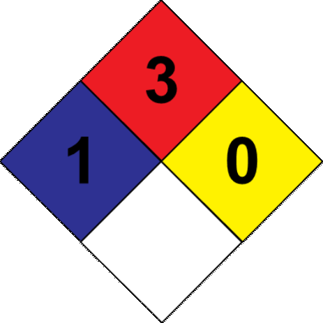
> **Nota de trazabilidad:** Elemento visual sin texto identificable.
> Imagen en Sección 1: IDENTIFICACIÓN DEL PRODUCTO.
> Información relacionada en la sección correspondiente.

> **Nota de trazabilidad:** Elemento visual sin texto identificable.
> Imagen en Sección 1: IDENTIFICACIÓN DEL PRODUCTO.
> Información relacionada en la sección correspondiente.

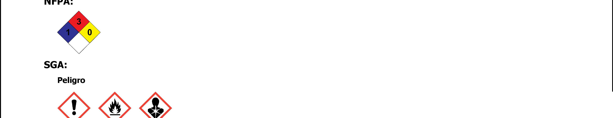
> **Nota de trazabilidad:** Elemento visual sin texto identificable.
> Imagen en Sección 1: IDENTIFICACIÓN DEL PRODUCTO.
> Información relacionada en la sección correspondiente.

> **Nota de trazabilidad:** Pictograma(s) GHS: H350, H319, H226, H340.
> Imagen en Sección 1: IDENTIFICACIÓN DEL PRODUCTO.
> Información relacionada en la sección correspondiente.

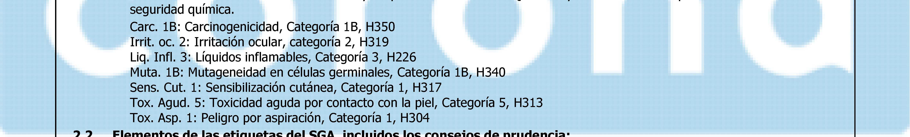
> **Nota de trazabilidad:** seguridad química. Carc. 1B: Carcinogenicidad, Categoría 1B, H350 Trrit. oc. 2: Irritación ocular, categoría 2, H319 Lig. Infl. 3: Líquidos inflamables, Categoría 3, H226 Muta. 1B: Mutageneidad en células germinales, Categoría 1B, H340 Sens. Cut. 1: Sensibilización cutánea, Categoría 1, H317 Tox. Agud. 5: Toxicidad aguda por contacto con la piel, Categoría 5, H313 Tox. Asp. 1: Peligro por aspiración, Categoría 1, H304 »”» Elamanine sta lame abtirmiartae dal <A inrillurne Ine raincaime ra nriuirianria"
> Imagen en Sección 1: IDENTIFICACIÓN DEL PRODUCTO.
> Información relacionada en la sección correspondiente.

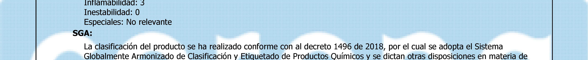
> **Nota de trazabilidad:** Pictograma(s) GHS: H340, H317, H313, H304.
> Imagen en Sección 1: IDENTIFICACIÓN DEL PRODUCTO.
> Información relacionada en la sección correspondiente.

> **Nota de trazabilidad:** 2.1 Clasificación de la sustancia o de la mezcla: NFPA: Salud: 1
> Imagen en Sección 1: IDENTIFICACIÓN DEL PRODUCTO.
> Información relacionada en la sección correspondiente.

**1.1 Identificador SGA del producto:** 407141521 - RECUBRIMIENTO ANTIGRAFFITI **1.2 Uso recomendado del producto químico y restricciones:** Usos pertinentes: Recubrimiento, protección y decoración para sustratos al exterior. Usos desaconsejados: Todo aquel uso no especificado en este epígrafe ni en el epígrafe 7.3 **1.3 Datos sobre el proveedor:** CORLANC S.A.S. Carrera 48 N° 72 sur 01 Avenida Las Vegas 055450 Sabaneta - Antioquia - Colombia Tfno.: +57-4-3787800 materialesypinturascorona@corona.com.co https://www.corona.co **1.4 Número de teléfono para emergencias:** CISTEMA - ARL SURA 018000511414 - 0314055911 

## Sección 2: IDENTIFICACIÓN DEL PELIGRO O PELIGROS

> **Nota de trazabilidad:** Pictograma(s) GHS: H304, H350, H340, H313.
> Imagen en Sección 2: IDENTIFICACIÓN DEL PELIGRO O PELIGROS.
> Información relacionada en la sección correspondiente.

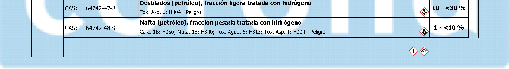
> **Nota de trazabilidad:** Destilados (petróleo), fracción ligera tratada con hidrógeno . = - 2, 9) A 73 Tox. Asp. 1: H304 - Peligro Sd A o Nafta (petróleo), fracción pesada tratada con hidrógeno CAS: 64742-48- He Carc. 18: H350; Muta. 1B: H340; Tox. Agud. 5: H313; Tox. Asp. 1: H304 - Peligro 93)
> Imagen en Sección 2: IDENTIFICACIÓN DEL PELIGRO O PELIGROS.
> Información relacionada en la sección correspondiente.

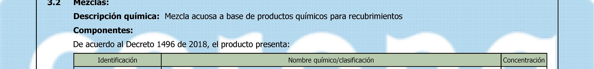
> **Nota de trazabilidad:** Pictograma(s) GHS: H304, H350, H340, H313.
> Imagen en Sección 2: IDENTIFICACIÓN DEL PELIGRO O PELIGROS.
> Información relacionada en la sección correspondiente.

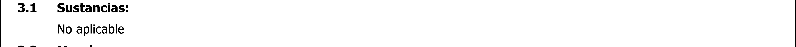
> **Nota de trazabilidad:** Pictograma(s) GHS: H350, H319.
> Imagen en Sección 2: IDENTIFICACIÓN DEL PELIGRO O PELIGROS.
> Información relacionada en la sección correspondiente.

> **Nota de trazabilidad:** Pictograma(s) GHS: H350, H319, H226, H340, H317, H313, H304.
> Imagen en Sección 2: IDENTIFICACIÓN DEL PELIGRO O PELIGROS.
> Información relacionada en la sección correspondiente.

**Indicaciones de peligro:** 

Carc. 1B: H350 - Puede provocar cáncer Irrit. oc. 2: H319 - Provoca irritación ocular grave Liq. Infl. 3: H226 - Líquido y vapores inflamables Muta. 1B: H340 - Puede provocar defectos genéticos Sens. Cut. 1: H317 - Puede provocar una reacción cutánea alérgica Tox. Agud. 5: H313 - Puede ser nocivo en contacto con la piel Tox. Asp. 1: H304 - Puede ser mortal en caso de ingestión y de penetración en las vías respiratorias 

**Consejos de prudencia:** 

**407141521 - RECUBRIMIENTO ANTIGRAFFITI** 

P101: Si se necesita consultar a un médico, tener a mano el recipiente o la etiqueta del producto P102: Mantener fuera del alcance de los niños P210: Mantener alejado del calor, superficies calientes, chispas llamas al descubierto y otras fuentes de ignición. No fumar P264: Lavarse cuidadosamente después de la manipulación P280: Usar guantes/ropa de protección/equipo de protección para los ojos/la cara 

P305+P351+P338: EN CASO DE CONTACTO CON LOS OJOS: Enjuagar con agua cuidadosamente durante varios minutos. Quitar las lentes de contacto cuando estén presentes y pueda hacerse con facilidad. Proseguir con el lavado P370+P378: En caso de incendio: Utilizar extintor de polvo ABC para la extinción 

P501: Eliminar el contenido/recipiente mediante el sistema de recogida selectiva habilitado en su municipio **Sustancias que contribuyen a la clasificación** 

N-butil-N-((trietoxisilil)metil)butan-1-amina; Destilados (petróleo), fracción ligera tratada con hidrógeno; Nafta (petróleo), fracción pesada tratada con hidrógeno; N-(3-(trimetoxisilil)propil)etilenodiamina 

**2.3 Otros peligros que no conducen a una clasificación:** 

No relevante 

## Sección 3: COMPOSICIÓN/INFORMACIÓN SOBRE LOS COMPONENTES

**N-(3-(trimetoxisilil)propil)etilenodiamina** CAS: 1760-24-3 **1 - <10 %** Les. Oc. 1: H318; Sens. Cut. 1: H317; Tox. Agud. 5: H303 - Peligro 

Para ampliar información sobre la peligrosidad de la sustancias consultar las secciones 8, 11, 12, 15 y 16. La clasificación respecto Carcinogenicidad de las sustancias se ha establecido en función de las monografías de la IARC adecuandola al sistema de clasificación SGA, para información sobre la clasificación IARC consulte la sección 11. 

## Sección 4: PRIMEROS AUXILIOS

> **Nota de trazabilidad:** Pictograma(s) GHS: H303.
> Imagen en Sección 4: PRIMEROS AUXILIOS.
> Información relacionada en la sección correspondiente.

> **Nota de trazabilidad:** Pictograma(s) GHS: SGA.
> Imagen en Sección 4: PRIMEROS AUXILIOS.
> Información relacionada en la sección correspondiente.

> **Nota de trazabilidad:** Elemento visual sin texto identificable.
> Imagen en Sección 4: PRIMEROS AUXILIOS.
> Información relacionada en la sección correspondiente.

> **Nota de trazabilidad:** Elemento visual sin texto identificable.
> Imagen en Sección 4: PRIMEROS AUXILIOS.
> Información relacionada en la sección correspondiente.

**4.1 Descripción de los primeros auxilios necesarios:** 

Los síntomas como consecuencia de una intoxicación pueden presentarse con posterioridad a la exposición, por lo que, en caso de duda, exposición directa al producto químico o persistencia del malestar solicitar atención médica, mostrándole la FDS de este producto. 

**Por inhalación:** 

Se trata de un producto que no contiene sustancias clasificadas como peligrosas por inhalación, sin embargo, en caso de síntomas de intoxicación sacar al afectado de la zona de exposición y proporcionarle aire fresco. Solicitar atención médica si los síntomas se agravan o persisten. 

**Por contacto con la piel:** 

Quitar la ropa y los zapatos contaminados, aclarar la piel o duchar al afectado si procede con abundante agua fría y jabón neutro. En caso de afección importante acudir al médico. Si el producto produce quemaduras o congelación, no se debe quitar la ropa debido a que podría empeorar la lesión producida si esta se encuentra pegada a la piel. En el caso de formarse ampollas en la piel, éstas nunca deben reventarse ya que aumentaría el riesgo de infección. 

**Por contacto con los ojos:** 

Enjuagar los ojos con abundante agua a temperatura ambiente al menos durante 15 minutos. Evitar que el afectado se frote o cierre los ojos. En el caso de que el accidentado use lentes de contacto, éstas deben retirarse siempre que no estén pegadas a los ojos, de otro modo podría producirse un daño adicional. En todos los casos, después del lavado, se debe acudir al médico lo más rápidamente posible con la FDS del producto. 

**Por ingestión/aspiración:** 

## ~~=a~~ 

**407141521 - RECUBRIMIENTO ANTIGRAFFITI** 

Requerir asistencia médica inmediata, mostrándole la FDS de este producto. No inducir al vómito, en el caso de que se produzca mantener inclinada la cabeza hacia delante para evitar la aspiración. En el caso de pérdida de consciencia no administrar nada por vía oral hasta la supervisión del médico. Enjuagar la boca y la garganta, ya que existe la posibilidad de que hayan sido afectadas en la ingestión. Mantener al afectado en reposo. 

**4.2 Síntomas/efectos más importantes, agudos o retardados:** 

Los efectos agudos y retardados son los indicados en las secciones 2 y 11. 

**Indicación de la necesidad de recibir atención médica inmediata y, en su caso, de tratamiento especial:** 

## Sección 7: MANIPULACIÓN Y ALMACENAMIENTO
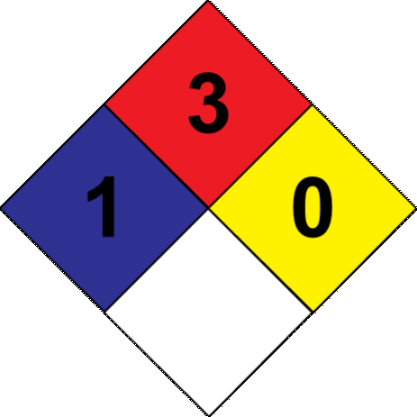
> **Nota de trazabilidad:** Elemento visual sin texto identificable.
> Imagen en Sección 7: MANIPULACIÓN Y ALMACENAMIENTO.
> Información relacionada en la sección correspondiente.

> **Nota de trazabilidad:** Elemento visual sin texto identificable.
> Imagen en Sección 7: MANIPULACIÓN Y ALMACENAMIENTO.
> Información relacionada en la sección correspondiente.

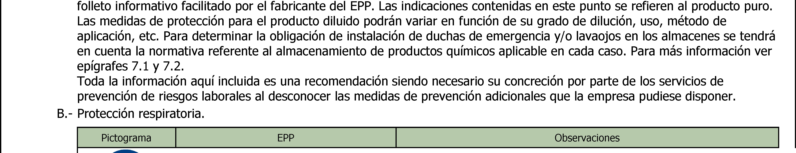
> **Nota de trazabilidad:** folleto informativo facilitado por el fabricante del EPP. Las indicaciones contenidas en este punto se refieren al producto puro. Las medidas de protección para el producto diluido podrán variar en función de su grado de dilución, uso, método de aplicación, etc. Para determinar la obligación de instalación de duchas de emergencia y/o lavaojos en los almacenes se tendrá en cuenta la normativa referente al almacenamiento de productos químicos aplicable en cada caso. Para más información ver epígrafes 7.1 y 7.2. Toda la información aquí incluida es una recomendación siendo necesario su concreción por parte de los servicios de prevención de riesgos laborales al desconocer las medidas de prevención adicionales que la empresa pudiese disponer. B.- Protección respiratoria. >> - —
> Imagen en Sección 7: MANIPULACIÓN Y ALMACENAMIENTO.
> Información relacionada en la sección correspondiente.

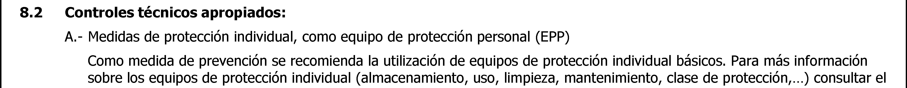
> **Nota de trazabilidad:** 8.2 Controles técnicos apropiados: A.- Medidas de protección individual, como equipo de protección personal (EPP) Como medida de prevención se recomienda la utilización de equipos de protección individual básicos. Para más información sobre los equipos de protección individual (almacenamiento, uso, limpieza, mantenimiento, clase de protección,...) consultar el
> Imagen en Sección 7: MANIPULACIÓN Y ALMACENAMIENTO.
> Información relacionada en la sección correspondiente.

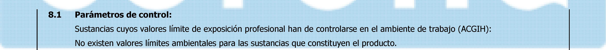
> **Nota de trazabilidad:** 8.1 Parámetros de control: Sustancias cuyos valores límite de exposición profesional han de controlarse en el ambiente de trabajo (ACGIH): No existen valores límites ambientales para las sustancias que constituyen el producto.
> Imagen en Sección 7: MANIPULACIÓN Y ALMACENAMIENTO.
> Información relacionada en la sección correspondiente.

> **Nota de trazabilidad:** Elemento visual sin texto identificable.
> Imagen en Sección 7: MANIPULACIÓN Y ALMACENAMIENTO.
> Información relacionada en la sección correspondiente.

> **Nota de trazabilidad:** Elemento visual sin texto identificable.
> Imagen en Sección 7: MANIPULACIÓN Y ALMACENAMIENTO.
> Información relacionada en la sección correspondiente.

## Sección 6: MEDIDAS QUE DEBEN TOMARSE EN CASO DE VERTIDO ACCIDENTAL

## Sección 5: MEDIDAS DE LUCHA CONTRA INCENDIOS

**407141521 - RECUBRIMIENTO ANTIGRAFFITI** 

Trasvasar en lugares bien ventilados, preferentemente mediante extracción localizada. Controlar totalmente los focos de ignición (teléfonos móviles, chispas,…) y ventilar en las operaciones de limpieza. Evitar la existencia de atmósferas peligrosas en el interior de recipientes, aplicando en lo posible sistemas de inertización. Trasvasar a velocidades lentas para evitar la generación de cargas electroestáticas. Ante la posibilidad de existencia de cargas electroestáticas: asegurar una perfecta conexión equipotencial, utilizar siempre tomas de tierras, no emplear ropa de trabajo de fibras acrílicas, empleando preferiblemente ropa de algodón y calzado conductor. Cumplir con los requisitos esenciales de seguridad para equipos  y con las disposiciones mínimas para la protección de la seguridad y salud de los trabajadores. Consultar la sección 10 sobre condiciones y materias que deben evitarse. 

C.- Recomendaciones técnicas para prevenir riesgos ergonómicos y toxicológicos. Para control de exposición consultar la sección 8. No comer, beber ni fumar en las zonas de trabajo; lavarse las manos después de cada utilización, y despojarse de prendas de vestir y equipos de protección contaminados antes de entrar en las zonas para comer. D.- Recomendaciones técnicas para prevenir riesgos medioambientales Se recomienda disponer de material absorbente en las proximidades del producto (ver epígrafe 6.3) **7.2 Condiciones de almacenamiento seguro, incluidas cualesquiera incompatibilidades:** A.- Medidas técnicas de almacenamiento Tª mínima: 5 ºC Tª máxima: 30 ºC Tiempo máximo: 12 meses B.- Condiciones generales de almacenamiento. Evitar fuentes de calor, radiación, electricidad estática y el contacto con alimentos. Para información adicional ver epígrafe 10.5 **7.3 Usos específicos finales:** Salvo las indicaciones ya especificadas no es preciso realizar ninguna recomendación especial en cuanto a los usos de este producto. 

## Sección 8: CONTROLES DE EXPOSICIÓN/PROTECCIÓN PERSONAL

> **Nota de trazabilidad:** Pictograma EPP: Protección respiratoria — Máscara autofiltrante para gases y vapores. Uso obligatorio.
> Imagen en Sección 8: CONTROLES DE EXPOSICIÓN/PROTECCIÓN PERSONAL.
> Información relacionada en la sección correspondiente.

> **Nota de trazabilidad:** Pictograma EPP: Protección ocular y facial — Pantalla facial. Uso obligatorio en caso de riesgo de salpicaduras.
> Imagen en Sección 8: CONTROLES DE EXPOSICIÓN/PROTECCIÓN PERSONAL.
> Información relacionada en la sección correspondiente.

> **Nota de trazabilidad:** Pictograma EPP: Protección ocular y facial — Pantalla facial. Uso obligatorio en caso de riesgo de salpicaduras.
> Imagen en Sección 8: CONTROLES DE EXPOSICIÓN/PROTECCIÓN PERSONAL.
> Información relacionada en la sección correspondiente.

> **Nota de trazabilidad:** Pictograma EPP: Pantalla facial — uso obligatorio.
> Imagen en Sección 8: CONTROLES DE EXPOSICIÓN/PROTECCIÓN PERSONAL.
> Información relacionada en la sección correspondiente.

> **Nota de trazabilidad:** Pictograma EPP: Protección ocular y facial — Pantalla facial. Uso obligatorio en caso de riesgo de salpicaduras.
> Imagen en Sección 8: CONTROLES DE EXPOSICIÓN/PROTECCIÓN PERSONAL.
> Información relacionada en la sección correspondiente.

> **Nota de trazabilidad:** Pictograma EPP: Pantalla facial — uso obligatorio.
> Imagen en Sección 8: CONTROLES DE EXPOSICIÓN/PROTECCIÓN PERSONAL.
> Información relacionada en la sección correspondiente.

> **Nota de trazabilidad:** Pictograma EPP: Protección respiratoria — Máscara autofiltrante para gases y vapores. Uso obligatorio.
> Imagen en Sección 8: CONTROLES DE EXPOSICIÓN/PROTECCIÓN PERSONAL.
> Información relacionada en la sección correspondiente.

Reemplazar cuando se detecte olor o sabor del contaminante en el interior de la
Máscara autofiltrante para gases y vapores máscara o adaptador facial. Cuando el contaminante no tiene buenas propiedades
Proteccion obligatoria  de aviso se recomienda el uso de equipos aislantes.
del las vias
respiratorias
C.- Protección específica de las manos.

**407141521 - RECUBRIMIENTO ANTIGRAFFITI** 

**----- Start of picture text -----**

ANSI Z358-1 DIN 12 899
ISO 3864-1:2011, ISO 3864-4:2011 ISO 3864-1:2011, ISO 3864-4:2011
Ducha de emergencia Lavaojos
Controles de la exposición del medio ambiente:

En virtud de la legislación comunitaria de protección del medio ambiente se recomienda evitar el vertido tanto del producto como de su envase al medio ambiente. Para información adicional ver epígrafe 7.1.D 

## Sección 9: PROPIEDADES FÍSICAS Y QUÍMICAS Y CARACTERÍSTICAS DE SEGURIDAD

> **Nota de trazabilidad:** Elemento visual sin texto identificable.
> Imagen en Sección 9: PROPIEDADES FÍSICAS Y QUÍMICAS Y CARACTERÍSTICAS DE SEGURIDAD.
> Información relacionada en la sección correspondiente.

> **Nota de trazabilidad:** Elemento visual sin texto identificable.
> Imagen en Sección 9: PROPIEDADES FÍSICAS Y QUÍMICAS Y CARACTERÍSTICAS DE SEGURIDAD.
> Información relacionada en la sección correspondiente.

> **Nota de trazabilidad:** Elemento visual sin texto identificable.
> Imagen en Sección 9: PROPIEDADES FÍSICAS Y QUÍMICAS Y CARACTERÍSTICAS DE SEGURIDAD.
> Información relacionada en la sección correspondiente.

> **Nota de trazabilidad:** Elemento visual sin texto identificable.
> Imagen en Sección 9: PROPIEDADES FÍSICAS Y QUÍMICAS Y CARACTERÍSTICAS DE SEGURIDAD.
> Información relacionada en la sección correspondiente.

**9.1 Información de propiedades físicas y químicas básicas:** 

Para completar la información ver la ficha técnica/hoja de especificaciones del producto. **Aspecto físico:** 

Estado físico a 20 ºC: Líquido Aspecto: Cristalino Color: Incoloro Olor: Característico Umbral olfativo: No relevante * **Volatilidad:** Temperatura de ebullición a presión atmosférica: 211 ºC Presión de vapor a 20 ºC: 209 Pa Presión de vapor a 50 ºC: 1158,31 Pa  (1,16 kPa) Tasa de evaporación a 20 ºC: No relevante * 

*No relevante debido a la naturaleza del producto, no aportando información característica de su peligrosidad. 

## Sección 10: ESTABILIDAD Y REACTIVIDAD

> **Nota de trazabilidad:** Elemento visual sin texto identificable.
> Imagen en Sección 10: ESTABILIDAD Y REACTIVIDAD.
> Información relacionada en la sección correspondiente.

> **Nota de trazabilidad:** Elemento visual sin texto identificable.
> Imagen en Sección 10: ESTABILIDAD Y REACTIVIDAD.
> Información relacionada en la sección correspondiente.

> **Nota de trazabilidad:** Elemento visual sin texto identificable.
> Imagen en Sección 10: ESTABILIDAD Y REACTIVIDAD.
> Información relacionada en la sección correspondiente.

> **Nota de trazabilidad:** Elemento visual sin texto identificable.
> Imagen en Sección 10: ESTABILIDAD Y REACTIVIDAD.
> Información relacionada en la sección correspondiente.

**407141521 - RECUBRIMIENTO ANTIGRAFFITI** 

Ver epígrafe 10.3, 10.4 y 10.5 para conocer los productos de descomposición específicamente. En dependencia de las condiciones de descomposición, como consecuencia de la misma pueden liberarse mezclas complejas de sustancias químicas: dióxido de carbono (CO2), monóxido de carbono y otros compuestos orgánicos. 

## Sección 11: INFORMACIÓN TOXICOLÓGICA

> **Nota de trazabilidad:** Elemento visual sin texto identificable.
> Imagen en Sección 11: INFORMACIÓN TOXICOLÓGICA.
> Información relacionada en la sección correspondiente.

> **Nota de trazabilidad:** Elemento visual sin texto identificable.
> Imagen en Sección 11: INFORMACIÓN TOXICOLÓGICA.
> Información relacionada en la sección correspondiente.

> **Nota de trazabilidad:** Elemento visual sin texto identificable.
> Imagen en Sección 11: INFORMACIÓN TOXICOLÓGICA.
> Información relacionada en la sección correspondiente.

> **Nota de trazabilidad:** Elemento visual sin texto identificable.
> Imagen en Sección 11: INFORMACIÓN TOXICOLÓGICA.
> Información relacionada en la sección correspondiente.

**11.1 Información sobre las posibles vías de exposición:** 

No se dispone de datos experimentales del producto en si mismos relativos a las propiedades toxicológicas **Efectos peligrosos para la salud:** 

En caso de exposición repetitiva, prolongada o a concentraciones superiores a las establecidas por los límites de exposición profesionales, pueden producirse efectos adversos para la salud en función de la vía de exposición: A- Ingestión (efecto agudo): -   Toxicidad aguda: A la vista de los datos disponibles, no se cumplen los criterios de clasificación, sin embargo, presenta sustancias clasificadas como peligrosas por ingestión. Para más información ver sección 3. -   Corrosividad/Irritabilidad: A la vista de los datos disponibles, no se cumplen los criterios de clasificación, no presentando sustancias clasificadas como peligrosas por este efecto. Para más información ver sección 3. B- Inhalación (efecto agudo): -   Toxicidad aguda: A la vista de los datos disponibles, no se cumplen los criterios de clasificación, no presentando sustancias clasificadas como peligrosas por inhalación. Para más información ver sección 3. -   Corrosividad/Irritabilidad: A la vista de los datos disponibles, no se cumplen los criterios de clasificación, no presentando sustancias clasificadas como peligrosas por este efecto. Para más información ver sección 3. C- Contacto con la piel y los ojos (efecto agudo): -   Contacto con la piel: Principalmente puede presentar efectos nocivos para la salud si el producto es absorbido vía cutánea. Para más información sobre efectos secundarios por contacto con la piel ver sección 2. -   Contacto con los ojos: Produce lesiones oculares tras contacto. D- Efectos CMR (carcinogenicidad, mutagenicidad y toxicidad para la reproducción): -   Carcinogenicidad: La exposición a este producto puede causar cáncer. Para más información sobre posibles efectos específicos sobre la salud ver sección 2. IARC: Nafta (petróleo), fracción pesada tratada con hidrógeno (1) -   Mutagenicidad: La exposición a este producto puede causar alteraciones genéticas. Para más información sobre posibles efectos específicos sobre la salud ver sección 2. -   Toxicidad para la reproducción: A la vista de los datos disponibles, no se cumplen los criterios de clasificación, no presentando sustancias clasificadas como peligrosas por este efecto. Para más información ver sección 3. E- Efectos de sensibilización: -   Respiratoria: A la vista de los datos disponibles, no se cumplen los criterios de clasificación, no presentando sustancias clasificadas como peligrosas con efectos sensibilizantes. Para más información ver secciónes 2, 3 y 15. -   Cutánea: El contacto prolongado con la piel puede derivar en EPPsodios de dermatitis alérgicas de contacto. F- Toxicidad específica en determinados órganos (STOT)-exposición única: A la vista de los datos disponibles, no se cumplen los criterios de clasificación, no presentando sustancias clasificadas como peligrosas por este efecto. Para más información ver sección 3. G- Toxicidad específica en determinados órganos (STOT)-exposición repetida: -   Toxicidad específica en determinados órganos (STOT)-exposición repetida: A la vista de los datos disponibles, no se cumplen los criterios de clasificación, no presentando sustancias clasificadas como peligrosas por este efecto. Para más información ver sección 3. -   Piel: A la vista de los datos disponibles, no se cumplen los criterios de clasificación, no presentando sustancias clasificadas como peligrosas por este efecto. Para más información ver sección 3. H- Peligro por aspiración: La ingesta de una dosis considerable puede producir daño pulmonar. **Información adicional:** No relevante **Información toxicológica específica de las sustancias:** 

## ~~oom~~ 

**407141521 - RECUBRIMIENTO ANTIGRAFFITI** 

|Identificación|Toxicidad aguda|Toxicidad aguda|Género|
|---|---|---|---|
|Nafta (petróleo), fracción pesada tratada con hidrógeno|DL50 oral|15000 mg/kg|Rata|
|CAS: 64742-48-9|DL50 cutánea|3160 mg/kg|Conejo|
||CL50 inhalación|No relevante||
|N-(3-(trimetoxisilil)propil)etilenodiamina|DL50 oral|2413 mg/kg|Rata|
|CAS: 1760-24-3|DL50 cutánea|No relevante||
||CL50 inhalación|No relevante||

## Sección 12: INFORMACIÓN ECOTOXICOLÓGICA

No se disponen de datos experimentales de la mezcla en sí misma relativos a las propiedades ecotoxicológicas. 

**12.1 Toxicidad:** 

## Sección 13: INFORMACIÓN RELATIVA A LA ELIMINACIÓN DE LOS PRODUCTOS

> **Nota de trazabilidad:** Elemento visual sin texto identificable.
> Imagen en Sección 13: INFORMACIÓN RELATIVA A LA ELIMINACIÓN DE LOS PRODUCTOS.
> Información relacionada en la sección correspondiente.

> **Nota de trazabilidad:** Elemento visual sin texto identificable.
> Imagen en Sección 13: INFORMACIÓN RELATIVA A LA ELIMINACIÓN DE LOS PRODUCTOS.
> Información relacionada en la sección correspondiente.

> **Nota de trazabilidad:** Elemento visual sin texto identificable.
> Imagen en Sección 13: INFORMACIÓN RELATIVA A LA ELIMINACIÓN DE LOS PRODUCTOS.
> Información relacionada en la sección correspondiente.

> **Nota de trazabilidad:** Elemento visual sin texto identificable.
> Imagen en Sección 13: INFORMACIÓN RELATIVA A LA ELIMINACIÓN DE LOS PRODUCTOS.
> Información relacionada en la sección correspondiente.

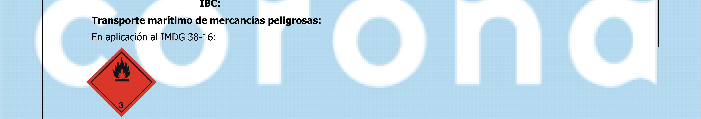
> **Nota de trazabilidad:** 1BC: Transporte marítimo de mercancías peligrosas: En aplicación al IMDG 38-16:
> Imagen en Sección 13: INFORMACIÓN RELATIVA A LA ELIMINACIÓN DE LOS PRODUCTOS.
> Información relacionada en la sección correspondiente.

> **Nota de trazabilidad:** A IN PIM.) MURIINAS UAMIITINQLAS a YN l dl or LAA -» 14.7 Transporte a granel con No relevante arreglo al anexo 11 de MARPOL 73/78 y al Código
> Imagen en Sección 13: INFORMACIÓN RELATIVA A LA ELIMINACIÓN DE LOS PRODUCTOS.
> Información relacionada en la sección correspondiente.

> **Nota de trazabilidad:** 14.4 14.5 14.6 Grupo de III embalaje/envasado si se aplica: Riesgos ambientales: No Precauciones especiales para el usuario ” y ” r ” r Deraniarlarlac ficien Su urna: var anirratfa ad
> Imagen en Sección 13: INFORMACIÓN RELATIVA A LA ELIMINACIÓN DE LOS PRODUCTOS.
> Información relacionada en la sección correspondiente.

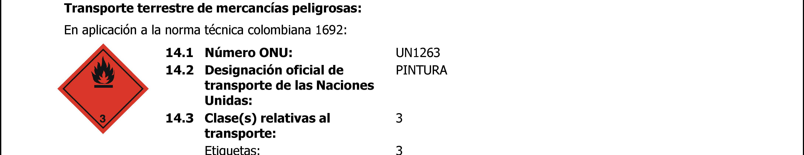
> **Nota de trazabilidad:** Transporte terrestre de mercancías peligrosas: En aplicación a la norma técnica colombiana 1692: 14.1 Número ONU: UN1263 14.2 Designación oficial de PINTURA transporte de las Naciones Unidas: 14.3 Clase(s) relativas al 3 transporte: Etiquetas: 23
> Imagen en Sección 13: INFORMACIÓN RELATIVA A LA ELIMINACIÓN DE LOS PRODUCTOS.
> Información relacionada en la sección correspondiente.

> **Nota de trazabilidad:** Elemento visual sin texto identificable.
> Imagen en Sección 13: INFORMACIÓN RELATIVA A LA ELIMINACIÓN DE LOS PRODUCTOS.
> Información relacionada en la sección correspondiente.

**407141521 - RECUBRIMIENTO ANTIGRAFFITI** 

Decreto 4741 de 2005, Por el cual se reglamenta parcialmente la prevención y el manejo de los residuos o desechos peligrosos generados en el marco de la gestión integral 

## Sección 14: INFORMACIÓN RELATIVA AL TRANSPORTE
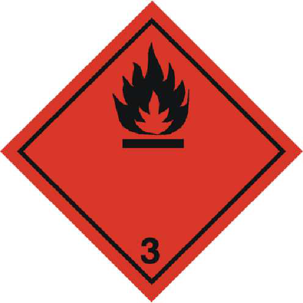
> **Nota de trazabilidad:** Elemento visual sin texto identificable.
> Imagen en Sección 14: INFORMACIÓN RELATIVA AL TRANSPORTE.
> Información relacionada en la sección correspondiente.

> **Nota de trazabilidad:** Elemento visual sin texto identificable.
> Imagen en Sección 14: INFORMACIÓN RELATIVA AL TRANSPORTE.
> Información relacionada en la sección correspondiente.

> **Nota de trazabilidad:** Elemento visual sin texto identificable.
> Imagen en Sección 14: INFORMACIÓN RELATIVA AL TRANSPORTE.
> Información relacionada en la sección correspondiente.

> **Nota de trazabilidad:** Elemento visual sin texto identificable.
> Imagen en Sección 14: INFORMACIÓN RELATIVA AL TRANSPORTE.
> Información relacionada en la sección correspondiente.

> **Nota de trazabilidad:** Elemento visual sin texto identificable.
> Imagen en Sección 14: INFORMACIÓN RELATIVA AL TRANSPORTE.
> Información relacionada en la sección correspondiente.

|**14.1**|**Número ONU:**|UN1263|
|---|---|---|
|**14.2**|**Designación oficial de**|PINTURA|
||**transporte de las Naciones**||
||**Unidas:**||
|**14.3**|**Clase(s) relativas al**|3|
||**transporte:**||
||Etiquetas:|3|
|**14.4**|**Grupo de**|III|
||**embalaje/envasado si se**||
||**aplica:**||
|**14.5**|**Riesgos ambientales:**|No|
|**14.6**|**Precauciones especiales para el usuario**|**Precauciones especiales para el usuario**|
||Propiedades físico-químicas:|ver epígrafe 9|
|**14.7**|**Transporte a granel con**|No relevante|
||**arreglo al anexo II de**||
||**MARPOL 73/78 y al Código**||
||**IBC:**||

**Transporte aéreo de mercancías peligrosas:** 

En aplicación al IATA/OACI 2019: 

**407141521 - RECUBRIMIENTO ANTIGRAFFITI** 

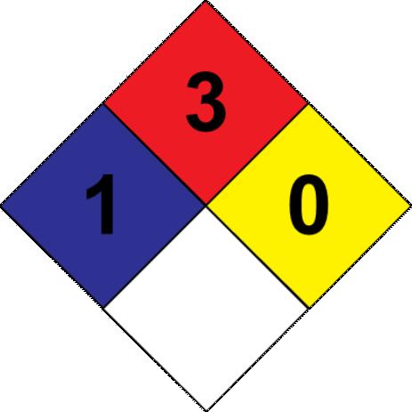
> **Nota de trazabilidad:** Elemento visual sin texto identificable.
> Imagen en Sección 16: OTRAS INFORMACIONES.
> Información relacionada en la sección correspondiente.

> **Nota de trazabilidad:** Elemento visual sin texto identificable.
> Imagen en Sección 16: OTRAS INFORMACIONES.
> Información relacionada en la sección correspondiente.

> **Nota de trazabilidad:** Elemento visual sin texto identificable.
> Imagen en Sección 16: OTRAS INFORMACIONES.
> Información relacionada en la sección correspondiente.

> **Nota de trazabilidad:** Pictograma(s) GHS: H350, H318.
> Imagen en Sección 16: OTRAS INFORMACIONES.
> Información relacionada en la sección correspondiente.

**407141521 - RECUBRIMIENTO ANTIGRAFFITI** 

|---|---|
||**Textos de las frases legislativas contempladas en la sección 3:**|
||Las frases indicadas no se refieren al producto en sí, son sólo a título informativo y hacen referencia a los componentes|
||individuales que aparecen en la sección 3|
||**SGA:**|
||Carc. 1B: H350 - Puede provocar cáncer|
||Les. Oc. 1: H318 - Provoca lesiones oculares graves|
||Muta. 1B: H340 - Puede provocar defectos genéticos|
||Sens. Cut. 1: H317 - Puede provocar una reacción cutánea alérgica|
||Tox. Agud. 5: H303 - Puede ser nocivo en caso de ingestión|
||Tox. Agud. 5: H313 - Puede ser nocivo en contacto con la piel|
||Tox. Asp. 1: H304 - Puede ser mortal en caso de ingestión y de penetración en las vías respiratorias|
||**Consejos relativos a la formación:**|
||Se recomienda formación mínima en materia de prevención de riesgos laborales al personal que va a manipular este producto,|
||con la finalidad de facilitar la comprensión e interpretación de esta hoja de datos de seguridad de materiales, así como del|
||etiquetado del producto.|
||**Principales fuentes bibliográficas:**|
||Instituto Colombiano de Normas Técnicas y Certificación (ICONTEC)|
||IARC:Agencia Internacional para la Investigación sobre Cáncer|
||OSHA:Occupational Safety and Health Administration, U.S Department of Labor|
||NTP:National Toxicology Program|
||TOXNET: Toxicology data network|
||**Abreviaturas y acrónimos:**|
||IMDG: Código Marítimo Internacional de Mercancías Peligrosas|
||IATA: Asociación Internacional de Transporte Aéreo|
||OACI: Organización de Aviación Civil Internacional|
||DQO:Demanda Quimica de oxígeno|
||DBO5:Demanda biológica de oxígeno a los 5 días|
||BCF: factor de bioconcentración|
||DL50: dosis letal 50|
||CL50: concentración letal 50|
||EC50: concentración efectiva 50|
||Log POW: logaritmo coeficiente partición octanol-agua|
||Koc: coeficiente de partición del carbono orgánico|

La información contenida en esta ficha de datos de seguridad está fundamentada en fuentes, conocimientos técnicos y legislación vigente a nivel europeo y estatal, no pudiendo garantizar la exactitud de la misma. Esta información no es posible considerarla como una garantía de las propiedades del producto, se trata simplemente de una descripción en cuanto a los requerimientos en materia de seguridad. La metodología y condiciones de trabajo de los usuarios de este producto se encuentran fuera de nuestro conocimiento y control, siendo siempre responsabilidad última del usuario tomar las medidas necesarias para adecuarse a las exigencias legislativas en cuanto a manipulación, almacenamiento, uso y eliminación de productos químicos. La información de esta ficha de datos de seguridad de materiales únicamente se refiere a este producto, el cual no debe emplearse con fines distintos a los que se especifican. 

FIN DE LA FICHA DE DATOS DE SEGURIDAD 
