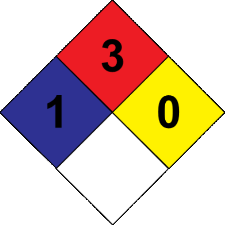
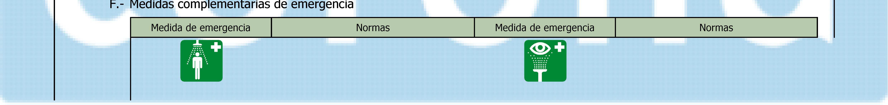
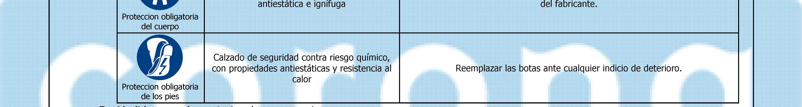
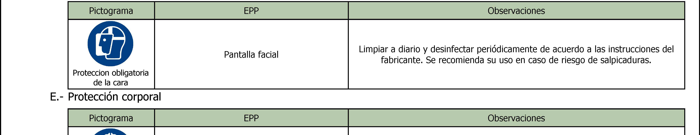
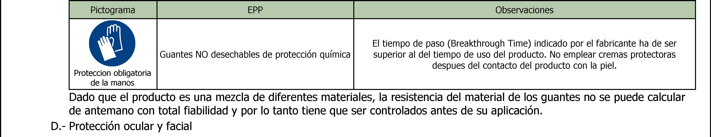

según Decreto 1496 de 2018

# 407141521 - RECUBRIMIENTO ANTIGRAFFITI

**Indicaciones de peligro:**

Carc. 1B: H350 - Puede provocar cáncer
Irrit. oc. 2: H319 - Provoca irritación ocular grave
Liq. Infl. 3: H226 - Líquido y vapores inflamables
Muta. 1B: H340 - Puede provocar defectos genéticos
Sens. Cut. 1: H317 - Puede provocar una reacción cutánea alérgica
Tox. Agud. 5: H313 - Puede ser nocivo en contacto con la piel
Tox. Asp. 1: H304 - Puede ser mortal en caso de ingestión y de penetración en las vías respiratorias
**Consejos de prudencia:**

- CONTINÚA EN LA SIGUIENTE PÁGINA 

-----

según Decreto 1496 de 2018

# 407141521 - RECUBRIMIENTO ANTIGRAFFITI

P101: Si se necesita consultar a un médico, tener a mano el recipiente o la etiqueta del producto

P210: Mantener alejado del calor, superficies calientes, chispas llamas al descubierto y otras fuentes de ignición. No fumar
P264: Lavarse cuidadosamente después de la manipulación
P280: Usar guantes/ropa de protección/equipo de protección para los ojos/la cara
P305+P351+P338: EN CASO DE CONTACTO CON LOS OJOS: Enjuagar con agua cuidadosamente durante varios minutos.
Quitar las lentes de contacto cuando estén presentes y pueda hacerse con facilidad. Proseguir con el lavado
P370+P378: En caso de incendio: Utilizar extintor de polvo ABC para la extinción
P501: Eliminar el contenido/recipiente mediante el sistema de recogida selectiva habilitado en su municipio

N-butil-N-((trietoxisilil)metil)butan-1-amina; Destilados (petróleo), fracción ligera tratada con hidrógeno; Nafta (petróleo),
fracción pesada tratada con hidrógeno; N-(3-(trimetoxisilil)propil)etilenodiamina

## Sección 3: COMPOSICIÓN/INFORMACIÓN SOBRE LOS COMPONENTES

**N-(3-(trimetoxisilil)propil)etilenodiamina**

Les. Oc. 1: H318; Sens. Cut. 1: H317; Tox. Agud. 5: H303 - Peligro

Para ampliar información sobre la peligrosidad de la sustancias consultar las secciones 8, 11, 12, 15 y 16. La clasificación respecto
Carcinogenicidad de las sustancias se ha establecido en función de las monografías de la IARC adecuandola al sistema de
clasificación SGA, para información sobre la clasificación IARC consulte la sección 11.

Los síntomas como consecuencia de una intoxicación pueden presentarse con posterioridad a la exposición, por lo que, en caso
de duda, exposición directa al producto químico o persistencia del malestar solicitar atención médica, mostrándole la FDS de este

Se trata de un producto que no contiene sustancias clasificadas como peligrosas por inhalación, sin embargo, en caso de
síntomas de intoxicación sacar al afectado de la zona de exposición y proporcionarle aire fresco. Solicitar atención médica si los

Quitar la ropa y los zapatos contaminados, aclarar la piel o duchar al afectado si procede con abundante agua fría y jabón
neutro. En caso de afección importante acudir al médico. Si el producto produce quemaduras o congelación, no se debe quitar la
ropa debido a que podría empeorar la lesión producida si esta se encuentra pegada a la piel. En el caso de formarse ampollas en
la piel, éstas nunca deben reventarse ya que aumentaría el riesgo de infección.

Enjuagar los ojos con abundante agua a temperatura ambiente al menos durante 15 minutos. Evitar que el afectado se frote o
cierre los ojos. En el caso de que el accidentado use lentes de contacto, éstas deben retirarse siempre que no estén pegadas a
los ojos, de otro modo podría producirse un daño adicional. En todos los casos, después del lavado, se debe acudir al médico lo

     - CONTINÚA EN LA SIGUIENTE PÁGINA 

**N-(3-(trimetoxisilil)propil)etilenodiamina**

CAS: 1760-24-3 **1 - <10 %**

Les. Oc. 1: H318; Sens. Cut. 1: H317; Tox. Agud. 5: H303 - Peligro

Para ampliar información sobre la peligrosidad de la sustancias consultar las secciones 8, 11, 12, 15 y 16. La clasificación respecto

-----

según Decreto 1496 de 2018

# 407141521 - RECUBRIMIENTO ANTIGRAFFITI

Requerir asistencia médica inmediata, mostrándole la FDS de este producto. No inducir al vómito, en el caso de que se produzca
mantener inclinada la cabeza hacia delante para evitar la aspiración. En el caso de pérdida de consciencia no administrar nada
por vía oral hasta la supervisión del médico. Enjuagar la boca y la garganta, ya que existe la posibilidad de que hayan sido

**Síntomas/efectos más importantes, agudos o retardados:**

Los efectos agudos y retardados son los indicados en las secciones 2 y 11.

**Indicación de la necesidad de recibir atención médica inmediata y, en su caso, de tratamiento especial:**

Emplear preferentemente extintores de polvo polivalente (polvo ABC), alternativamente utilizar espuma física o extintores de
dióxido de carbono (CO2). NO SE RECOMIENDA emplear agua a chorro como agente de extinción.

Como consecuencia de la combustión o descomposición térmica se generan subproductos de reacción que pueden resultar
altamente tóxicos y, consecuentemente, pueden presentar un riesgo elevado para la salud.
**Medidas especiales que deben tomar los equipos de lucha contra incendios:**

En función de la magnitud del incendio puede hacerse necesario el uso de ropa protectora completa y equipo de respiración
autónomo. Disponer de un mínimo de instalaciones de emergencia o elementos de actuación (mantas ignífugas, botiquín

Actuar conforme el Plan de Emergencia Interior y las Fichas Informativas sobre actuación ante accidentes y otras emergencias.
Suprimir cualquier fuente de ignición. En caso de incendio, refrigerar los recipientes y tanques de almacenamiento de productos
susceptibles a inflamación, explosión o BLEVE como consecuencia de elevadas temperaturas. Evitar el vertido de los productos

## Sección 6: MEDIDAS QUE DEBEN TOMARSE EN CASO DE VERTIDO ACCIDENTAL

**Precauciones personales, equipo protector y procedimiento de emergencia:**

Aislar las fugas siempre y cuando no suponga un riesgo adicional para las personas que desempeñen esta función. Evacuar la
zona y mantener a las personas sin protección alejadas. Ante el contacto potencial con el producto derramado se hace obligatorio
el uso de elementos de protección personal (ver sección 8). Evitar de manera prioritaria la formación de mezclas vapor-aire
inflamables, ya sea mediante ventilación o el uso de un agente inertizante. Suprimir cualquier fuente de ignición. Eliminar las
cargas electroestáticas mediante la interconexión de todas las superficies conductoras sobre las que se puede formar electricidad

Producto no clasificado como peligroso para el medioambiente. Mantener el producto alejado de los desagües y de las aguas

**Métodos y materiales para la contención y limpieza de vertidos:**

Absorber el vertido mediante arena o absorbente inerte y trasladarlo a un lugar seguro. No absorber en serrín u otros
absorbentes combustibles. Para cualquier consideración relativa a la eliminación consultar la sección 13.

**Precauciones que se deben tomar para garantizar una manipulación segura:**

Cumplir con la legislación vigente en materia de prevención de riesgos laborales. Mantener los recipientes herméticamente
cerrados. Controlar los derrames y residuos, eliminándolos con métodos seguros (sección 6). Evitar el vertido libre desde el
recipiente. Mantener orden y limpieza donde se manipulen productos peligrosos.
Recomendaciones técnicas para la prevención de incendios y explosiones.

     - CONTINÚA EN LA SIGUIENTE PÁGINA 

En función de la magnitud del incendio puede hacerse necesario el uso de ropa protectora completa y equipo de respiración
autónomo. Disponer de un mínimo de instalaciones de emergencia o elementos de actuación (mantas ignífugas, botiquín
portátil,...).
**Disposiciones adicionales:**

Actuar conforme el Plan de Emergencia Interior y las Fichas Informativas sobre actuación ante accidentes y otras emergencias.
Suprimir cualquier fuente de ignición. En caso de incendio, refrigerar los recipientes y tanques de almacenamiento de productos
susceptibles a inflamación, explosión o BLEVE como consecuencia de elevadas temperaturas. Evitar el vertido de los productos
empleados en la extinción del incendio al medio acuático.

-----

según Decreto 1496 de 2018

# 407141521 - RECUBRIMIENTO ANTIGRAFFITI

|Proteccion obligatoria del las vias respiratorias|Reemplazar cuando se detecte olor o sabor del contaminante en el interior de la Máscara autofiltrante para gases y vapores máscara o adaptador facial. Cuando el contaminante no tiene buenas propiedades de aviso se recomienda el uso de equipos aislantes.|
|---|---|

B.- Condiciones generales de almacenamiento.

Evitar fuentes de calor, radiación, electricidad estática y el contacto con alimentos. Para información adicional ver epígrafe
10.5
**7.3** **Usos específicos finales:**

Salvo las indicaciones ya especificadas no es preciso realizar ninguna recomendación especial en cuanto a los usos de este
producto.

## Sección 8: CONTROLES DE EXPOSICIÓN/PROTECCIÓN PERSONAL

> **Nota de trazabilidad:** Elemento visual: Pictograma o gráfico de seguridad sin texto extenso
> Imagen en Sección 8: CONTROLES DE EXPOSICIÓN/PROTECCIÓN PERSONAL.
> Información relacionada en la sección correspondiente.

> **Nota de trazabilidad:** F.- Medidas complementarias de emergencia O. +
> Imagen en Sección 8: CONTROLES DE EXPOSICIÓN/PROTECCIÓN PERSONAL.
> Información relacionada en la sección correspondiente.

> **Nota de trazabilidad:** Me" d antiestatica e Ignifuga del fabricante. Proteccion obligatoria del cuerpo Calzado de seguridad contra riesgo químico, con propiedades antiestáticas y resistencia al Reemplazar las botas ante cualquier indicio de deterioro. calor Proteccion obligatoria de los pies
> Imagen en Sección 8: CONTROLES DE EXPOSICIÓN/PROTECCIÓN PERSONAL.
> Información relacionada en la sección correspondiente.

> **Nota de trazabilidad:** E Mo Prenda de protección frente a riesgos químicos, | Uso exclusivo en el trabajo. Limpiar periódicamente de acuerdo a las instrucciones
> Imagen en Sección 8: CONTROLES DE EXPOSICIÓN/PROTECCIÓN PERSONAL.
> Información relacionada en la sección correspondiente.

> **Nota de trazabilidad:** Limpiar a diario y desinfectar periódicamente de acuerdo a las instrucciones del Pantalla facial j ] fabricante. Se recomienda su uso en caso de riesgo de salpicaduras. Proteccion obligatoria de la cara E.- Protección corporal ss Y
> Imagen en Sección 8: CONTROLES DE EXPOSICIÓN/PROTECCIÓN PERSONAL.
> Información relacionada en la sección correspondiente.

> **Nota de trazabilidad:** Pictograma Observaciones El tiempo de paso (Breakthrough Time) indicado por el fabricante ha de ser Guantes NO desechables de protección química superior al del tiempo de uso del producto. No emplear cremas protectoras despues del contacto del producto con la piel. Proteccion obligatoria de la manos Dado que el producto es una mezcla de diferentes materiales, la resistencia del material de los guantes no se puede calcular de antemano con total fiabilidad y por lo tanto tiene que ser controlados antes de su aplicación. D.- Protección ocular y facial
> Imagen en Sección 8: CONTROLES DE EXPOSICIÓN/PROTECCIÓN PERSONAL.
> Información relacionada en la sección correspondiente.

> **Nota de trazabilidad:** Elemento visual: Pictograma o gráfico de seguridad sin texto extenso
> Imagen en Sección 8: CONTROLES DE EXPOSICIÓN/PROTECCIÓN PERSONAL.
> Información relacionada en la sección correspondiente.

C.- Protección específica de las manos.

- CONTINÚA EN LA SIGUIENTE PÁGINA 

Reemplazar cuando se detecte olor o sabor del contaminante en el interior de la

Máscara autofiltrante para gases y vapores máscara o adaptador facial. Cuando el contaminante no tiene buenas propiedades

Proteccion obligatoria de aviso se recomienda el uso de equipos aislantes.
del las vias
respiratorias

-----

según Decreto 1496 de 2018

# 407141521 - RECUBRIMIENTO ANTIGRAFFITI

ANSI Z358-1
ISO 3864-1:2011, ISO 3864-4:2011

Lavaojos

En virtud de la legislación comunitaria de protección del medio ambiente se recomienda evitar el vertido tanto del producto como
de su envase al medio ambiente. Para información adicional ver epígrafe 7.1.D

## Sección 9: PROPIEDADES FÍSICAS Y QUÍMICAS Y CARACTERÍSTICAS DE SEGURIDAD

> **Nota de trazabilidad:** Elemento visual: Pictograma o gráfico de seguridad sin texto extenso
> Imagen en Sección 9: PROPIEDADES FÍSICAS Y QUÍMICAS Y CARACTERÍSTICAS DE SEGURIDAD.
> Información relacionada en la sección correspondiente.

> **Nota de trazabilidad:** Elemento visual: Pictograma o gráfico de seguridad sin texto extenso
> Imagen en Sección 9: PROPIEDADES FÍSICAS Y QUÍMICAS Y CARACTERÍSTICAS DE SEGURIDAD.
> Información relacionada en la sección correspondiente.

> **Nota de trazabilidad:** Elemento visual: Pictograma o gráfico de seguridad sin texto extenso
> Imagen en Sección 9: PROPIEDADES FÍSICAS Y QUÍMICAS Y CARACTERÍSTICAS DE SEGURIDAD.
> Información relacionada en la sección correspondiente.

> **Nota de trazabilidad:** Elemento visual: Pictograma o gráfico de seguridad sin texto extenso
> Imagen en Sección 9: PROPIEDADES FÍSICAS Y QUÍMICAS Y CARACTERÍSTICAS DE SEGURIDAD.
> Información relacionada en la sección correspondiente.

**Información de propiedades físicas y químicas básicas:**

Para completar la información ver la ficha técnica/hoja de especificaciones del producto.

Líquido

Cristalino

Incoloro

Característico

No relevante *

211 ºC

209 Pa

1158,31 Pa (1,16 kPa)

No relevante *

*No relevante debido a la naturaleza del producto, no aportando información característica de su peligrosidad.

     - CONTINÚA EN LA SIGUIENTE PÁGINA 

-----

según Decreto 1496 de 2018

# 407141521 - RECUBRIMIENTO ANTIGRAFFITI

|Choque y fricción No aplicable|Contacto con el aire No aplicable|Calentamiento Riesgo de inflamación|Luz Solar Humedad Evitar incidencia directa No aplicable|
|---|---|---|---|

**Inflamabilidad:**

Punto de inflamación: 54 ºC

Inflamabilidad (sólido, gas): No relevante *

Temperatura de auto-inflamación: 410 ºC

Límite de inflamabilidad inferior: No determinado

Límite de inflamabilidad superior: >110 % Volumen

**Explosividad:**

**10.5** **Materiales incompatibles:**

|Ácidos Evitar ácidos fuertes|Agua No aplicable|Materias comburentes Evitar incidencia directa|Materias combustibles Otros No aplicable Evitar alcalis o bases fuertes|
|---|---|---|---|

Límite inferior de explosividad: No relevante *

Límite superior de explosividad: No relevante *

**9.2** **Información adicional:**

Tensión superficial a 20 ºC: No relevante *

**10.6** **Productos de descomposición peligrosos:**

- CONTINÚA EN LA SIGUIENTE PÁGINA 

-----

según Decreto 1496 de 2018

# 407141521 - RECUBRIMIENTO ANTIGRAFFITI

Ver epígrafe 10.3, 10.4 y 10.5 para conocer los productos de descomposición específicamente. En dependencia de las condiciones
de descomposición, como consecuencia de la misma pueden liberarse mezclas complejas de sustancias químicas: dióxido de
carbono (CO2), monóxido de carbono y otros compuestos orgánicos.

No se dispone de datos experimentales del producto en si mismos relativos a las propiedades toxicológicas

En caso de exposición repetitiva, prolongada o a concentraciones superiores a las establecidas por los límites de exposición
profesionales, pueden producirse efectos adversos para la salud en función de la vía de exposición:

- Toxicidad aguda: A la vista de los datos disponibles, no se cumplen los criterios de clasificación, sin embargo, presenta
sustancias clasificadas como peligrosas por ingestión. Para más información ver sección 3.

- Corrosividad/Irritabilidad: A la vista de los datos disponibles, no se cumplen los criterios de clasificación, no presentando
sustancias clasificadas como peligrosas por este efecto. Para más información ver sección 3.

- Toxicidad aguda: A la vista de los datos disponibles, no se cumplen los criterios de clasificación, no presentando sustancias
clasificadas como peligrosas por inhalación. Para más información ver sección 3.

- Corrosividad/Irritabilidad: A la vista de los datos disponibles, no se cumplen los criterios de clasificación, no presentando
sustancias clasificadas como peligrosas por este efecto. Para más información ver sección 3.

- Contacto con la piel: Principalmente puede presentar efectos nocivos para la salud si el producto es absorbido vía cutánea.
Para más información sobre efectos secundarios por contacto con la piel ver sección 2.

- Contacto con los ojos: Produce lesiones oculares tras contacto.
Efectos CMR (carcinogenicidad, mutagenicidad y toxicidad para la reproducción):

- Carcinogenicidad: La exposición a este producto puede causar cáncer. Para más información sobre posibles efectos

IARC: Nafta (petróleo), fracción pesada tratada con hidrógeno (1)

- Mutagenicidad: La exposición a este producto puede causar alteraciones genéticas. Para más información sobre posibles

- Toxicidad para la reproducción: A la vista de los datos disponibles, no se cumplen los criterios de clasificación, no
presentando sustancias clasificadas como peligrosas por este efecto. Para más información ver sección 3.

- Respiratoria: A la vista de los datos disponibles, no se cumplen los criterios de clasificación, no presentando sustancias
clasificadas como peligrosas con efectos sensibilizantes. Para más información ver secciónes 2, 3 y 15.

- Cutánea: El contacto prolongado con la piel puede derivar en EPPsodios de dermatitis alérgicas de contacto.
Toxicidad específica en determinados órganos (STOT)-exposición única:

A la vista de los datos disponibles, no se cumplen los criterios de clasificación, no presentando sustancias clasificadas como
peligrosas por este efecto. Para más información ver sección 3.
Toxicidad específica en determinados órganos (STOT)-exposición repetida:

- Toxicidad específica en determinados órganos (STOT)-exposición repetida: A la vista de los datos disponibles, no se
cumplen los criterios de clasificación, no presentando sustancias clasificadas como peligrosas por este efecto. Para más

- Piel: A la vista de los datos disponibles, no se cumplen los criterios de clasificación, no presentando sustancias clasificadas
como peligrosas por este efecto. Para más información ver sección 3.

La ingesta de una dosis considerable puede producir daño pulmonar.

**Información toxicológica específica de las sustancias:**

     - CONTINÚA EN LA SIGUIENTE PÁGINA 

clasificadas como peligrosas por inhalación. Para más información ver sección 3.

             - Corrosividad/Irritabilidad: A la vista de los datos disponibles, no se cumplen los criterios de clasificación, no presentando
sustancias clasificadas como peligrosas por este efecto. Para más información ver sección 3.
C- Contacto con la piel y los ojos (efecto agudo):

            - Contacto con la piel: Principalmente puede presentar efectos nocivos para la salud si el producto es absorbido vía cutánea.
Para más información sobre efectos secundarios por contacto con la piel ver sección 2.

            - Contacto con los ojos: Produce lesiones oculares tras contacto.
D- Efectos CMR (carcinogenicidad, mutagenicidad y toxicidad para la reproducción):

-----

según Decreto 1496 de 2018

# 407141521 - RECUBRIMIENTO ANTIGRAFFITI

|Toxicidad aguda DL50 oral 15000 mg/kg|Col2|Género Rata|
|---|---|---|
|DL50 cutánea|3160 mg/kg|Conejo|
|CL50 inhalación DL50 oral|No relevante 2413 mg/kg|Rata|
|DL50 cutánea|No relevante||
|CL50 inhalación|No relevante|No relevante|

Nafta (petróleo), fracción pesada tratada con hidrógeno CL50 2200 mg/L (96 h) Pimephales promelas Pez

CAS: 64742-48-9 CE50 1000 mg/L (96 h) Daphnia magna Crustáceo

N-(3-(trimetoxisilil)propil)etilenodiamina CL50 597 mg/L (96 h) Brachydanio rerio Pez

CAS: 1760-24-3 CE50 81 mg/L (48 h) Daphnia magna Crustáceo

|Toxicidad aguda CL50 2200 mg/L (96 h)|Col2|Especie Pimephales promelas|Género Pez|
|---|---|---|---|
|CE50|1000 mg/L (96 h)|Daphnia magna|Crustáceo|
|CE50 CL50|No relevante 597 mg/L (96 h)|Brachydanio rerio Pez|Brachydanio rerio Pez|
|CE50|81 mg/L(48 h)|Daphnia magna|Crustáceo|
|CE50|8,8 mg/L (72 h)|Selenastrum capricornutum|Alga|

|Degradabilidad DBO5 No relevante|Col2|Biodegradabilidad Concentración No relevante|Col4|
|---|---|---|---|
|DQO|No relevante|Periodo|28 días|
|DBO5/DQO DBO5|No relevante No relevante|% Biodegradado Concentración|89,9 % No relevante|
|DQO|No relevante|Periodo|28 días|
|DBO5/DQO|No relevante|% Biodegradado|39 %|

|Potencial de bioacumulación BCF 130|Col2|
|---|---|
|Log POW|3,3|
|Potencial|Alto|

CE50 8,8 mg/L (72 h) Selenastrum capricornutum Alga

**12.2** **Persistencia y degradabilidad:**

Identificación Degradabilidad Biodegradabilidad

Nafta (petróleo), fracción pesada tratada con hidrógeno DBO5 No relevante Concentración No relevante

CAS: 64742-48-9 DQO No relevante Periodo 28 días

DBO5/DQO No relevante % Biodegradado 89,9 %

N-(3-(trimetoxisilil)propil)etilenodiamina DBO5 No relevante Concentración No relevante

CAS: 1760-24-3 DQO No relevante Periodo 28 días

Nafta (petróleo), fracción pesada tratada con hidrógeno Koc 100 Henry No relevante

CAS: 64742-48-9 Conclusión Alto Suelo seco No relevante

|Absorción/Desorción Koc 100|Col2|Volatilidad Henry No relevante|Col4|
|---|---|---|---|
|Conclusión|Alto|Suelo seco|No relevante|
|Tensión superficial|No relevante|Suelo húmedo|No relevante|

DBO5/DQO No relevante % Biodegradado 39 %

**12.3** **Potencial de bioacumulación:**

Identificación Potencial de bioacumulación

Destilados (petróleo), fracción ligera tratada con hidrógeno BCF 130

**12.5** **Resultados de la valoración PBT y mPmB:**

No aplicable

**12.6** **Otros efectos adversos:**

No descritos

- CONTINÚA EN LA SIGUIENTE PÁGINA 

-----

según Decreto 1496 de 2018

# 407141521 - RECUBRIMIENTO ANTIGRAFFITI

**14.1** **Número ONU:** UN1263
**14.2** **Designación oficial de** PINTURA

**transporte de las Naciones**
**Unidas:**

**14.3** **Clase(s) relativas al** 3

**transporte:**

Etiquetas: 3

**14.4** **Grupo de**

**embalaje/envasado si se**
**aplica:**

**14.5** **Riesgos ambientales:**

**14.6** **Precauciones especiales para el usuario**

Propiedades físico-químicas:

**14.7** **Transporte a granel con**

**arreglo al anexo II de**
**MARPOL 73/78 y al Código**
**IBC:**

**Transporte aéreo de mercancías peligrosas:**

Etiquetas: 3

En aplicación al IATA/OACI 2019:

**14.4** **Grupo de** III

**embalaje/envasado si se**
**aplica:**

**14.5** **Riesgos ambientales:** No

**14.6** **Precauciones especiales para el usuario**

Propiedades físico-químicas: ver epígrafe 9

**14.7** **Transporte a granel con** No relevante

**arreglo al anexo II de**

- CONTINÚA EN LA SIGUIENTE PÁGINA 

**MARPOL 73/78 y al Código**
**IBC:**

-----

según Decreto 1496 de 2018

# 407141521 - RECUBRIMIENTO ANTIGRAFFITI

**Número ONU:** UN1263

**Designación oficial de** PINTURA
**transporte de las Naciones**
**Unidas:**

**Clase(s) relativas al** 3
**transporte:**

Etiquetas: 3

**Grupo de** III
**embalaje/envasado si se**

**Riesgos ambientales:** No

**Precauciones especiales para el usuario**

Propiedades físico-químicas: ver epígrafe 9

**Transporte a granel con** No relevante
**arreglo al anexo II de**
**MARPOL 73/78 y al Código**

**Disposiciones específicas sobre seguridad, salud y medio ambiente para el producto de que se trate:**

**Disposiciones particulares en materia de protección de las personas o el medio ambiente:**

Se recomienda emplear la información recopilada en esta hoja de datos de seguridad de materiales como datos de entrada en
una evaluación de riesgos de las circunstancias locales con el objeto de establecer las medidas necesarias de prevención de
riesgos para el manejo, utilización, almacenamiento y eliminación de este producto.

Resolución 0312 de 2019 – Nuevos estándares mínimos del SG-SST
CONPES 3868 - Política de gestión del riesgo asociado al uso de sustancias químicas.
Decreto 1079 de 2015 - decreto único reglamentario del sector transporte
NTC 1692 -Transporte de mercancías peligrosas. Definiciones, clasificación, marcado, etiquetado y rotulado
NTC 4532- Transporte de mercancías peligrosas. Tarjetas de emergencia para transporte de materiales. Elaboración

Decreto 1299 de 2008 -Reglamenta departamento de gestión ambiental de empresas a nivel industrial estado
Decreto 321 de 1999 - Adopta el Plan Nacional de Contingencia contra derrames de hidrocarburos, derivados y sustancias

NTC 4702 - 1 -Embalaje y Envases para Transporte de Mercancías Peligrosas Clase 1. Explosivos
NTC 4702 - 2 - Embalaje y Envases para Transporte de Mercancías Peligrosas Clase 2. Gases
NTC 4702 - 3 - Embalaje y Envases para Transporte de Mercancías Peligrosas Clase 3. Líquidos Inflamables
NTC 4702 - 4 - Embalaje y Envases para Transporte de Mercancías Peligrosas Clase 4. Sólidos Inflamables, Sustancias que
presentan riesgo de combustión espontánea, sustancias que en contacto con el agua desprenden gases inflamables.
NTC 4702 - 5 - Embalaje y Envases para Transporte de Mercancías Peligrosas Clase 5. Sustancias Comburentes y Peróxidos

NTC 4702 - 6 - Embalaje y Envases para Transporte de Mercancías Peligrosas Clase 6. Sustancias Tóxicas e Infecciosas
NTC 4702 - 8 - Embalaje y Envases para Transporte de Mercancías Peligrosas Clase 8. Sustancias Corrosivas
NTC 4702 - 9 - Embalaje y Envases para Transporte de Mercancías Peligrosas Clase 9. Sustancias Peligrosas varias

Esta hoja de datos de seguridad de materiales se ha desarrollado de acuerdo a la norma técnica colombiana NTC 4435:2010
**Textos de las frases legislativas contempladas en la sección 2:**

H304: Puede ser mortal en caso de ingestión y de penetración en las vías respiratorias

     - CONTINÚA EN LA SIGUIENTE PÁGINA 

**15.1** **Disposiciones específicas sobre seguridad, salud y medio ambiente para el producto de que se trate:**

NTP (National Toxicology Program): No relevante

**Disposiciones particulares en materia de protección de las personas o el medio ambiente:**

Se recomienda emplear la información recopilada en esta hoja de datos de seguridad de materiales como datos de entrada en
una evaluación de riesgos de las circunstancias locales con el objeto de establecer las medidas necesarias de prevención de
riesgos para el manejo, utilización, almacenamiento y eliminación de este producto.
**Otras legislaciones:**

Resolución 0312 de 2019 – Nuevos estándares mínimos del SG-SST

-----

según Decreto 1496 de 2018

# 407141521 - RECUBRIMIENTO ANTIGRAFFITI

**Textos de las frases legislativas contempladas en la sección 3:**
Las frases indicadas no se refieren al producto en sí, son sólo a título informativo y hacen referencia a los componentes

Sens. Cut. 1: H317 - Puede provocar una reacción cutánea alérgica
Tox. Agud. 5: H303 - Puede ser nocivo en caso de ingestión
Tox. Agud. 5: H313 - Puede ser nocivo en contacto con la piel
Tox. Asp. 1: H304 - Puede ser mortal en caso de ingestión y de penetración en las vías respiratorias

Se recomienda formación mínima en materia de prevención de riesgos laborales al personal que va a manipular este producto,
con la finalidad de facilitar la comprensión e interpretación de esta hoja de datos de seguridad de materiales, así como del

Instituto Colombiano de Normas Técnicas y Certificación (ICONTEC)
IARC:Agencia Internacional para la Investigación sobre Cáncer
OSHA:Occupational Safety and Health Administration, U.S Department of Labor

IMDG: Código Marítimo Internacional de Mercancías Peligrosas

seguridad está fundamentada en fuentes, conocimientos técnicos y legislación vigente
considerarla como una garantía de las propiedades del producto, se trata simplemente
trabajo de los usuarios de este producto se encuentran fuera de nuestro conocimiento
a las exigencias legislativas en cuanto a manipulación, almacenamiento, uso y
se refiere a este producto, el cual no debe emplearse con fines distintos a los que se

FIN DE LA FICHA DE DATOS DE SEGURIDAD

**Abreviaturas y acrónimos:**

IMDG: Código Marítimo Internacional de Mercancías Peligrosas
IATA: Asociación Internacional de Transporte Aéreo
OACI: Organización de Aviación Civil Internacional
DQO:Demanda Quimica de oxígeno
DBO5:Demanda biológica de oxígeno a los 5 días
BCF: factor de bioconcentración
DL50: dosis letal 50
CL50: concentración letal 50

-----

