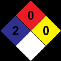

según Decreto 1496 de 2018

# PINTURA TOTAL

## Sección 1: IDENTIFICACIÓN DEL PRODUCTO

> **Nota de trazabilidad:** Elemento visual: Pictograma o gráfico de seguridad sin texto extenso
> Imagen en Sección 1: IDENTIFICACIÓN DEL PRODUCTO.
> Información relacionada en la sección correspondiente.

> **Nota de trazabilidad:** Elemento visual: Pictograma o gráfico de seguridad sin texto extenso
> Imagen en Sección 1: IDENTIFICACIÓN DEL PRODUCTO.
> Información relacionada en la sección correspondiente.

> **Nota de trazabilidad:** Elemento visual: Pictograma o gráfico de seguridad sin texto extenso
> Imagen en Sección 1: IDENTIFICACIÓN DEL PRODUCTO.
> Información relacionada en la sección correspondiente.

> **Nota de trazabilidad:** Elemento visual: Pictograma o gráfico de seguridad sin texto extenso
> Imagen en Sección 1: IDENTIFICACIÓN DEL PRODUCTO.
> Información relacionada en la sección correspondiente.

> **Nota de trazabilidad:** Elemento visual: Pictograma o gráfico de seguridad sin texto extenso
> Imagen en Sección 1: IDENTIFICACIÓN DEL PRODUCTO.
> Información relacionada en la sección correspondiente.

**1.1** **Identificador SGA del producto:** PINTURA TOTAL

**Otros medios de identificación:**

No relevante

**1.2** **Uso recomendado del producto químico y restricciones:**

Usos pertinentes: Pintura decorativa

Usos desaconsejados: Todo aquel uso no especificado en este epígrafe ni en el epígrafe 7.3

**1.3** **Datos sobre el proveedor:**

CORLANC S.A.S.
Carrera 48 N° 72 sur 01 Avenida Las Vegas
055450 Sabaneta - Antioquia - Colombia
Tfno.: +57-4-3787800
materialesypinturascorona@corona.com.co
https://www.corona.co

**1.4** **Número de teléfono para emergencias:** CISTEMA - ARL SURA 018000511414 - 0314055911

## Sección 2: IDENTIFICACIÓN DEL PELIGRO O PELIGROS

> **Nota de trazabilidad:** Elemento visual: Pictograma o gráfico de seguridad sin texto extenso
> Imagen en Sección 2: IDENTIFICACIÓN DEL PELIGRO O PELIGROS.
> Información relacionada en la sección correspondiente.

> **Nota de trazabilidad:** Elemento visual: Pictograma o gráfico de seguridad sin texto extenso
> Imagen en Sección 2: IDENTIFICACIÓN DEL PELIGRO O PELIGROS.
> Información relacionada en la sección correspondiente.

> **Nota de trazabilidad:** Elemento visual: Pictograma o gráfico de seguridad sin texto extenso
> Imagen en Sección 2: IDENTIFICACIÓN DEL PELIGRO O PELIGROS.
> Información relacionada en la sección correspondiente.

**2.1** **Clasificación de la sustancia o de la mezcla:**

**NFPA:**

Salud: 2
Inflamabilidad: 0
Inestabilidad: 0
Especiales: No relevante

**SGA:**

La clasificación del producto se ha realizado conforme con al decreto 1496 de 2018, por el cual se adopta el Sistema Globalmente
Armonizado de Clasificación y Etiquetado de Productos Químicos y se dictan otras disposiciones en materia de seguridad química.

Carc. 1B: Carcinogenicidad, Categoría 1B, H350

**2.2** **Elementos de las etiquetas del SGA, incluidos los consejos de prudencia:**

**NFPA:**

**SGA:**

**Peligro**

**Indicaciones de peligro:**

Carc. 1B: H350 - Puede provocar cáncer.

**Consejos de prudencia:**

P101: Si se necesita consultar a un médico, tener a mano el recipiente o la etiqueta del producto.
P102: Mantener fuera del alcance de los niños.
P201: Procurarse las instrucciones antes del uso.
P202: No manipular antes de haber leído y comprendido todas las precauciones de seguridad.
P308+P313: EN CASO DE exposición demostrada o supuesta: consultar a un médico.
P405: Guardar bajo llave.
P501: Eliminar el contenido/recipiente mediante el sistema de recogida selectiva habilitado en su municipio.

**Sustancias que contribuyen a la clasificación**

Dioxido de titanio (diámetro aerodinámico ≤ 10 μm); Dioxido de silicio (1 % < RCS < 10 %)

**2.3** **Otros peligros que no conducen a una clasificación:**

No relevante

                       - CONTINÚA EN LA SIGUIENTE PÁGINA 
Emisión: 04/03/2019      Revisión: 26/10/2021      Versión: 7 (sustituye a 6) **Página 1/10**

Salud: 2
Inflamabilidad: 0
Inestabilidad: 0
Especiales: No relevante

**SGA:**

La clasificación del producto se ha realizado conforme con al decreto 1496 de 2018, por el cual se adopta el Sistema Globalmente
Armonizado de Clasificación y Etiquetado de Productos Químicos y se dictan otras disposiciones en materia de seguridad química.

Carc. 1B: Carcinogenicidad, Categoría 1B, H350

**2.2** **Elementos de las etiquetas del SGA, incluidos los consejos de prudencia:**

**NFPA:**

-----

según Decreto 1496 de 2018

# PINTURA TOTAL

## Sección 3: COMPOSICIÓN/INFORMACIÓN SOBRE LOS COMPONENTES

**3.1** **Sustancias:**

No aplicable

**3.2** **Mezclas:**

**Descripción química:** Mezcla acuosa a base de aditivos, cargas, coalescentes, pigmentos y resinas

**Componentes:**

De acuerdo al Decreto 1496 de 2018, el producto presenta:

Identificación Nombre químico/clasificación Concentración

**Agua**

CAS: 7732-18-5 **25 - <50 %**

**Piedra caliza**

CAS: 1317-65-3 **10 - <25 %**

**Caolin**

CAS: 1332-58-7 **10 - <25 %**

**Dioxido de titanio (diámetro aerodinámico ≤ 10 μm)**

CAS: 13463-67-7 **2.5 - <10 %**

Carc. 2: H351 - Atención

**Dioxido de silicio (1 % < RCS < 10 %)**

CAS: 7631-86-9 **<1 %**

Carc. 1B: H350; STOT repe. 2: H373 - Peligro

Para ampliar información sobre la peligrosidad de las sustancias consultar las secciones 11, 12 y 16. La clasificación respecto
Carcinogenicidad de las sustancias se ha establecido en función de las monografías de la IARC adecuándola al sistema de clasificación
SGA, para información sobre la clasificación IARC consulte la sección 11.

## Sección 4: PRIMEROS AUXILIOS

**4.1** **Descripción de los primeros auxilios necesarios:**

Los síntomas como consecuencia de una intoxicación pueden presentarse con posterioridad a la exposición, por lo que, en caso de
duda, exposición directa al producto químico o persistencia del malestar solicitar atención médica, mostrándole la FDS de este
producto.

**Por inhalación:**

Se trata de un producto no clasificado como peligroso por inhalación, sin embargo, se recomienda en caso de síntomas de
intoxicación sacar al afectado del lugar de exposición, suministrarle aire limpio y mantenerlo en reposo. Solicitar atención médica en
el caso de que los síntomas persistan.

**Por contacto con la piel:**

En caso de contacto se recomienda limpiar la zona afecta con agua por arrastre y con jabón neutro. En caso de alteraciones en la
piel (escozor, rojez, sarpullidos, ampollas…), acudir a consulta médica con esta Ficha de Datos de Seguridad
**Por contacto con los ojos:**

Se trata de un producto que no contiene sustancias clasificadas como peligrosas en contacto con los ojos. Enjuagar durante al menos
15 minutos con abundante agua a temperatura ambiente, evitando que el afectado se frote o cierre los ojos.

**Por ingestión/aspiración:**

En caso de ingestión, solicitar asistencia médica inmediata mostrando la FDS de este producto.

**4.2** **Síntomas/efectos más importantes, agudos o retardados:**

Los efectos agudos y retardados son los indicados en las secciones 2 y 11 de la FDS.

**4.3** **Indicación de la necesidad de recibir atención médica inmediata y, en su caso, de tratamiento especial:**

No relevante

|Identificación|Nombre químico/clasificación|Concentración|
|---|---|---|
|CAS: 7732-18-5|**Agua**|**25 - <50 %**|
|CAS: 1317-65-3|**Piedra caliza**|**10 - <25 %**|
|CAS: 1332-58-7|**Caolin**|**10 - <25 %**|
|CAS: 13463-67-7|**Dioxido de titanio (diámetro aerodinámico ≤ 10 μm)** Carc. 2: H351 - Atención|**2.5 - <10 %**|
|CAS: 7631-86-9|**Dioxido de silicio (1 % < RCS < 10 %)** Carc. 1B: H350; STOT repe. 2: H373 - Peligro|**<1 %**|

SGA, para información sobre la clasificación IARC consulte la sección 11.

## Sección 4: PRIMEROS AUXILIOS

**4.1** **Descripción de los primeros auxilios necesarios:**

Los síntomas como consecuencia de una intoxicación pueden presentarse con posterioridad a la exposición, por lo que, en caso de
duda, exposición directa al producto químico o persistencia del malestar solicitar atención médica, mostrándole la FDS de este
producto.

**Por inhalación:**

Se trata de un producto no clasificado como peligroso por inhalación, sin embargo, se recomienda en caso de síntomas de
intoxicación sacar al afectado del lugar de exposición, suministrarle aire limpio y mantenerlo en reposo. Solicitar atención médica en
el caso de que los síntomas persistan.

**Por contacto con la piel:**

## Sección 5: MEDIDAS DE LUCHA CONTRA INCENDIOS

> **Nota de trazabilidad:** Elemento visual: Pictograma o gráfico de seguridad sin texto extenso
> Imagen en Sección 5: MEDIDAS DE LUCHA CONTRA INCENDIOS.
> Información relacionada en la sección correspondiente.

> **Nota de trazabilidad:** Elemento visual: Pictograma o gráfico de seguridad sin texto extenso
> Imagen en Sección 5: MEDIDAS DE LUCHA CONTRA INCENDIOS.
> Información relacionada en la sección correspondiente.

**5.1** **Medios de extinción apropiados:**

**Medios de extinción apropiados:**

Producto no inflamable bajo condiciones normales de almacenamiento, manipulación y uso. En caso de inflamación como
consecuencia de manipulación, almacenamiento o uso indebido emplear preferentemente extintores de polvo polivalente (polvo ABC).

**Medios de extinción no apropiados:**

                       - CONTINÚA EN LA SIGUIENTE PÁGINA 
Emisión: 04/03/2019      Revisión: 26/10/2021      Versión: 7 (sustituye a 6) **Página 2/10**

-----

según Decreto 1496 de 2018

# PINTURA TOTAL

No relevante

**5.2** **Peligros específicos del producto químico:**

Como consecuencia de la combustión o descomposición térmica se generan subproductos de reacción que pueden resultar altamente
tóxicos y, consecuentemente, pueden presentar un riesgo elevado para la salud.

**5.3** **Medidas especiales que deben tomar los equipos de lucha contra incendios:**

En función de la magnitud del incendio puede hacerse necesario el uso de ropa protectora completa y equipo de respiración
autónomo. Disponer de un mínimo de instalaciones de emergencia o elementos de actuación (mantas ignífugas, botiquín portátil,...).

**Disposiciones adicionales:**

Actuar conforme el Plan de Emergencia Interior y las Fichas Informativas sobre actuación ante accidentes y otras emergencias.
Suprimir cualquier fuente de ignición. En caso de incendio, refrigerar los recipientes y tanques de almacenamiento de productos
susceptibles a inflamación, explosión o BLEVE como consecuencia de elevadas temperaturas. Evitar el vertido de los productos
empleados en la extinción del incendio al medio acuático.

## Sección 6: MEDIDAS QUE DEBEN TOMARSE EN CASO DE VERTIDO ACCIDENTAL

**6.1** **Precauciones personales, equipo protector y procedimiento de emergencia:**

Aislar las fugas siempre y cuando no suponga un riesgo adicional para las personas que desempeñen esta función. Ante la exposición
potencial con el producto derramado se hace obligatorio el uso de elementos de protección personal (ver sección 8 de la FDS).
Evacuar la zona y mantener a las personas sin protección alejadas.

**6.2** **Precauciones relativas al medio ambiente:**

Producto no clasificado como peligroso para el medioambiente. Mantener el producto alejado de los desagües y de las aguas
superficiales y subterráneas.
**6.3** **Métodos y materiales para la contención y limpieza de vertidos:**

Se recomienda:

Absorber el vertido mediante arena o absorbente inerte y trasladarlo a un lugar seguro. No absorber en serrín u otros absorbentes
combustibles. Para cualquier consideración relativa a la eliminación consultar la sección 13 de la FDS.
**6.4** **Referencias a otras secciones:**

Ver secciones 8 y 13.

## Sección 7: MANIPULACIÓN Y ALMACENAMIENTO

> **Nota de trazabilidad:** Elemento visual: Pictograma o gráfico de seguridad sin texto extenso
> Imagen en Sección 7: MANIPULACIÓN Y ALMACENAMIENTO.
> Información relacionada en la sección correspondiente.

> **Nota de trazabilidad:** Elemento visual: Pictograma o gráfico de seguridad sin texto extenso
> Imagen en Sección 7: MANIPULACIÓN Y ALMACENAMIENTO.
> Información relacionada en la sección correspondiente.

> **Nota de trazabilidad:** Elemento visual: Pictograma o gráfico de seguridad sin texto extenso
> Imagen en Sección 7: MANIPULACIÓN Y ALMACENAMIENTO.
> Información relacionada en la sección correspondiente.

> **Nota de trazabilidad:** Elemento visual: Pictograma o gráfico de seguridad sin texto extenso
> Imagen en Sección 7: MANIPULACIÓN Y ALMACENAMIENTO.
> Información relacionada en la sección correspondiente.

**7.1** **Precauciones que se deben tomar para garantizar una manipulación segura:**

A.- Precauciones generales

Cumplir con la legislación vigente en materia de prevención de riesgos laborales. Mantener los recipientes herméticamente
cerrados. Controlar los derrames y residuos, eliminándolos con métodos seguros (sección 6 de la FDS). Evitar el vertido libre
desde el recipiente. Mantener orden y limpieza donde se manipulen productos peligrosos.

B.- Recomendaciones técnicas para la prevención de incendios y explosiones.

Producto no inflamable bajo condiciones normales de almacenamiento, manipulación y uso. Se recomienda trasvasar a
velocidades lentas para evitar la generación de cargas electroestáticas que pudieran afectar a productos inflamables. Consultar la
sección 10 de la FDS sobre condiciones y materias que deben evitarse.

C.- Recomendaciones técnicas para prevenir riesgos ergonómicos y toxicológicos.

Para control de exposición consultar la sección 8 de la FDS. No comer, beber ni fumar en las zonas de trabajo

lavarse las manos después de cada utilización, y despojarse de prendas de vestir y equipos de protección contaminados antes de
entrar en las zonas para comer.

D.- Recomendaciones técnicas para prevenir riesgos medioambientales

Se recomienda disponer de material absorbente en las proximidades del producto (ver epígrafe 6.3 de la FDS para mayor
información)

**7.2** **Condiciones de almacenamiento seguro, incluidas cualesquiera incompatibilidades:**

A.- Medidas técnicas de almacenamiento

Temperatura mínima: 5 ºC

Temperatura máxima: 30 ºC

Tiempo máximo: 6 meses

                       - CONTINÚA EN LA SIGUIENTE PÁGINA 
Emisión: 04/03/2019      Revisión: 26/10/2021      Versión: 7 (sustituye a 6) **Página 3/10**

Producto no clasificado como peligroso para el medioambiente. Mantener el producto alejado de los desagües y de las aguas
superficiales y subterráneas.
**6.3** **Métodos y materiales para la contención y limpieza de vertidos:**

Se recomienda:

Absorber el vertido mediante arena o absorbente inerte y trasladarlo a un lugar seguro. No absorber en serrín u otros absorbentes
combustibles. Para cualquier consideración relativa a la eliminación consultar la sección 13 de la FDS.
**6.4** **Referencias a otras secciones:**

Ver secciones 8 y 13.

## Sección 7: MANIPULACIÓN Y ALMACENAMIENTO

**7.1** **Precauciones que se deben tomar para garantizar una manipulación segura:**

-----

según Decreto 1496 de 2018

# PINTURA TOTAL

B.- Condiciones generales de almacenamiento.

Evitar fuentes de calor, radiación, electricidad estática y el contacto con alimentos. Para información adicional ver epígrafe 10.5

**7.3** **Usos específicos finales:**

Salvo las indicaciones ya especificadas no es preciso realizar ninguna recomendación especial en cuanto a los usos de este producto.

## Sección 8: CONTROLES DE EXPOSICIÓN/PROTECCIÓN PERSONAL

> **Nota de trazabilidad:** Elemento visual: Pictograma o gráfico de seguridad sin texto extenso
> Imagen en Sección 8: CONTROLES DE EXPOSICIÓN/PROTECCIÓN PERSONAL.
> Información relacionada en la sección correspondiente.

> **Nota de trazabilidad:** Elemento visual: Pictograma o gráfico de seguridad sin texto extenso
> Imagen en Sección 8: CONTROLES DE EXPOSICIÓN/PROTECCIÓN PERSONAL.
> Información relacionada en la sección correspondiente.

> **Nota de trazabilidad:** Elemento visual: Pictograma o gráfico de seguridad sin texto extenso
> Imagen en Sección 8: CONTROLES DE EXPOSICIÓN/PROTECCIÓN PERSONAL.
> Información relacionada en la sección correspondiente.

> **Nota de trazabilidad:** Elemento visual: Pictograma o gráfico de seguridad sin texto extenso
> Imagen en Sección 8: CONTROLES DE EXPOSICIÓN/PROTECCIÓN PERSONAL.
> Información relacionada en la sección correspondiente.

> **Nota de trazabilidad:** Elemento visual: Pictograma o gráfico de seguridad sin texto extenso
> Imagen en Sección 8: CONTROLES DE EXPOSICIÓN/PROTECCIÓN PERSONAL.
> Información relacionada en la sección correspondiente.

> **Nota de trazabilidad:** Elemento visual: Pictograma o gráfico de seguridad sin texto extenso
> Imagen en Sección 8: CONTROLES DE EXPOSICIÓN/PROTECCIÓN PERSONAL.
> Información relacionada en la sección correspondiente.

> **Nota de trazabilidad:** Elemento visual: Pictograma o gráfico de seguridad sin texto extenso
> Imagen en Sección 8: CONTROLES DE EXPOSICIÓN/PROTECCIÓN PERSONAL.
> Información relacionada en la sección correspondiente.

**8.1** **Parámetros de control:**

Sustancias cuyos valores límite de exposición profesional han de controlarse en el ambiente de trabajo:

OSHA (Tablas Z):

Identificación Valores límite ambientales

Dioxido de titanio (diámetro aerodinámico ≤ 10 μm) 8-hour TWA PEL 15 mg/m³

Ceiling Values - TWA
CAS: 13463-67-7
PEL

ACGIH:

Identificación Valores límite ambientales

Piedra caliza TLV-TWA 10 mg/m³

CAS: 1317-65-3 TLV-STEL 20 mg/m³

Caolin TLV-TWA 2 mg/m³

CAS: 1332-58-7 TLV-STEL

Dioxido de titanio (diámetro aerodinámico ≤ 10 μm) TLV-TWA 10 mg/m³

CAS: 13463-67-7 TLV-STEL

**8.2** **Controles técnicos apropiados:**

A.- Medidas de protección individual, como equipo de protección personal (EPP)

Realizar la identificación de los peligros y la valoración de los riesgos de acuerdo a la Guia técnica colombiana GTC 45. Como
medida de prevención se recomienda la utilización de equipos de protección individual básicos. Para más información sobre los
equipos de protección individual (almacenamiento, uso, limpieza, mantenimiento, clase de protección,…) consultar el folleto
informativo facilitado por el fabricante del EPP. Las indicaciones contenidas en este punto se refieren al producto puro. Las
medidas de protección para el producto diluido podrán variar en función de su grado de dilución, uso, método de aplicación, etc.
Para determinar la obligación de instalación de duchas de emergencia y/o lavaojos en los almacenes se tendrá en cuenta la
normativa referente al almacenamiento de productos químicos aplicable en cada caso. Para más información ver epígrafes 7.1 y
7.2 de la FDS.
Toda la información aquí incluida es una recomendación siendo necesario su concreción por parte de los servicios de prevención
de riesgos laborales al desconocer las medidas de prevención adicionales que la empresa pudiese disponer.

B.- Protección respiratoria.

Pictograma EPP Observaciones

NOMATIVIDAD APLICABLE: NTC 1584, NTC 1589, NTC 3851 y NTC 1728. Reemplazar

cuando se detecte olor o sabor del contaminante en el interior de la máscara o

Máscara autofiltrante para gases y vapores

adaptador facial. Cuando el contaminante no tiene buenas propiedades de aviso se

Protección obligatoria recomienda el uso de equipos aislantes.

de las vías
respiratorias

C.- Protección específica de las manos.

Pictograma EPP Observaciones

NORMATIVIDAD APLICABLE: NTC 3398, EN 374 y EN420. El tiempo de paso
(Breakthrough Time) indicado por el fabricante ha de ser superior al del tiempo de

Guantes NO desechables de protección química

uso del producto. No emplear cremas protectoras después del contacto del producto

Protección obligatoria con la piel.

de la manos
Dado que el producto es una mezcla de diferentes materiales, la resistencia del material de los guantes no se puede calcular de
antemano con total fiabilidad y por lo tanto tiene que ser controlados antes de su aplicación.
D.- Protección ocular y facial

                       - CONTINÚA EN LA SIGUIENTE PÁGINA 
Emisión: 04/03/2019      Revisión: 26/10/2021      Versión: 7 (sustituye a 6) **Página 4/10**

|Identificación|Valores límite ambientales|Col3|Col4|
|---|---|---|---|
|Dioxido de titanio (diámetro aerodinámico ≤ 10 μm) CAS: 13463-67-7|8-hour TWA PEL||15 mg/m³|
|Dioxido de titanio (diámetro aerodinámico ≤ 10 μm) CAS: 13463-67-7|Ceiling Values - TWA PEL|||

|Identificación|Valores límite ambientales|Col3|Col4|
|---|---|---|---|
|Piedra caliza CAS: 1317-65-3|TLV-TWA||10 mg/m³|
|Piedra caliza CAS: 1317-65-3|TLV-STEL||20 mg/m³|
|Caolin CAS: 1332-58-7|TLV-TWA||2 mg/m³|
|Caolin CAS: 1332-58-7|TLV-STEL|||
|Dioxido de titanio (diámetro aerodinámico ≤ 10 μm) CAS: 13463-67-7|TLV-TWA||10 mg/m³|
|Dioxido de titanio (diámetro aerodinámico ≤ 10 μm) CAS: 13463-67-7|TLV-STEL|||

|EPP|Observaciones|
|---|---|
|Máscara autofiltrante para gases y vapores|NOMATIVIDAD APLICABLE: NTC 1584, NTC 1589, NTC 3851 y NTC 1728. Reemplazar cuando se detecte olor o sabor del contaminante en el interior de la máscara o adaptador facial. Cuando el contaminante no tiene buenas propiedades de aviso se recomienda el uso de equipos aislantes.|

|EPP|Observaciones|
|---|---|
|Guantes NO desechables de protección química|NORMATIVIDAD APLICABLE: NTC 3398, EN 374 y EN420. El tiempo de paso (Breakthrough Time) indicado por el fabricante ha de ser superior al del tiempo de uso del producto. No emplear cremas protectoras después del contacto del producto con la piel.|

CAS: 1332-58-7 TLV-STEL

Dioxido de titanio (diámetro aerodinámico ≤ 10 μm) TLV-TWA 10 mg/m³

CAS: 13463-67-7 TLV-STEL

**8.2** **Controles técnicos apropiados:**

A.- Medidas de protección individual, como equipo de protección personal (EPP)

Realizar la identificación de los peligros y la valoración de los riesgos de acuerdo a la Guia técnica colombiana GTC 45. Como
medida de prevención se recomienda la utilización de equipos de protección individual básicos. Para más información sobre los
equipos de protección individual (almacenamiento, uso, limpieza, mantenimiento, clase de protección,…) consultar el folleto
informativo facilitado por el fabricante del EPP. Las indicaciones contenidas en este punto se refieren al producto puro. Las
medidas de protección para el producto diluido podrán variar en función de su grado de dilución, uso, método de aplicación, etc.
Para determinar la obligación de instalación de duchas de emergencia y/o lavaojos en los almacenes se tendrá en cuenta la
normativa referente al almacenamiento de productos químicos aplicable en cada caso. Para más información ver epígrafes 7.1 y
7.2 de la FDS.

-----

según Decreto 1496 de 2018

# PINTURA TOTAL

Pictograma EPP Observaciones

NORMATIVIDAD APLICABLE: NTC 1825, NTC 1826 y ANSI Z87.1. Limpiar a diario y

Pantalla facial desinfectar periódicamente de acuerdo a las instrucciones del fabricante. Se

recomienda su uso en caso de riesgo de salpicaduras.
Protección obligatoria

de la cara
E.- Protección corporal

Pictograma EPP Observaciones

NORMATIVIDAD APLICABLE: EN ISO 13688 y EN 14605. Uso exclusivo en el trabajo.
Prenda de protección frente a riesgos químicos

Limpiar periódicamente de acuerdo a las instrucciones del fabricante.

Protección obligatoria

del cuerpo

NORMATIVIDAD APLICABLE: NTC-ISO 20345 y NTC 2257. Reemplazar las botas ante
Calzado de seguridad contra riesgo químico

cualquier indicio de deterioro.

Protección obligatoria

de los pies
F.- Medidas complementarias de emergencia

Medida de emergencia Normas Medida de emergencia Normas

ANSI Z358-1 DIN 12 899
ISO 3864-1:2011, ISO 3864-4:2011 ISO 3864-1:2011, ISO 3864-4:2011

Ducha de emergencia Lavaojos

**Controles de la exposición del medio ambiente:**

Se recomienda evitar el vertido tanto del producto como de su envase al medio ambiente. Para información adicional ver epígrafe
7.1.D de la FDS.
**NTC 6018- Etiquetas ambientales tipo I. Sello ambiental colombiano. Criterios ambientales para pinturas y materiales**
**de recubrimiento (determinados de acuerdo con la norma ASTM D6886):**

Compuestos orgánicos volátiles: 1,01 % peso

Concentración C.O.V. a 20 ºC: 14,68 kg/m³ (14,68 g/L)

## Sección 9: PROPIEDADES FÍSICAS Y QUÍMICAS Y CARACTERÍSTICAS DE SEGURIDAD

> **Nota de trazabilidad:** Elemento visual: Pictograma o gráfico de seguridad sin texto extenso
> Imagen en Sección 9: PROPIEDADES FÍSICAS Y QUÍMICAS Y CARACTERÍSTICAS DE SEGURIDAD.
> Información relacionada en la sección correspondiente.

> **Nota de trazabilidad:** Elemento visual: Pictograma o gráfico de seguridad sin texto extenso
> Imagen en Sección 9: PROPIEDADES FÍSICAS Y QUÍMICAS Y CARACTERÍSTICAS DE SEGURIDAD.
> Información relacionada en la sección correspondiente.

**9.1** **Información de propiedades físicas y químicas básicas:**

Para completar la información ver la ficha técnica/hoja de especificaciones del producto.

**Aspecto físico:**

Estado físico a 20 ºC: Líquido

Aspecto: Dispersión

Color: Blanco

Olor: Característico

Umbral olfativo: No relevante *

**Volatilidad:**

Temperatura de ebullición a presión atmosférica: 102 ºC

Presión de vapor a 20 ºC: 2335 Pa

Presión de vapor a 50 ºC: 12302,1 Pa (12,3 kPa)

Tasa de evaporación a 20 ºC: No relevante *

**Caracterización del producto:**

Densidad a 20 ºC: 1451 kg/m³

Densidad relativa a 20 ºC: 1,451

Viscosidad dinámica a 20 ºC: No relevante *

*No relevante debido a la naturaleza del producto, no aportando información característica de su peligrosidad.

                       - CONTINÚA EN LA SIGUIENTE PÁGINA 
Emisión: 04/03/2019      Revisión: 26/10/2021      Versión: 7 (sustituye a 6) **Página 5/10**

|Pictograma|EPP|Observaciones|
|---|---|---|
|Protección obligatoria de la cara|Pantalla facial|NORMATIVIDAD APLICABLE: NTC 1825, NTC 1826 y ANSI Z87.1. Limpiar a diario y desinfectar periódicamente de acuerdo a las instrucciones del fabricante. Se recomienda su uso en caso de riesgo de salpicaduras.|

|Pictograma|EPP|Observaciones|
|---|---|---|
|Protección obligatoria del cuerpo|Prenda de protección frente a riesgos químicos|NORMATIVIDAD APLICABLE: EN ISO 13688 y EN 14605. Uso exclusivo en el trabajo. Limpiar periódicamente de acuerdo a las instrucciones del fabricante.|
|Protección obligatoria de los pies|Calzado de seguridad contra riesgo químico|NORMATIVIDAD APLICABLE: NTC-ISO 20345 y NTC 2257. Reemplazar las botas ante cualquier indicio de deterioro.|

|Medida de emergencia|Normas|Medida de emergencia|Normas|
|---|---|---|---|
|Ducha de emergencia|ANSI Z358-1 ISO 3864-1:2011, ISO 3864-4:2011|Lavaojos|DIN 12 899 ISO 3864-1:2011, ISO 3864-4:2011|

ANSI Z358-1 DIN 12 899
ISO 3864-1:2011, ISO 3864-4:2011 ISO 3864-1:2011, ISO 3864-4:2011

Ducha de emergencia Lavaojos

**Controles de la exposición del medio ambiente:**

Se recomienda evitar el vertido tanto del producto como de su envase al medio ambiente. Para información adicional ver epígrafe
7.1.D de la FDS.
**NTC 6018- Etiquetas ambientales tipo I. Sello ambiental colombiano. Criterios ambientales para pinturas y materiales**
**de recubrimiento (determinados de acuerdo con la norma ASTM D6886):**

Compuestos orgánicos volátiles: 1,01 % peso

Concentración C.O.V. a 20 ºC: 14,68 kg/m³ (14,68 g/L)

## Sección 9: PROPIEDADES FÍSICAS Y QUÍMICAS Y CARACTERÍSTICAS DE SEGURIDAD

-----

según Decreto 1496 de 2018

# PINTURA TOTAL

Viscosidad cinemática a 20 ºC: No relevante *

Viscosidad cinemática a 40 ºC: No relevante *

Concentración: No relevante *

pH: No relevante *

Densidad de vapor a 20 ºC: No relevante *

Coeficiente de reparto n-octanol/agua a 20 ºC: No relevante *

Solubilidad en agua a 20 ºC:

Propiedad de solubilidad: No relevante *

Temperatura de descomposición: No relevante *

Punto de fusión/punto de congelación: No relevante *

Propiedades explosivas: No relevante *

Propiedades comburentes: No relevante *

**Inflamabilidad:**

Punto de inflamación: No inflamable (>93 ºC)

Calor de combustión: No relevante *

Inflamabilidad (sólido, gas): No relevante *

Temperatura de auto-inflamación: 330 ºC

## Sección 10: ESTABILIDAD Y REACTIVIDAD

> **Nota de trazabilidad:** Elemento visual: Pictograma o gráfico de seguridad sin texto extenso
> Imagen en Sección 10: ESTABILIDAD Y REACTIVIDAD.
> Información relacionada en la sección correspondiente.

Límite de inflamabilidad inferior: No relevante *

Límite de inflamabilidad superior: No relevante *

**Explosividad:**

Límite inferior de explosividad: No relevante *

Límite superior de explosividad: No relevante *

**9.2** **Información adicional:**

Tensión superficial a 20 ºC: No relevante *

Índice de refracción: No relevante *

*No relevante debido a la naturaleza del producto, no aportando información característica de su peligrosidad.

## Sección 10: ESTABILIDAD Y REACTIVIDAD

**10.1 Reactividad:**

No se esperan reacciones peligrosas si se cumplen las instrucciones técnicas de almacenamiento de productos químicos. Ver sección
7 de la FDS para mayor información.

**10.2 Estabilidad química:**

Estable químicamente bajo las condiciones indicadas de almacenamiento, manipulación y uso.

**10.3 Posibilidad de reacciones peligrosas:**

Bajo las condiciones indicadas no se esperan reacciones peligrosas ni polimerización peligrosa que puedan producir una presión o
temperaturas excesivas.

**10.4 Condiciones que deben evitarse:**

Aplicables para manipulación y almacenamiento a temperatura ambiente:

Choque y fricción Contacto con el aire Calentamiento Luz Solar Humedad

No aplicable No aplicable No aplicable No aplicable No aplicable

**10.5 Materiales incompatibles:**

Ácidos Agua Materias comburentes Materias combustibles Otros

Evitar ácidos fuertes No aplicable No aplicable No aplicable Evitar álcalis o bases fuertes

**10.6 Productos de descomposición peligrosos:**

Ver epígrafe 10.3, 10.4 y 10.5 de la FDS para conocer los productos de descomposición específicamente. En dependencia de las
condiciones de descomposición, como consecuencia de la misma pueden liberarse mezclas complejas de sustancias químicas: dióxido
de carbono (CO2), monóxido de carbono y otros compuestos orgánicos.

                       - CONTINÚA EN LA SIGUIENTE PÁGINA 
Emisión: 04/03/2019      Revisión: 26/10/2021      Versión: 7 (sustituye a 6) **Página 6/10**

|Choque y fricción|Contacto con el aire|Calentamiento|Luz Solar|Humedad|
|---|---|---|---|---|
|No aplicable|No aplicable|No aplicable|No aplicable|No aplicable|

|Ácidos|Agua|Materias comburentes|Materias combustibles|Otros|
|---|---|---|---|---|
|Evitar ácidos fuertes|No aplicable|No aplicable|No aplicable|Evitar álcalis o bases fuertes|

-----

según Decreto 1496 de 2018

# PINTURA TOTAL

## Sección 11: INFORMACIÓN TOXICOLÓGICA

> **Nota de trazabilidad:** Elemento visual: Pictograma o gráfico de seguridad sin texto extenso
> Imagen en Sección 11: INFORMACIÓN TOXICOLÓGICA.
> Información relacionada en la sección correspondiente.

> **Nota de trazabilidad:** Elemento visual: Pictograma o gráfico de seguridad sin texto extenso
> Imagen en Sección 11: INFORMACIÓN TOXICOLÓGICA.
> Información relacionada en la sección correspondiente.

**11.1 Información sobre las posibles vías de exposición:**

No se dispone de datos experimentales del producto en sí mismo relativos a las propiedades toxicológicas

**Efectos peligrosos para la salud:**

En caso de exposición repetitiva, prolongada o a concentraciones superiores a las establecidas por los límites de exposición
profesionales, pueden producirse efectos adversos para la salud en función de la vía de exposición:
A- Ingestión (efecto agudo):

       - Toxicidad aguda: A la vista de los datos disponibles, no se cumplen los criterios de clasificación, no presentando sustancias
clasificadas como peligrosas por ingestión. Para más información ver sección 3 de la FDS.

        - Corrosividad/Irritabilidad: A la vista de los datos disponibles, no se cumplen los criterios de clasificación, no presentando
sustancias clasificadas como peligrosas por este efecto. Para más información ver sección 3 de la FDS.

B- Inhalación (efecto agudo):

       - Toxicidad aguda: A la vista de los datos disponibles, no se cumplen los criterios de clasificación, no presentando sustancias
clasificadas como peligrosas por inhalación. Para más información ver sección 3 de la FDS.

        - Corrosividad/Irritabilidad: A la vista de los datos disponibles, no se cumplen los criterios de clasificación, no presentando
sustancias clasificadas como peligrosas por este efecto. Para más información ver sección 3 de la FDS.

C- Contacto con la piel y los ojos (efecto agudo):

       - Contacto con la piel: A la vista de los datos disponibles, no se cumplen los criterios de clasificación, no presentando sustancias
clasificadas como peligrosas por contacto con la piel. Para más información ver sección 3 de la FDS.

       - Contacto con los ojos: A la vista de los datos disponibles, no se cumplen los criterios de clasificación, no presentando
sustancias clasificadas como peligrosas por este efecto. Para más información ver sección 3 de la FDS.

D- Efectos CMR (carcinogenicidad, mutagenicidad y toxicidad para la reproducción):

       - Carcinogenicidad: La exposición a este producto puede causar cáncer. Para más información sobre posibles efectos específicos
sobre la salud ver sección 2 de la FDS.

IARC: White mineral oil, <=20.5mm2/s (40ºC) (3); Dioxido de titanio (diámetro aerodinámico ≤ 10 μm) (2B); Dioxido de silicio
(1 % < RCS < 10 %) (3); Destilados (petróleo), fracción ligera tratada con hidrógeno (3)

       - Mutagenicidad: A la vista de los datos disponibles, no se cumplen los criterios de clasificación, no presentando sustancias
clasificadas como peligrosas por este efecto. Para más información ver sección 3 de la FDS.

       - Toxicidad para la reproducción: A la vista de los datos disponibles, no se cumplen los criterios de clasificación, no presentando
sustancias clasificadas como peligrosas por este efecto. Para más información ver sección 3 de la FDS.

E- Efectos de sensibilización:

       - Respiratoria: A la vista de los datos disponibles, no se cumplen los criterios de clasificación, no presentando sustancias
clasificadas como peligrosas con efectos sensibilizantes. Para más información ver secciones 2, 3 y 15 de la FDS.

       - Cutánea: A la vista de los datos disponibles, no se cumplen los criterios de clasificación, no presentando sustancias clasificadas
como peligrosas por este efecto. Para más información ver sección 3 de la FDS.

F- Toxicidad específica en determinados órganos (STOT)-exposición única:

A la vista de los datos disponibles, no se cumplen los criterios de clasificación, no presentando sustancias clasificadas como
peligrosas por este efecto. Para más información ver sección 3 de la FDS.

G- Toxicidad específica en determinados órganos (STOT)-exposición repetida:

       - Toxicidad específica en determinados órganos (STOT)-exposición repetida: A la vista de los datos disponibles, no se cumplen
los criterios de clasificación, sin embargo, presenta sustancias clasificadas como peligrosas por inhalación. Para más información
ver sección 3 de la FDS.

        - Piel: A la vista de los datos disponibles, no se cumplen los criterios de clasificación, no presentando sustancias clasificadas
como peligrosas por este efecto. Para más información ver sección 3 de la FDS.

H- Peligro por aspiración:

A la vista de los datos disponibles, no se cumplen los criterios de clasificación, no presentando sustancias clasificadas como
peligrosas por este efecto. Para más información ver sección 3 de la FDS.
**Información adicional:**

CAS 13463-67-7 Dióxido de Titanio: IARC lista esta sustancia como un posible carcinógeno humano (grupo 2B), indicando que hay
suficientes evidencias para considerarlo carcinógeno en animales pero insuficientes para considerarlo como carcinógeno para seres
humanos.
La monografía de IARC para esta sustancia indica que no hay exposición significativa al dióxido de titanio durante el uso normal de
productos en los que dióxido de titanio está unido permanentemente a otros materiales, tales como pinturas (Ref: Monografía IARC,
Vol. 93, 2010).
El lijado repetido de las superficies de película seca puede producir riesgo de sobreexposición al polvo dependiendo de la duración y
nivel de lijado, para evitarla deben tomarse las medidas de protección adecuadas.

                       - CONTINÚA EN LA SIGUIENTE PÁGINA 
Emisión: 04/03/2019 Revisión: 26/10/2021 Versión: 7 (sustituye a 6) **Página 7/10**

-----

según Decreto 1496 de 2018

# PINTURA TOTAL

**Información toxicológica específica de las sustancias:**

Identificación Toxicidad aguda Género

Dioxido de titanio (diámetro aerodinámico ≤ 10 μm) DL50 oral 10000 mg/kg Rata

CAS: 13463-67-7 DL50 cutánea 10000 mg/kg Conejo

CL50 inhalación No relevante

Caolin DL50 oral 5100 mg/kg Rata

CAS: 1332-58-7 DL50 cutánea 5100 mg/kg Rata

CL50 inhalación No relevante

Piedra caliza DL50 oral 5100 mg/kg Rata

CAS: 1317-65-3 DL50 cutánea No relevante

CL50 inhalación No relevante

Dioxido de silicio (1 % < RCS < 10 %) DL50 oral 5100 mg/kg Rata

CAS: 7631-86-9 DL50 cutánea 5100 mg/kg Conejo

CL50 inhalación No relevante

|Identificación|Toxicidad aguda|Col3|Género|
|---|---|---|---|
|Dioxido de titanio (diámetro aerodinámico ≤ 10 μm) CAS: 13463-67-7|DL50 oral|10000 mg/kg|Rata|
|Dioxido de titanio (diámetro aerodinámico ≤ 10 μm) CAS: 13463-67-7|DL50 cutánea|10000 mg/kg|Conejo|
|Dioxido de titanio (diámetro aerodinámico ≤ 10 μm) CAS: 13463-67-7|CL50 inhalación|No relevante||
|Caolin CAS: 1332-58-7|DL50 oral|5100 mg/kg|Rata|
|Caolin CAS: 1332-58-7|DL50 cutánea|5100 mg/kg|Rata|
|Caolin CAS: 1332-58-7|CL50 inhalación|No relevante||
|Piedra caliza CAS: 1317-65-3|DL50 oral|5100 mg/kg|Rata|
|Piedra caliza CAS: 1317-65-3|DL50 cutánea|No relevante||
|Piedra caliza CAS: 1317-65-3|CL50 inhalación|No relevante||
|Dioxido de silicio (1 % < RCS < 10 %) CAS: 7631-86-9|DL50 oral|5100 mg/kg|Rata|
|Dioxido de silicio (1 % < RCS < 10 %) CAS: 7631-86-9|DL50 cutánea|5100 mg/kg|Conejo|
|Dioxido de silicio (1 % < RCS < 10 %) CAS: 7631-86-9|CL50 inhalación|No relevante||

## Sección 12: INFORMACIÓN ECOTOXICOLÓGICA

No se disponen de datos experimentales de la mezcla en sí misma relativos a las propiedades ecotoxicológicas.

**12.1 Toxicidad:**

Identificación Toxicidad aguda

Caolin CL50 No relevante

CAS: 1332-58-7 CE50 1100 mg/L (48 h)

CE50 No relevante

**12.2 Persistencia y degradabilidad:**

No disponible

**12.3 Potencial de bioacumulación:**

No determinado

**12.4 Movilidad en el suelo:**

No determinado

**12.5 Resultados de la valoración PBT y mPmB:**

No aplicable

**12.6 Otros efectos adversos:**

No descritos

|Identificación|Toxicidad aguda|Col3|Especie|Género|
|---|---|---|---|---|
|Caolin CAS: 1332-58-7|CL50|No relevante|||
|Caolin CAS: 1332-58-7|CE50|1100 mg/L (48 h)|Daphnia pulex|Crustáceo|
|Caolin CAS: 1332-58-7|CE50|No relevante|||

Identificación Toxicidad aguda Especie Género

Caolin CL50 No relevante

CAS: 1332-58-7 CE50 1100 mg/L (48 h) Daphnia pulex Crustáceo

CE50 No relevante

**12.2 Persistencia y degradabilidad:**

No disponible

**12.3 Potencial de bioacumulación:**

No determinado

**12.4 Movilidad en el suelo:**

No determinado

**12.5 Resultados de la valoración PBT y mPmB:**

## Sección 13: INFORMACIÓN RELATIVA A LA ELIMINACIÓN DE LOS PRODUCTOS

**13.1 Métodos de eliminación:**

**Gestión del residuo (eliminación y valorización):**

Consultar al gestor de residuos autorizado las operaciones de valorización y eliminación. En el caso de que el envase haya estado en
contacto directo con el producto se gestionará del mismo modo que el propio producto, en caso contrario se gestionará como residuo
no peligroso. Se desaconseja su vertido a cursos de agua. Ver epígrafe 6.2.

**Disposiciones legislativas relacionadas con la gestión de residuos:**

Legislación relacionada con la gestión de residuos:

Decreto 1076 de 2015 (Decreto único reglamentario del Sector Ambiente y Desarrollo Sostenible)

## Sección 14: INFORMACIÓN RELATIVA AL TRANSPORTE

> **Nota de trazabilidad:** Elemento visual: Pictograma o gráfico de seguridad sin texto extenso
> Imagen en Sección 14: INFORMACIÓN RELATIVA AL TRANSPORTE.
> Información relacionada en la sección correspondiente.

> **Nota de trazabilidad:** Elemento visual: Pictograma o gráfico de seguridad sin texto extenso
> Imagen en Sección 14: INFORMACIÓN RELATIVA AL TRANSPORTE.
> Información relacionada en la sección correspondiente.

Este producto no está regulado para su transporte

                       - CONTINÚA EN LA SIGUIENTE PÁGINA 
Emisión: 04/03/2019      Revisión: 26/10/2021      Versión: 7 (sustituye a 6) **Página 8/10**

-----

según Decreto 1496 de 2018

# PINTURA TOTAL

## Sección 15: INFORMACIÓN SOBRE LA REGLAMENTACIÓN

**15.1 Disposiciones específicas sobre seguridad, salud y medio ambiente para el producto de que se trate:**

NTP (National Toxicology Program): Dioxido de silicio (1 % < RCS < 10 %)

**Disposiciones particulares en materia de protección de las personas o el medio ambiente:**

Se recomienda emplear la información recopilada en esta hoja de datos de seguridad de materiales como datos de entrada en una
evaluación de riesgos de las circunstancias locales con el objeto de establecer las medidas necesarias de prevención de riesgos para
el manejo, utilización, almacenamiento y eliminación de este producto.

**Otras legislaciones:**

Resolución 0312 de 2019 – Nuevos estándares mínimos del SG-SST
CONPES 3868 - Política de gestión del riesgo asociado al uso de sustancias químicas.
Decreto 1079 de 2015 - Decreto único reglamentario del sector transporte
NTC 1692 -Transporte de mercancías peligrosas. Definiciones, clasificación, marcado, etiquetado y rotulado
NTC 4532- Transporte de mercancías peligrosas. Tarjetas de emergencia para transporte de materiales. Elaboración
Decreto número 4741 de 2005
Decreto 1299 de 2008 -Reglamenta departamento de gestión ambiental de empresas a nivel industrial estado
Decreto 321 de 1999 - Adopta el Plan Nacional de Contingencia contra derrames de hidrocarburos, derivados y sustancias nocivas.
NTC 4702 - 1 -Embalaje y Envases para Transporte de Mercancías Peligrosas Clase 1. Explosivos
NTC 4702 - 2 - Embalaje y Envases para Transporte de Mercancías Peligrosas Clase 2. Gases
NTC 4702 - 3 - Embalaje y Envases para Transporte de Mercancías Peligrosas Clase 3. Líquidos Inflamables
NTC 4702 - 4 - Embalaje y Envases para Transporte de Mercancías Peligrosas Clase 4. Sólidos Inflamables, Sustancias que presentan
riesgo de combustión espontánea, sustancias que en contacto con el agua desprenden gases inflamables.
NTC 4702 - 5 - Embalaje y Envases para Transporte de Mercancías Peligrosas Clase 5. Sustancias Comburentes y Peróxidos Orgánicos
NTC 4702 - 6 - Embalaje y Envases para Transporte de Mercancías Peligrosas Clase 6. Sustancias Tóxicas e Infecciosas
NTC 4702 - 8 - Embalaje y Envases para Transporte de Mercancías Peligrosas Clase 8. Sustancias Corrosivas
NTC 4702 - 9 - Embalaje y Envases para Transporte de Mercancías Peligrosas Clase 9. Sustancias Peligrosas varias

Ley 2041 de 2020 - Por medio de la cual se garantiza el derecho de las personas a desarrollarse física e intelectualmente en un
ambiente libre de plomo, fijando límites para su contenido en productos comercializados en el país.

## Sección 16: OTRAS INFORMACIONES

> **Nota de trazabilidad:** Elemento visual: Pictograma o gráfico de seguridad sin texto extenso
> Imagen en Sección 16: OTRAS INFORMACIONES.
> Información relacionada en la sección correspondiente.

> **Nota de trazabilidad:** Elemento visual: Pictograma o gráfico de seguridad sin texto extenso
> Imagen en Sección 16: OTRAS INFORMACIONES.
> Información relacionada en la sección correspondiente.

**Legislación aplicable a fichas de datos de seguridad:**
Esta hoja de datos de seguridad de materiales se ha desarrollado de acuerdo a la norma técnica colombiana NTC 4435:2010
**Textos de las frases legislativas contempladas en la sección 2:**
H350: Puede provocar cáncer.
**Textos de las frases legislativas contempladas en la sección 3:**
Las frases indicadas no se refieren al producto en sí, son sólo a título informativo y hacen referencia a los componentes individuales
que aparecen en la sección 3

**SGA:**

Carc. 1B: H350 - Puede provocar cáncer.
Carc. 2: H351 - Susceptible de provocar cáncer (Inhalación).
STOT repe. 2: H373 - Puede provocar daños en los órganos tras exposiciones prolongadas o repetidas (Inhalación).

**Consejos relativos a la formación:**
Se recomienda formación mínima en materia de prevención de riesgos laborales al personal que va a manipular este producto, con la
finalidad de facilitar la comprensión e interpretación de esta hoja de datos de seguridad de materiales, así como del etiquetado del
producto.

**Principales fuentes bibliográficas:**
Instituto Colombiano de Normas Técnicas y Certificación (ICONTEC).
IARC: Agencia Internacional para la Investigación sobre Cáncer.
OSHA: Occupational Safety and Health Administration, U.S Department of Labor.
NTP: National Toxicology Program.
TOXNET: Toxicology data network.

**Abreviaturas y acrónimos:**

                       - CONTINÚA EN LA SIGUIENTE PÁGINA 
Emisión: 04/03/2019      Revisión: 26/10/2021      Versión: 7 (sustituye a 6) **Página 9/10**

NTC 4702 - 8 - Embalaje y Envases para Transporte de Mercancías Peligrosas Clase 8. Sustancias Corrosivas
NTC 4702 - 9 - Embalaje y Envases para Transporte de Mercancías Peligrosas Clase 9. Sustancias Peligrosas varias

Ley 2041 de 2020 - Por medio de la cual se garantiza el derecho de las personas a desarrollarse física e intelectualmente en un
ambiente libre de plomo, fijando límites para su contenido en productos comercializados en el país.

## Sección 16: OTRAS INFORMACIONES

**Legislación aplicable a fichas de datos de seguridad:**
Esta hoja de datos de seguridad de materiales se ha desarrollado de acuerdo a la norma técnica colombiana NTC 4435:2010
**Textos de las frases legislativas contempladas en la sección 2:**
H350: Puede provocar cáncer.
**Textos de las frases legislativas contempladas en la sección 3:**

-----

según Decreto 1496 de 2018

# PINTURA TOTAL

IMDG: Código Marítimo Internacional de Mercancías Peligrosas
IATA: Asociación Internacional de Transporte Aéreo
OACI: Organización de Aviación Civil Internacional
DQO: Demanda Química de Oxígeno
DBO5: Demanda Biológica de Oxígeno a los 5 días
BCF: Factor de bioconcentración
DL50: Dosis Letal 50
CL50: Concentración Letal 50
EC50: Concentración Efectiva 50
Log POW: Logaritmo Coeficiente Partición Octanol-Agua
Koc: Coeficiente de Partición del Carbono Orgánico

La información contenida en esta ficha de datos de seguridad está fundamentada en fuentes, conocimientos técnicos y legislación vigente a nivel europeo y estatal, no pudiendo garantizar la
exactitud de la misma. Esta información no es posible considerarla como una garantía de las propiedades del producto, se trata simplemente de una descripción en cuanto a los requerimientos en
materia de seguridad. La metodología y condiciones de trabajo de los usuarios de este producto se encuentran fuera de nuestro conocimiento y control, siendo siempre responsabilidad última del
usuario tomar las medidas necesarias para adecuarse a las exigencias legislativas en cuanto a manipulación, almacenamiento, uso y eliminación de productos químicos. La información de esta
ficha de datos de seguridad de materiales únicamente se refiere a este producto, el cual no debe emplearse con fines distintos a los que se especifican.

FIN DE LA FICHA DE DATOS DE SEGURIDAD

Emisión: 04/03/2019      Revisión: 26/10/2021      Versión: 7 (sustituye a 6) **Página 10/10**

-----

