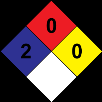
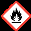

## Sección 1: IDENTIFICACIÓN DEL PRODUCTO 1.1 Identificador SGA del producto: PINTURA SEÑALIZACIÓN Y DEMARCACIÓN Otros medios de identificación: No relevante 1.2 Uso recomendado del producto químico y restricciones: Usos pertinentes: Pintura para señalización de tráfico Usos desaconsejados: Todo aquel uso no especificado en este epígrafe ni en el epígrafe 7.3 1.3 Datos sobre el proveedor: CORLANC S.A.S. Carrera 48 N° 72 sur 01 Avenida Las Vegas 055450 Sabaneta - Antioquia - Colombia Tfno.: +57-4-3787800 materialesypinturascorona@corona.com.co https://www.corona.co 1.4 Número de teléfono para emergencias: CISTEMA - ARL SURA 018000511414 - 0314055911 SECCIÓN 2: IDENTIFICACIÓN DEL PELIGRO O PELIGROS 2.1 Clasificación de la sustancia o de la mezcla: NFPA: Salud: 2 Inflamabilidad: 0 Inestabilidad: 0 Especiales: No relevante SGA: La clasificación del producto se ha realizado conforme con al decreto 1496 de 2018, por el cual se adopta el Sistema Globalmente Armonizado de Clasificación y Etiquetado de Productos Químicos y se dictan otras disposiciones en materia de seguridad química. Acuático agudo. 2: Peligrosidad aguda para el medio ambiente acuático, Categoría 2, H401 Carc. 2: Carcinogenicidad, Categoría 2, H351 2.2 Elementos de las etiquetas del SGA, incluidos los consejos de prudencia: NFPA: + SGA: Atención Indicaciones de peligro: Acuático agudo. 2: H401 - Tóxico para los organismos acuáticos. Carc. 2: H351 - Susceptible de provocar cáncer (Inhalación). Consejos de prudencia: P101: Si se necesita consultar a un médico, tener a mano el recipiente o la etiqueta del producto. P102: Mantener fuera del alcance de los niños. P201: Procurarse las instrucciones antes del uso. P202: No manipular antes de haber leído y comprendido todas las precauciones de seguridad. P273: No dispersar en el medio ambiente. P308+P313: EN CASO DE exposición demostrada o supuesta: consultar a un médico. P405: Guardar bajo llave. P501: Eliminar el contenido/recipiente mediante el sistema de recogida selectiva habilitado en su municipio. Sustancias que contribuyen a la clasificación Dioxido de titanio (diámetro aerodinámico ≤ 10 μm)

> **Nota de trazabilidad:** Elemento visual sin texto identificable.
> Imagen en Sección 1: IDENTIFICACIÓN DEL PRODUCTO.
> Información relacionada en la sección correspondiente.

> **Nota de trazabilidad:** Elemento visual sin texto identificable.
> Imagen en Sección 1: IDENTIFICACIÓN DEL PRODUCTO.
> Información relacionada en la sección correspondiente.

> **Nota de trazabilidad:** Elemento visual sin texto identificable.
> Imagen en Sección 1: IDENTIFICACIÓN DEL PRODUCTO.
> Información relacionada en la sección correspondiente.

> **Nota de trazabilidad:** Elemento visual sin texto identificable.
> Imagen en Sección 1: IDENTIFICACIÓN DEL PRODUCTO.
> Información relacionada en la sección correspondiente.

> **Nota de trazabilidad:** Elemento visual sin texto identificable.
> Imagen en Sección 1: IDENTIFICACIÓN DEL PRODUCTO.
> Información relacionada en la sección correspondiente.

> **Nota de trazabilidad:** Elemento visual sin texto identificable.
> Imagen en Sección 1: IDENTIFICACIÓN DEL PRODUCTO.
> Información relacionada en la sección correspondiente.

## Sección 2: IDENTIFICACIÓN DEL PELIGRO O PELIGROS

> **Nota de trazabilidad:** Elemento visual sin texto identificable.
> Imagen en Sección 2: IDENTIFICACIÓN DEL PELIGRO O PELIGROS.
> Información relacionada en la sección correspondiente.

> **Nota de trazabilidad:** Elemento visual sin texto identificable.
> Imagen en Sección 2: IDENTIFICACIÓN DEL PELIGRO O PELIGROS.
> Información relacionada en la sección correspondiente.

> **Nota de trazabilidad:** Elemento visual sin texto identificable.
> Imagen en Sección 2: IDENTIFICACIÓN DEL PELIGRO O PELIGROS.
> Información relacionada en la sección correspondiente.

> **Nota de trazabilidad:** Elemento visual sin texto identificable.
> Imagen en Sección 2: IDENTIFICACIÓN DEL PELIGRO O PELIGROS.
> Información relacionada en la sección correspondiente.

> **Nota de trazabilidad:** Elemento visual sin texto identificable.
> Imagen en Sección 2: IDENTIFICACIÓN DEL PELIGRO O PELIGROS.
> Información relacionada en la sección correspondiente.

**2.3 Otros peligros que no conducen a una clasificación:** No relevante 

## Sección 3: COMPOSICIÓN/INFORMACIÓN SOBRE LOS COMPONENTES

**3.1 Sustancias:** No aplicable 

**3.2 Mezclas:** 

**Descripción química:** Mezcla acuosa a base de aditivos, cargas, coalescentes, pigmentos y resinas **Componentes:** 

De acuerdo al Decreto 1496 de 2018, el producto presenta: 

Identificación Nombre químico/clasificación Concentración ~~es~~ **Agua** CAS: 7732-18-5 **25 - <50 %** ~~a ee~~ **Piedra caliza** CAS: 1317-65-3 **25 - <50 %** ~~a~~ **Polimero acrilico** CAS: No aplicable **10 - <25 %** ~~a ee~~ **Dioxido de titanio (diámetro aerodinámico ≤ 10 μm)** CAS: 13463-67-7 **2.5 - <10 %** Carc. 2: H351 - Atención ~~es~~ **Propan-2-ol** CAS: 67-63-0 **1 - <2.5 %** Irrit. oc. 2: H319; Liq. Infl. 2: H225; STOT única 3: H336 - Peligro ~~a~~ Para ampliar información sobre la peligrosidad de las sustancias consultar las secciones 11, 12 y 16. La clasificación respecto Carcinogenicidad de las sustancias se ha establecido en función de las monografías de la IARC adecuándola al sistema de clasificación SGA, para información sobre la clasificación IARC consulte la sección 11. 

## Sección 4: PRIMEROS AUXILIOS

**4.1 Descripción de los primeros auxilios necesarios:** Los síntomas como consecuencia de una intoxicación pueden presentarse con posterioridad a la exposición, por lo que, en caso de duda, exposición directa al producto químico o persistencia del malestar solicitar atención médica, mostrándole la FDS de este producto. 

**Por inhalación:** 

Se trata de un producto no clasificado como peligroso por inhalación, sin embargo, se recomienda en caso de síntomas de intoxicación sacar al afectado del lugar de exposición, suministrarle aire limpio y mantenerlo en reposo. Solicitar atención médica en el caso de que los síntomas persistan. 

**Por contacto con la piel:** 

En caso de contacto se recomienda limpiar la zona afecta con agua por arrastre y con jabón neutro. En caso de alteraciones en la piel (escozor, rojez, sarpullidos, ampollas…), acudir a consulta médica con esta Ficha de Datos de Seguridad **Por contacto con los ojos:** 

Enjuagar los ojos con abundante agua al menos durante 15 minutos. En el caso de que el accidentado use lentes de contacto, éstas deben retirarse siempre que no estén pegadas a los ojos, de otro modo podría producirse un daño adicional. En todos los casos, después del lavado, se debe acudir al médico lo más rápidamente posible con la FDS del producto. 

**Por ingestión/aspiración:** 

En caso de ingestión, solicitar asistencia médica inmediata mostrando la FDS de este producto. 

- **4.2 Síntomas/efectos más importantes, agudos o retardados:** 

Los efectos agudos y retardados son los indicados en las secciones 2 y 11 de la FDS. 

- **4.3 Indicación de la necesidad de recibir atención médica inmediata y, en su caso, de tratamiento especial:** No relevante 

## Sección 5: MEDIDAS DE LUCHA CONTRA INCENDIOS

> **Nota de trazabilidad:** Elemento visual sin texto identificable.
> Imagen en Sección 5: MEDIDAS DE LUCHA CONTRA INCENDIOS.
> Información relacionada en la sección correspondiente.

> **Nota de trazabilidad:** Elemento visual sin texto identificable.
> Imagen en Sección 5: MEDIDAS DE LUCHA CONTRA INCENDIOS.
> Información relacionada en la sección correspondiente.

Para control de exposición consultar la sección 8 de la FDS. No comer, beber ni fumar en las zonas de trabajo lavarse las manos después de cada utilización, y despojarse de prendas de vestir y equipos de protección contaminados antes de entrar en las zonas para comer. 

D.- Recomendaciones técnicas para prevenir riesgos medioambientales Debido a la peligrosidad de este producto para el medio ambiente se recomienda manipularlo dentro de un área que disponga de barreras de control de la contaminación en caso de vertido, así como disponer de material absorbente en las proximidades del mismo **7.2 Condiciones de almacenamiento seguro, incluidas cualesquiera incompatibilidades:** A.- Medidas técnicas de almacenamiento Temperatura mínima: 5 ºC Temperatura máxima: 30 ºC Tiempo máximo: 12 meses 

- B.- Condiciones generales de almacenamiento. 

Evitar fuentes de calor, radiación, electricidad estática y el contacto con alimentos. Para información adicional ver epígrafe 10.5 

**7.3 Usos específicos finales:** 

Salvo las indicaciones ya especificadas no es preciso realizar ninguna recomendación especial en cuanto a los usos de este producto. 

## Sección 8: CONTROLES DE EXPOSICIÓN/PROTECCIÓN PERSONAL

> **Nota de trazabilidad:** Elemento visual sin texto identificable.
> Imagen en Sección 8: CONTROLES DE EXPOSICIÓN/PROTECCIÓN PERSONAL.
> Información relacionada en la sección correspondiente.

> **Nota de trazabilidad:** Elemento visual sin texto identificable.
> Imagen en Sección 8: CONTROLES DE EXPOSICIÓN/PROTECCIÓN PERSONAL.
> Información relacionada en la sección correspondiente.

> **Nota de trazabilidad:** Elemento visual sin texto identificable.
> Imagen en Sección 8: CONTROLES DE EXPOSICIÓN/PROTECCIÓN PERSONAL.
> Información relacionada en la sección correspondiente.

> **Nota de trazabilidad:** Elemento visual sin texto identificable.
> Imagen en Sección 8: CONTROLES DE EXPOSICIÓN/PROTECCIÓN PERSONAL.
> Información relacionada en la sección correspondiente.

> **Nota de trazabilidad:** Elemento visual sin texto identificable.
> Imagen en Sección 8: CONTROLES DE EXPOSICIÓN/PROTECCIÓN PERSONAL.
> Información relacionada en la sección correspondiente.

> **Nota de trazabilidad:** Elemento visual sin texto identificable.
> Imagen en Sección 8: CONTROLES DE EXPOSICIÓN/PROTECCIÓN PERSONAL.
> Información relacionada en la sección correspondiente.

> **Nota de trazabilidad:** Elemento visual sin texto identificable.
> Imagen en Sección 8: CONTROLES DE EXPOSICIÓN/PROTECCIÓN PERSONAL.
> Información relacionada en la sección correspondiente.

> **Nota de trazabilidad:** Elemento visual sin texto identificable.
> Imagen en Sección 8: CONTROLES DE EXPOSICIÓN/PROTECCIÓN PERSONAL.
> Información relacionada en la sección correspondiente.

> **Nota de trazabilidad:** Elemento visual sin texto identificable.
> Imagen en Sección 8: CONTROLES DE EXPOSICIÓN/PROTECCIÓN PERSONAL.
> Información relacionada en la sección correspondiente.

- **8.1 Parámetros de control:** 

Sustancias cuyos valores límite de exposición profesional han de controlarse en el ambiente de trabajo: 

|||||
|---|---|---|---|
|OSHA (Tablas Z):|
|Identificación|Valores límite ambientales|
|Dioxido de titanio (diámetro aerodinámico ≤ 10 μm)|8-hour TWA PEL|15 mg/m³|
|CAS: 13463-67-7|Ceiling Values - TWA|
|PEL|
|Propan-2-ol|8-hour TWA PEL|400 ppm|980 mg/m³|
|CAS: 67-63-0|Ceiling Values - TWA|
|PEL|
|aa|
|ACGIH:|
|Identificación|Valores límite ambientales|
|Piedra caliza|TLV-TWA|10 mg/m³|
|CAS: 1317-65-3|TLV-STEL|20 mg/m³|
|Dioxido de titanio (diámetro aerodinámico ≤ 10 μm)|TLV-TWA|10 mg/m³|
|CAS: 13463-67-7|TLV-STEL|
|Propan-2-ol|TLV-TWA|200 ppm|
|CAS: 67-63-0|TLV-STEL|400 ppm|

**8.2 Controles técnicos apropiados:** 

A.- Medidas de protección individual, como equipo de protección personal (EPP) 

Realizar la identificación de los peligros y la valoración de los riesgos de acuerdo a la Guia técnica colombiana GTC 45. Como medida de prevención se recomienda la utilización de equipos de protección individual básicos. Para más información sobre los equipos de protección individual (almacenamiento, uso, limpieza, mantenimiento, clase de protección,…) consultar el folleto informativo facilitado por el fabricante del EPP. Las indicaciones contenidas en este punto se refieren al producto puro. Las medidas de protección para el producto diluido podrán variar en función de su grado de dilución, uso, método de aplicación, etc. Para determinar la obligación de instalación de duchas de emergencia y/o lavaojos en los almacenes se tendrá en cuenta la normativa referente al almacenamiento de productos químicos aplicable en cada caso. Para más información ver epígrafes 7.1 y 7.2 de la FDS. 

Toda la información aquí incluida es una recomendación siendo necesario su concreción por parte de los servicios de prevención de riesgos laborales al desconocer las medidas de prevención adicionales que la empresa pudiese disponer. 

B.- Protección respiratoria. 

**----- Start of picture text -----** 

## Sección 9: PROPIEDADES FÍSICAS Y QUÍMICAS Y CARACTERÍSTICAS DE SEGURIDAD

> **Nota de trazabilidad:** Elemento visual sin texto identificable.
> Imagen en Sección 9: PROPIEDADES FÍSICAS Y QUÍMICAS Y CARACTERÍSTICAS DE SEGURIDAD.
> Información relacionada en la sección correspondiente.

> **Nota de trazabilidad:** Elemento visual sin texto identificable.
> Imagen en Sección 9: PROPIEDADES FÍSICAS Y QUÍMICAS Y CARACTERÍSTICAS DE SEGURIDAD.
> Información relacionada en la sección correspondiente.

**9.1 Información de propiedades físicas y químicas básicas:** 

Para completar la información ver la ficha técnica/hoja de especificaciones del producto. **Aspecto físico:** 

- *No relevante debido a la naturaleza del producto, no aportando información característica de su peligrosidad. 

|---|---|---|---|
||Estado físico a 20 ºC:|Líquido||
||Aspecto:|Fluido||
||Color:||Blanco|
||Olor:|Característico||
||Umbral olfativo:|No relevante *|No relevante *|
||**Volatilidad:**|||
||Temperatura de ebullición a presión atmosférica:|101 ºC||
||Presión de vapor a 20 ºC:|2405 Pa||
||Presión de vapor a 50 ºC:|12627,67 Pa  (12,63 kPa)||
||Tasa de evaporación a 20 ºC:|No relevante *|No relevante *|
||**Caracterización del producto:**|||
||Densidad a 20 ºC:|1407,3 kg/m³||
||Densidad relativa a 20 ºC:|1,407||
||Viscosidad dinámica a 20 ºC:|No relevante *|No relevante *|
||Viscosidad cinemática a 20 ºC:|No relevante *|No relevante *|
||Viscosidad cinemática a 40 ºC:|No relevante *|No relevante *|
||Concentración:|54 - 56 g/L  (sustancia activa)||
||pH:|8,5 - 9,5|8,5 - 9,5|
||Densidad de vapor a 20 ºC:|No relevante *|No relevante *|
||Coeficiente de reparto n-octanol/agua a 20 ºC:|No relevante *|No relevante *|
||Solubilidad en agua a 20 ºC:|||
||Propiedad de solubilidad:|No relevante *|No relevante *|
||Temperatura de descomposición:|No relevante *|No relevante *|
||Punto de fusión/punto de congelación:|No relevante *|No relevante *|
||Propiedades explosivas:|No relevante *|No relevante *|
||Propiedades comburentes:|No relevante *|No relevante *|
||**Inflamabilidad:**|||
||Punto de inflamación:|No inflamable (>93 ºC)|No inflamable (>93 ºC)|
||Calor de combustión:|No relevante *|No relevante *|
||Inflamabilidad (sólido, gas):|No relevante *|No relevante *|
||Temperatura de auto-inflamación:|330 ºC||
||Límite de inflamabilidad inferior:|No relevante *|No relevante *|
||Límite de inflamabilidad superior:|No relevante *|No relevante *|
||**Explosividad:**|||
||Límite inferior de explosividad:|No relevante *|No relevante *|
||Límite superior de explosividad:|No relevante *|No relevante *|
|**9.2**|**Información adicional:**|||
||Tensión superficial a 20 ºC:|No relevante *|No relevante *|
||Índice de refracción:|No relevante *|No relevante *|
||*No relevante debido a la naturaleza del producto, no aportando información característica de su peligrosidad.|*No relevante debido a la naturaleza del producto, no aportando información característica de su peligrosidad.||

## Sección 10: ESTABILIDAD Y REACTIVIDAD

> **Nota de trazabilidad:** Elemento visual sin texto identificable.
> Imagen en Sección 10: ESTABILIDAD Y REACTIVIDAD.
> Información relacionada en la sección correspondiente.

> **Nota de trazabilidad:** Elemento visual sin texto identificable.
> Imagen en Sección 10: ESTABILIDAD Y REACTIVIDAD.
> Información relacionada en la sección correspondiente.

**10.1 Reactividad:** 

No se esperan reacciones peligrosas si se cumplen las instrucciones técnicas de almacenamiento de productos químicos. Ver sección 7 de la FDS para mayor información. 

**10.2 Estabilidad química:** 

## Sección 11: INFORMACIÓN TOXICOLÓGICA

> **Nota de trazabilidad:** Elemento visual sin texto identificable.
> Imagen en Sección 11: INFORMACIÓN TOXICOLÓGICA.
> Información relacionada en la sección correspondiente.

> **Nota de trazabilidad:** Elemento visual sin texto identificable.
> Imagen en Sección 11: INFORMACIÓN TOXICOLÓGICA.
> Información relacionada en la sección correspondiente.

A la vista de los datos disponibles, no se cumplen los criterios de clasificación, sin embargo, presenta sustancias clasificadas como peligrosas por inhalación. Para más información ver sección 3 de la FDS. 

- G- Toxicidad específica en determinados órganos (STOT)-exposición repetida: 

-   Toxicidad específica en determinados órganos (STOT)-exposición repetida: A la vista de los datos disponibles, no se cumplen los criterios de clasificación, no presentando sustancias clasificadas como peligrosas por este efecto. Para más información ver sección 3 de la FDS. 

-   Piel: A la vista de los datos disponibles, no se cumplen los criterios de clasificación, no presentando sustancias clasificadas como peligrosas por este efecto. Para más información ver sección 3 de la FDS. 

H- Peligro por aspiración: 

A la vista de los datos disponibles, no se cumplen los criterios de clasificación, no presentando sustancias clasificadas como peligrosas por este efecto. Para más información ver sección 3 de la FDS. 

**Información adicional:** 

CAS 13463-67-7 Dióxido de Titanio: IARC lista esta sustancia como un posible carcinógeno humano (grupo 2B), indicando que hay suficientes evidencias para considerarlo carcinógeno en animales pero insuficientes para considerarlo como carcinógeno para seres humanos. 

La monografía de IARC para esta sustancia indica que no hay exposición significativa al dióxido de titanio durante el uso normal de productos en los que dióxido de titanio está unido permanentemente a otros materiales, tales como pinturas (Ref: Monografía IARC, Vol. 93, 2010). 

El lijado repetido de las superficies de película seca puede producir riesgo de sobreexposición al polvo dependiendo de la duración y nivel de lijado, para evitarla deben tomarse las medidas de protección adecuadas. 

**Información toxicológica específica de las sustancias:** 

|||Identificación||||Toxicidad aguda|Toxicidad aguda||Género|
|---|---|---|---|---|---|---|---|---|---|
||Dioxido de titanio (diámetro aerodinámico ≤ 10 μm)|Dioxido de titanio (diámetro aerodinámico ≤ 10 μm)|||DL50 oral||10000 mg/kg||Rata|
||CAS: 13463-67-7|CAS: 13463-67-7|||DL50 cutánea||10000 mg/kg||Conejo|
||||||CL50 inhalación||No relevante|||
||Propan-2-ol||||DL50 oral||5280 mg/kg||Rata|
||CAS: 67-63-0||||DL50 cutánea||12800 mg/kg||Rata|
||||||CL50 inhalación||72,6 mg/L (4 h)||Rata|
||Piedra caliza||||DL50 oral||5100 mg/kg||Rata|
||CAS: 1317-65-3||||DL50 cutánea||No relevante|||
||||||CL50 inhalación||No relevante|||
|||||||||||
|SECCIÓN 12: INFORMACIÓN ECOTOXICOLÓGICA||||||||||
## Sección 12: INFORMACIÓN ECOTOXICOLÓGICA

> **Nota de trazabilidad:** Elemento visual sin texto identificable.
> Imagen en Sección 12: INFORMACIÓN ECOTOXICOLÓGICA.
> Información relacionada en la sección correspondiente.

> **Nota de trazabilidad:** Elemento visual sin texto identificable.
> Imagen en Sección 12: INFORMACIÓN ECOTOXICOLÓGICA.
> Información relacionada en la sección correspondiente.

|No se disponen de datos experimentales de la mezcla en sí misma relativos a las propiedades ecotoxicológicas.||||||||||
|**12.1 Toxicidad:**||||||||||
|||Identificación|||Toxicidad aguda||Especie||Género|
||Propan-2-ol||||CL50 9640 mg/L (96 h)||Pimephales promelas||Pez|
||CAS: 67-63-0||||CE50 13299 mg/L (48 h)||Daphnia magna||Crustáceo|
||||||CE50 1000 mg/L (72 h)|Scenedesmus subspicatus|||Alga|
|**12.2 Persistencia y degradabilidad:**||||||||||
|Identificación Degradabilidad Biodegradabilidad Propan-2-ol DBO5 1,19 g O2/g Concentración 100 mg/L CAS: 67-63-0 DQO 2,23 g O2/g Periodo 14 días DBO5/DQO 0,53 % Biodegradado 86 % **12.3 Potencial de bioacumulación:** Identificación Potencial de bioacumulación Propan-2-ol BCF 3 CAS: 67-63-0 Log POW 0,05 Potencial Bajo ~~SS~~ ~~— —__ ——~~ ~~————~~||||||||||
|**12.4 Movilidad en el suelo:**||**12.4 Movilidad en el suelo:**||||||||

## Sección 16: OTRAS INFORMACIONES

## Sección 7: MANIPULACIÓN Y ALMACENAMIENTO

> **Nota de trazabilidad:** Elemento visual sin texto identificable.
> Imagen en Sección 7: MANIPULACIÓN Y ALMACENAMIENTO.
> Información relacionada en la sección correspondiente.

> **Nota de trazabilidad:** Pictograma(s) GHS: H351, H401.
> Imagen en Sección 7: MANIPULACIÓN Y ALMACENAMIENTO.
> Información relacionada en la sección correspondiente.

**Legislación aplicable a fichas de datos de seguridad:** Esta hoja de datos de seguridad de materiales se ha desarrollado de acuerdo a la norma técnica colombiana NTC 4435:2010 **Textos de las frases legislativas contempladas en la sección 2:** H351: Susceptible de provocar cáncer (Inhalación). H401: Tóxico para los organismos acuáticos. **Textos de las frases legislativas contempladas en la sección 3:** Las frases indicadas no se refieren al producto en sí, son sólo a título informativo y hacen referencia a los componentes individuales que aparecen en la sección 3 **SGA:** Carc. 2: H351 - Susceptible de provocar cáncer (Inhalación). Irrit. oc. 2: H319 - Provoca irritación ocular grave. Liq. Infl. 2: H225 - Líquido y vapores muy inflamables. STOT única 3: H336 - Puede provocar somnolencia o vértigo. **Consejos relativos a la formación:** Se recomienda formación mínima en materia de prevención de riesgos laborales al personal que va a manipular este producto, con la finalidad de facilitar la comprensión e interpretación de esta hoja de datos de seguridad de materiales, así como del etiquetado del producto. **Principales fuentes bibliográficas:** Instituto Colombiano de Normas Técnicas y Certificación (ICONTEC). IARC: Agencia Internacional para la Investigación sobre Cáncer. OSHA: Occupational Safety and Health Administration, U.S Department of Labor. NTP: National Toxicology Program. TOXNET: Toxicology data network. **Abreviaturas y acrónimos:** IMDG: Código Marítimo Internacional de Mercancías Peligrosas IATA: Asociación Internacional de Transporte Aéreo OACI: Organización de Aviación Civil Internacional DQO: Demanda Química de Oxígeno DBO5: Demanda Biológica de Oxígeno a los 5 días BCF: Factor de bioconcentración DL50: Dosis Letal 50 CL50: Concentración Letal 50 EC50: Concentración Efectiva 50 Log POW: Logaritmo Coeficiente Partición Octanol-Agua Koc: Coeficiente de Partición del Carbono Orgánico 

La información contenida en esta ficha de datos de seguridad está fundamentada en fuentes, conocimientos técnicos y legislación vigente a nivel europeo y estatal, no pudiendo garantizar la exactitud de la misma. Esta información no es posible considerarla como una garantía de las propiedades del producto, se trata simplemente de una descripción en cuanto a los requerimientos en materia de seguridad. La metodología y condiciones de trabajo de los usuarios de este producto se encuentran fuera de nuestro conocimiento y control, siendo siempre responsabilidad última del usuario tomar las medidas necesarias para adecuarse a las exigencias legislativas en cuanto a manipulación, almacenamiento, uso y eliminación de productos químicos. La información de esta ficha de datos de seguridad de materiales únicamente se refiere a este producto, el cual no debe emplearse con fines distintos a los que se especifican. 

FIN DE LA FICHA DE DATOS DE SEGURIDAD 
