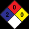

## Sección 2: IDENTIFICACIÓN DEL PELIGRO O PELIGROS

> **Nota de trazabilidad:** Elemento visual sin texto identificable.
> Imagen en Sección 2: IDENTIFICACIÓN DEL PELIGRO O PELIGROS.
> Información relacionada en la sección correspondiente.

> **Nota de trazabilidad:** Elemento visual sin texto identificable.
> Imagen en Sección 2: IDENTIFICACIÓN DEL PELIGRO O PELIGROS.
> Información relacionada en la sección correspondiente.

> **Nota de trazabilidad:** Elemento visual sin texto identificable.
> Imagen en Sección 2: IDENTIFICACIÓN DEL PELIGRO O PELIGROS.
> Información relacionada en la sección correspondiente.

> **Nota de trazabilidad:** Elemento visual sin texto identificable.
> Imagen en Sección 2: IDENTIFICACIÓN DEL PELIGRO O PELIGROS.
> Información relacionada en la sección correspondiente.

> **Nota de trazabilidad:** Pictograma(s) GHS: SGA.
> Imagen en Sección 2: IDENTIFICACIÓN DEL PELIGRO O PELIGROS.
> Información relacionada en la sección correspondiente.

> **Nota de trazabilidad:** Pictograma(s) GHS: SGA.
> Imagen en Sección 2: IDENTIFICACIÓN DEL PELIGRO O PELIGROS.
> Información relacionada en la sección correspondiente.

## Sección 1: IDENTIFICACIÓN DEL PRODUCTO
1.1  Identificador SGA del producto:  PINTURA TOTAL
Otros medios de identificación:
No relevante
1.2  Uso recomendado del producto químico y restricciones:
Usos pertinentes: Pintura decorativa
Usos desaconsejados: Todo aquel uso no especificado en este epígrafe ni en el epígrafe 7.3
1.3  Datos sobre el proveedor:
CORLANC S.A.S.
Carrera 48 N° 72 sur 01 Avenida Las Vegas
055450 Sabaneta - Antioquia - Colombia
Tfno.: +57-4-3787800
materialesypinturascorona@corona.com.co
https://www.corona.co
1.4  Número de teléfono para emergencias:  SISTEMA - ARL SURA 018000511414 - 0314055911
SECCIÓN 2: IDENTIFICACIÓN DEL PELIGRO O PELIGROS
2.1  Clasificación de la sustancia o de la mezcla:
NFPA:
Salud: 2
Inflamabilidad: 0
Inestabilidad: 0
Especiales: No relevante
SGA:
La clasificación del producto se ha realizado conforme con al decreto 1496 de 2018 y la Resolución 773 de 2021, por el cual se
adopta el Sistema Globalmente Armonizado de Clasificación y Etiquetado de Productos Químicos y se dictan otras disposiciones en
materia de seguridad química.
Carc. 2: Carcinogenicidad, Categoría 2, H351
2.2  Elementos de las etiquetas del SGA, incluidos los consejos de prudencia:
NFPA:
SGA:
Atención
Indicaciones de peligro:
Carc. 2: H351 - Susceptible de provocar cáncer (Inhalación).
Consejos de prudencia:
P101: Si se necesita consultar a un médico, tener a mano el recipiente o la etiqueta del producto.
P102: Mantener fuera del alcance de los niños.
P201: Procurarse las instrucciones antes del uso.
P202: No manipular antes de haber leído y comprendido todas las precauciones de seguridad.
P308+P313: EN CASO DE exposición demostrada o supuesta: consultar a un médico.
P405: Guardar bajo llave.
P501: Eliminar el contenido/recipiente mediante el sistema de recogida selectiva habilitado en su municipio.
Sustancias que contribuyen a la clasificación
Dioxido de titanio (diámetro aerodinámico ≤ 10 μm)
2.3  Otros peligros que no conducen a una clasificación:
No relevante
----- End of picture text -----

> **Nota de trazabilidad:** Elemento visual sin texto identificable.
> Imagen en Sección 1: IDENTIFICACIÓN DEL PRODUCTO.
> Información relacionada en la sección correspondiente.

> **Nota de trazabilidad:** Elemento visual sin texto identificable.
> Imagen en Sección 1: IDENTIFICACIÓN DEL PRODUCTO.
> Información relacionada en la sección correspondiente.

> **Nota de trazabilidad:** Elemento visual sin texto identificable.
> Imagen en Sección 1: IDENTIFICACIÓN DEL PRODUCTO.
> Información relacionada en la sección correspondiente.

> **Nota de trazabilidad:** Elemento visual sin texto identificable.
> Imagen en Sección 1: IDENTIFICACIÓN DEL PRODUCTO.
> Información relacionada en la sección correspondiente.

> **Nota de trazabilidad:** Elemento visual sin texto identificable.
> Imagen en Sección 1: IDENTIFICACIÓN DEL PRODUCTO.
> Información relacionada en la sección correspondiente.

## Sección 3: COMPOSICIÓN/INFORMACIÓN SOBRE LOS COMPONENTES

**3.1 Sustancias:** No aplicable **3.2 Mezclas: Descripción química:** Mezcla acuosa a base de aditivos, cargas, coalescentes, pigmentos y resinas **Componentes:** De acuerdo al Decreto 1496 de 2018 y la Resolución 773 de 2021, el producto presenta: ~~7~~ Identificación Nombre químico/clasificación Concentración **Agua** CAS: 7732-18-5 **30 - <50 %** ~~|ee~~ **Piedra caliza** CAS: 1317-65-3 **15 - <30 %** ~~|~~ **Caolin** CAS: 1332-58-7 **5 - <15 %** ~~|~~ **Dioxido de titanio (diámetro aerodinámico ≤ 10 μm)** CAS: 13463-67-7 **5 - <15 %** Carc. 2: H351 - Atención ~~| a~~ **Butilcarbamato de 3-iodo-2-propinilo** CAS: 55406-53-6 Acuático agudo. 1: H400; Les. Oc. 1: H318; Sens. Cut. 1: H317; STOT única 3: H335; Tox. Agud. 4: **<5 %** Para ampliar información sobre la peligrosidad de las sustancias consultar las secciones 11, 12 y 16. La clasificación respecto ~~a ee~~ H302+H332; Tox. Agud. 5: H313 - Peligro ~~ee~~ Carcinogenicidad de las sustancias se ha establecido en función de las monografías de la IARC adecuándola al sistema de clasificación SGA, para información sobre la clasificación IARC consulte la sección 11. 

## Sección 4: PRIMEROS AUXILIOS

**4.1 Descripción de los primeros auxilios necesarios:** Los síntomas como consecuencia de una intoxicación pueden presentarse con posterioridad a la exposición, por lo que, en caso de duda, exposición directa al producto químico o persistencia del malestar solicitar atención médica, mostrándole la FDS de este producto. **Por inhalación:** 

Se trata de un producto no clasificado como peligroso por inhalación, sin embargo, se recomienda en caso de síntomas de intoxicación sacar al afectado del lugar de exposición, suministrarle aire limpio y mantenerlo en reposo. Solicitar atención médica en el caso de que los síntomas persistan. 

**Por contacto con la piel:** 

Se trata de un producto no clasificado como peligroso en contacto con la piel. Sin embargo, se recomienda en caso de contacto con la piel quitar la ropa y los zapatos contaminados, aclarar la piel o duchar al afectado si procede con abundante agua fría y jabón neutro. En caso de afección importante acudir al médico. 

**Por contacto con los ojos:** 

Enjuagar los ojos con abundante agua al menos durante 15 minutos. En el caso de que el accidentado use lentes de contacto, éstas deben retirarse siempre que no estén pegadas a los ojos, de otro modo podría producirse un daño adicional. En todos los casos, después del lavado, se debe acudir al médico lo más rápidamente posible con la FDS del producto. **Por ingestión/aspiración:** 

No inducir al vómito, en el caso de que se produzca mantener inclinada la cabeza hacia delante para evitar la aspiración. Mantener al afectado en reposo. Enjuagar la boca y la garganta, ya que existe la posibilidad de que hayan sido afectadas en la ingestión. 

**4.2 Síntomas/efectos más importantes, agudos o retardados:** 

Los efectos agudos y retardados son los indicados en las secciones 2 y 11 de la FDS. 

**4.3 Indicación de la necesidad de recibir atención médica inmediata y, en su caso, de tratamiento especial:** No relevante 

## Sección 5: MEDIDAS DE LUCHA CONTRA INCENDIOS

> **Nota de trazabilidad:** Elemento visual sin texto identificable.
> Imagen en Sección 5: MEDIDAS DE LUCHA CONTRA INCENDIOS.
> Información relacionada en la sección correspondiente.

> **Nota de trazabilidad:** Elemento visual sin texto identificable.
> Imagen en Sección 5: MEDIDAS DE LUCHA CONTRA INCENDIOS.
> Información relacionada en la sección correspondiente.

- **5.1 Medios de extinción apropiados: Medios de extinción apropiados:** 

**----- Start of picture text -----**

## Sección 7: MANIPULACIÓN Y ALMACENAMIENTO

> **Nota de trazabilidad:** Elemento visual sin texto identificable.
> Imagen en Sección 7: MANIPULACIÓN Y ALMACENAMIENTO.
> Información relacionada en la sección correspondiente.

> **Nota de trazabilidad:** Elemento visual sin texto identificable.
> Imagen en Sección 7: MANIPULACIÓN Y ALMACENAMIENTO.
> Información relacionada en la sección correspondiente.

> **Nota de trazabilidad:** Elemento visual sin texto identificable.
> Imagen en Sección 7: MANIPULACIÓN Y ALMACENAMIENTO.
> Información relacionada en la sección correspondiente.

> **Nota de trazabilidad:** Elemento visual sin texto identificable.
> Imagen en Sección 7: MANIPULACIÓN Y ALMACENAMIENTO.
> Información relacionada en la sección correspondiente.

**7.2 Condiciones de almacenamiento seguro, incluidas cualesquiera incompatibilidades:** A.- Medidas técnicas de almacenamiento Temperatura mínima: 5 ºC Temperatura máxima: 30 ºC Tiempo máximo: 12 meses 

- B.- Condiciones generales de almacenamiento. 

Evitar fuentes de calor, radiación, electricidad estática y el contacto con alimentos. Para información adicional ver epígrafe 10.5 

**7.3 Usos específicos finales:** 

Salvo las indicaciones ya especificadas no es preciso realizar ninguna recomendación especial en cuanto a los usos de este producto. 

## Sección 8: CONTROLES DE EXPOSICIÓN/PROTECCIÓN PERSONAL

> **Nota de trazabilidad:** Pictograma EPP: Protección ocular y facial — Pantalla facial. Uso obligatorio en caso de riesgo de salpicaduras.
> Imagen en Sección 8: CONTROLES DE EXPOSICIÓN/PROTECCIÓN PERSONAL.
> Información relacionada en la sección correspondiente.

> **Nota de trazabilidad:** Elemento visual sin texto identificable.
> Imagen en Sección 8: CONTROLES DE EXPOSICIÓN/PROTECCIÓN PERSONAL.
> Información relacionada en la sección correspondiente.

> **Nota de trazabilidad:** Elemento visual sin texto identificable.
> Imagen en Sección 8: CONTROLES DE EXPOSICIÓN/PROTECCIÓN PERSONAL.
> Información relacionada en la sección correspondiente.

> **Nota de trazabilidad:** Elemento visual sin texto identificable.
> Imagen en Sección 8: CONTROLES DE EXPOSICIÓN/PROTECCIÓN PERSONAL.
> Información relacionada en la sección correspondiente.

> **Nota de trazabilidad:** Elemento visual sin texto identificable.
> Imagen en Sección 8: CONTROLES DE EXPOSICIÓN/PROTECCIÓN PERSONAL.
> Información relacionada en la sección correspondiente.

> **Nota de trazabilidad:** Elemento visual sin texto identificable.
> Imagen en Sección 8: CONTROLES DE EXPOSICIÓN/PROTECCIÓN PERSONAL.
> Información relacionada en la sección correspondiente.

> **Nota de trazabilidad:** Pictograma EPP: Guantes de protección química — uso obligatorio.
> Imagen en Sección 8: CONTROLES DE EXPOSICIÓN/PROTECCIÓN PERSONAL.
> Información relacionada en la sección correspondiente.

**----- Start of picture text -----**

8.1  Parámetros de control:

Sustancias cuyos valores límite de exposición profesional han de controlarse en el ambiente de trabajo: 

**----- Start of picture text -----** 
## Sección 6: MEDIDAS QUE DEBEN TOMARSE EN CASO DE VERTIDO ACCIDENTAL

Dado que el producto es una mezcla de diferentes materiales, la resistencia del material de los guantes no se puede calcular de antemano con total fiabilidad y por lo tanto tiene que ser controlados antes de su aplicación. 

|D.- Protección ocular y facial|
|---|
|Pictograma EPP Observaciones Pantalla facial NORMATIVIDAD APLICABLE: NTC 1825, NTC 1826 y ANSI Z87.1. Limpiar a diario y desinfectar periódicamente de acuerdo a las instrucciones del fabricante. Se recomienda su uso en caso de riesgo de salpicaduras. Protección obligatoria de la cara ~~aCL~~|
|E.- Protección corporal|
|Pictograma EPP Observaciones ~~a~~|
|Prenda de protección frente a riesgos químicos NORMATIVIDAD APLICABLE: EN ISO 13688 y EN 14605. Uso exclusivo en el trabajo. Limpiar periódicamente de acuerdo a las instrucciones del fabricante. Protección obligatoria del cuerpo ~~i~~|
|Calzado de seguridad contra riesgo químico NORMATIVIDAD APLICABLE: NTC-ISO 20345 y NTC 2257. Reemplazar las botas ante cualquier indicio de deterioro. Protección obligatoria de los pies ~~i~~|
|F.- Medidas complementarias de emergencia|
|Medida de emergencia Normas Medida de emergencia Normas ANSI Z358-1 ISO 3864-1:2011, ISO 3864-4:2011 DIN 12 899 ISO 3864-1:2011, ISO 3864-4:2011 Ducha de emergencia Lavaojos **Controles de la exposición del medio ambiente:** ~~————————~~ ~~rarA~~|
|Se recomienda evitar el vertido tanto del producto como de su envase al medio ambiente. Para información adicional ver epígrafe|
|7.1.D de la FDS.|
|**NTC 6018- Etiquetas ambientales tipo I. Sello ambiental colombiano. Criterios ambientales para pinturas y materiales**|
|**de recubrimiento (determinados de acuerdo con la norma ASTM D6886):**|
|Compuestos orgánicos volátiles: 1,01 % peso|
|Concentración C.O.V. a 20 ºC: 40,18 kg/m³  (40,18 g/L)|

## Sección 9: PROPIEDADES FÍSICAS Y QUÍMICAS Y CARACTERÍSTICAS DE SEGURIDAD

> **Nota de trazabilidad:** Elemento visual sin texto identificable.
> Imagen en Sección 9: PROPIEDADES FÍSICAS Y QUÍMICAS Y CARACTERÍSTICAS DE SEGURIDAD.
> Información relacionada en la sección correspondiente.

> **Nota de trazabilidad:** Elemento visual sin texto identificable.
> Imagen en Sección 9: PROPIEDADES FÍSICAS Y QUÍMICAS Y CARACTERÍSTICAS DE SEGURIDAD.
> Información relacionada en la sección correspondiente.

|**9.1**|**Información de propiedades físicas y químicas básicas:**|**Información de propiedades físicas y químicas básicas:**|**Información de propiedades físicas y químicas básicas:**|
|---|---|---|---|
||Para completar la información ver la ficha técnica/hoja de especificaciones del producto.|Para completar la información ver la ficha técnica/hoja de especificaciones del producto.||
||**Aspecto físico:**|||
||Estado físico a 20 ºC:|Líquido||
||Aspecto:|Dispersión||
||Color:||Blanco|
||Olor:|Característico||
||Umbral olfativo:|No relevante *|No relevante *|
||**Volatilidad:**|||
||Temperatura de ebullición a presión atmosférica:|101 ºC||
||Presión de vapor a 20 ºC:|2337 Pa||
||Presión de vapor a 50 ºC:|12312,85 Pa  (12,31 kPa)||
||Tasa de evaporación a 20 ºC:|No relevante *|No relevante *|
||**Caracterización del producto:**|||
||*No relevante debido a la naturaleza del producto, no aportando información característica de su peligrosidad.|||

||Densidad a 20 ºC:|1447,1 kg/m³|
|---|---|---|
||Densidad relativa a 20 ºC:|1,447|
||Viscosidad dinámica a 20 ºC:|No relevante *|
||Viscosidad cinemática a 20 ºC:|No relevante *|
||Viscosidad cinemática a 40 ºC:|No relevante *|
||Concentración:|No relevante *|
||pH:|No relevante *|
||Densidad de vapor a 20 ºC:|No relevante *|
||Coeficiente de reparto n-octanol/agua a 20 ºC:|No relevante *|
||Solubilidad en agua a 20 ºC:|No relevante *|
||Propiedad de solubilidad:|No relevante *|
||Temperatura de descomposición:|No relevante *|
||Punto de fusión/punto de congelación:|No relevante *|
||**Inflamabilidad:**||
||Punto de inflamación:|No inflamable (>93 ºC)|
||Inflamabilidad (sólido, gas):|No relevante *|
||Temperatura de auto-inflamación:|330 ºC|
||Límite de inflamabilidad inferior:|No relevante *|
||Límite de inflamabilidad superior:|No relevante *|
||**Características de las partículas:**||
||Diámetro medio equivalente:|No aplicable|
|**9.2**|**Información adicional:**||
||**Información relativa a las clases de peligro físico:**||
||Propiedades explosivas:|No relevante *|
||Propiedades comburentes:|No relevante *|
||Corrosivos para los metales:|No relevante *|
||Calor de combustión:|No relevante *|
||Aerosoles-porcentaje total (en masa) de componentes|No relevante *|
||inflamables:||
||**Otras características de seguridad:**||
||Tensión superficial a 20 ºC:|No relevante *|
||Índice de refracción:|No relevante *|

*No relevante debido a la naturaleza del producto, no aportando información característica de su peligrosidad. 

## Sección 10: ESTABILIDAD Y REACTIVIDAD

> **Nota de trazabilidad:** Elemento visual sin texto identificable.
> Imagen en Sección 10: ESTABILIDAD Y REACTIVIDAD.
> Información relacionada en la sección correspondiente.

> **Nota de trazabilidad:** Elemento visual sin texto identificable.
> Imagen en Sección 10: ESTABILIDAD Y REACTIVIDAD.
> Información relacionada en la sección correspondiente.

**10.1 Reactividad:** 

No se esperan reacciones peligrosas si se cumplen las instrucciones técnicas de almacenamiento de productos químicos. Ver sección 7 de la FDS para mayor información. 

**10.2 Estabilidad química:** 

Estable químicamente bajo las condiciones indicadas de almacenamiento, manipulación y uso. 

**10.3 Posibilidad de reacciones peligrosas:** 

Bajo las condiciones indicadas no se esperan reacciones peligrosas ni polimerización peligrosa que puedan producir una presión o temperaturas excesivas. 

**10.4 Condiciones que deben evitarse:** 

Aplicables para manipulación y almacenamiento a temperatura ambiente: 

|Choque y fricción|Contacto con el aire|Calentamiento|Luz Solar|Humedad|
|---|---|---|---|---|
|No aplicable|No aplicable|No aplicable|No aplicable|No aplicable|

## Sección 11: INFORMACIÓN TOXICOLÓGICA

> **Nota de trazabilidad:** Elemento visual sin texto identificable.
> Imagen en Sección 11: INFORMACIÓN TOXICOLÓGICA.
> Información relacionada en la sección correspondiente.

> **Nota de trazabilidad:** Elemento visual sin texto identificable.
> Imagen en Sección 11: INFORMACIÓN TOXICOLÓGICA.
> Información relacionada en la sección correspondiente.

A la vista de los datos disponibles, no se cumplen los criterios de clasificación, no presentando sustancias clasificadas como peligrosas por este efecto. Para más información ver sección 3 de la FDS. 

**Información adicional:** 

CAS 13463-67-7 Dióxido de Titanio: IARC lista esta sustancia como un posible carcinógeno humano (grupo 2B), indicando que hay suficientes evidencias para considerarlo carcinógeno en animales pero insuficientes para considerarlo como carcinógeno para seres humanos. 

La monografía de IARC para esta sustancia indica que no hay exposición significativa al dióxido de titanio durante el uso normal de productos en los que dióxido de titanio está unido permanentemente a otros materiales, tales como pinturas (Ref: Monografía IARC, Vol. 93, 2010). 

El lijado repetido de las superficies de película seca puede producir riesgo de sobreexposición al polvo dependiendo de la duración y nivel de lijado, para evitarla deben tomarse las medidas de protección adecuadas. 

**Información toxicológica específica de las sustancias:** 

|Identificación|Toxicidad aguda|Toxicidad aguda|Género|
|---|---|---|---|
|Dioxido de titanio (diámetro aerodinámico ≤ 10 μm) CAS: 13463-67-7|DL50 oral|10000 mg/kg|Rata|
||DL50 cutánea|10000 mg/kg|Conejo|
||CL50 inhalación|No relevante||
|Caolin CAS: 1332-58-7|DL50 oral|>5000 mg/kg|Rata|
||DL50 cutánea|5100 mg/kg|Rata|
||CL50 inhalación|No relevante||
|Piedra caliza CAS: 1317-65-3|DL50 oral|>5000 mg/kg|Rata|
||DL50 cutánea|No relevante||
||CL50 inhalación|No relevante||
|Butilcarbamato de 3-iodo-2-propinilo CAS: 55406-53-6|DL50 oral|1100 mg/kg|Rata|
||DL50 cutánea|2100 mg/kg|Conejo|
||CL50 inhalación|No relevante||

## Sección 12: INFORMACIÓN ECOTOXICOLÓGICA

> **Nota de trazabilidad:** Elemento visual sin texto identificable.
> Imagen en Sección 12: INFORMACIÓN ECOTOXICOLÓGICA.
> Información relacionada en la sección correspondiente.

> **Nota de trazabilidad:** Elemento visual sin texto identificable.
> Imagen en Sección 12: INFORMACIÓN ECOTOXICOLÓGICA.
> Información relacionada en la sección correspondiente.

No se disponen de datos experimentales de la mezcla en sí misma relativos a las propiedades ecotoxicológicas. 

**12.1 Toxicidad: Toxicidad aguda:** Identificación Concentración Especie Género Caolin CL50 No relevante CAS: 1332-58-7 CE50 1100 mg/L (48 h) Daphnia pulex Crustáceo CE50 No relevante Butilcarbamato de 3-iodo-2-propinilo CL50 0,07 mg/L (96 h) Oncorhynchus mykiss Pez CAS: 55406-53-6 CE50 0,09 mg/L (96 h) Mysidopsis bahia Crustáceo CE50 0,05 mg/L (72 h) Scenedesmus subspicatus Alga **Toxicidad a largo plazo:** Identificación Concentración Especie Género Butilcarbamato de 3-iodo-2-propinilo NOEC 0,0084 mg/L Pimephales promelas Pez ~~———~~ CAS: 55406-53-6 NOEC 0,0499 mg/L Daphnia magna Crustáceo **12.2 Persistencia y degradabilidad:** No disponible **12.3 Potencial de bioacumulación: Información específica de las sustancias:** Identificación Potencial de bioacumulación Butilcarbamato de 3-iodo-2-propinilo BCF 36 CAS: 55406-53-6 Log POW 2,4 Potencial Moderado ~~es~~ **12.4 Movilidad en el suelo:** ~~——~~ No determinado 

## Sección 16: OTRAS INFORMACIONES

> **Nota de trazabilidad:** Elemento visual sin texto identificable.
> Imagen en Sección 16: OTRAS INFORMACIONES.
> Información relacionada en la sección correspondiente.

> **Nota de trazabilidad:** Elemento visual sin texto identificable.
> Imagen en Sección 16: OTRAS INFORMACIONES.
> Información relacionada en la sección correspondiente.

## Sección 15: INFORMACIÓN SOBRE LA REGLAMENTACIÓN

## Sección 14: INFORMACIÓN RELATIVA AL TRANSPORTE

La información contenida en esta Ficha de datos de seguridad está fundamentada en fuentes, conocimientos técnicos y legislación vigente COLOMBIANA, no pudiendo garantizar la exactitud de la misma. Esta información no es posible considerarla como una garantía de las propiedades del producto, se trata simplemente de una descripción en cuanto a los requerimientos en materia de seguridad. La metodología y condiciones de trabajo de los usuarios de este producto se encuentran fuera de nuestro conocimiento y control, siendo siempre responsabilidad última del usuario tomar las medidas necesarias para adecuarse a las exigencias legislativas en cuanto a manipulación, almacenamiento, uso y eliminación de productos químicos. La información de esta ficha de seguridad únicamente se refiere a este producto, el cual no debe emplearse con fines distintos a los que se especifican. 

FIN DE LA FICHA DE DATOS DE SEGURIDAD 
