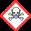
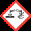
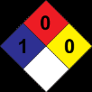

## Sección 2: IDENTIFICACIÓN DEL PELIGRO O PELIGROS

> **Nota de trazabilidad:** Elemento visual sin texto identificable.
> Imagen en Sección 2: IDENTIFICACIÓN DEL PELIGRO O PELIGROS.
> Información relacionada en la sección correspondiente.

> **Nota de trazabilidad:** Elemento visual sin texto identificable.
> Imagen en Sección 2: IDENTIFICACIÓN DEL PELIGRO O PELIGROS.
> Información relacionada en la sección correspondiente.

> **Nota de trazabilidad:** Elemento visual sin texto identificable.
> Imagen en Sección 2: IDENTIFICACIÓN DEL PELIGRO O PELIGROS.
> Información relacionada en la sección correspondiente.

> **Nota de trazabilidad:** Elemento visual sin texto identificable.
> Imagen en Sección 2: IDENTIFICACIÓN DEL PELIGRO O PELIGROS.
> Información relacionada en la sección correspondiente.

> **Nota de trazabilidad:** Pictograma(s) GHS: SGA.
> Imagen en Sección 2: IDENTIFICACIÓN DEL PELIGRO O PELIGROS.
> Información relacionada en la sección correspondiente.

> **Nota de trazabilidad:** Pictograma(s) GHS: SGA.
> Imagen en Sección 2: IDENTIFICACIÓN DEL PELIGRO O PELIGROS.
> Información relacionada en la sección correspondiente.

## Sección 1: IDENTIFICACIÓN DEL PRODUCTO 1.1 Identificador SGA del producto: PINTURA LAVABLE Otros medios de identificación: No relevante 1.2 Uso recomendado del producto químico y restricciones: Usos pertinentes: Pintura decorativa Usos desaconsejados: Todo aquel uso no especificado en este epígrafe ni en el epígrafe 7.3 1.3 Datos sobre el proveedor: CORLANC S.A.S. Carrera 48 N° 72 sur 01 Avenida Las Vegas 055450 Sabaneta - Antioquia - Colombia Tfno.: +57-4-3787800 materialesypinturascorona@corona.com.co https://www.corona.co 1.4 Número de teléfono para emergencias: CISTEMA - ARL SURA 018000511414 - 0314055911 SECCIÓN 2: IDENTIFICACIÓN DEL PELIGRO O PELIGROS 2.1 Clasificación de la sustancia o de la mezcla: NFPA: Salud: 1 Inflamabilidad: 0 Inestabilidad: 0 Especiales: No relevante SGA: La clasificación del producto se ha realizado conforme con al decreto 1496 de 2018 y la Resolución 773 de 2021, por el cual se adopta el Sistema Globalmente Armonizado de Clasificación y Etiquetado de Productos Químicos y se dictan otras disposiciones en materia de seguridad química. Acuático agudo. 1: Peligrosidad aguda para el medio ambiente acuático, Categoría 1, H400 Acuático crónico. 3: Peligrosidad crónica para el medio ambiente acuático, Categoría 3, H412 Carc. 2: Carcinogenicidad, Categoría 2, H351 2.2 Elementos de las etiquetas del SGA, incluidos los consejos de prudencia: NFPA:  SGA: Atención oe Indicaciones de peligro: Acuático agudo. 1: H400 - Muy tóxico para los organismos acuáticos. Acuático crónico. 3: H412 - Nocivo para los organismos acuáticos, con efectos nocivos duraderos. Carc. 2: H351 - Susceptible de provocar cáncer (Inhalación). Consejos de prudencia: P101: Si se necesita consultar a un médico, tener a mano el recipiente o la etiqueta del producto. P102: Mantener fuera del alcance de los niños. P201: Procurarse las instrucciones antes del uso. P202: No manipular antes de haber leído y comprendido todas las precauciones de seguridad. P273: No dispersar en el medio ambiente. P308+P313: EN CASO DE exposición demostrada o supuesta: consultar a un médico. P391: Recoger los vertidos. P501: Eliminar el contenido/recipiente mediante el sistema de recogida selectiva habilitado en su municipio. Sustancias que contribuyen a la clasificación

> **Nota de trazabilidad:** Elemento visual sin texto identificable.
> Imagen en Sección 1: IDENTIFICACIÓN DEL PRODUCTO.
> Información relacionada en la sección correspondiente.

> **Nota de trazabilidad:** Elemento visual sin texto identificable.
> Imagen en Sección 1: IDENTIFICACIÓN DEL PRODUCTO.
> Información relacionada en la sección correspondiente.

> **Nota de trazabilidad:** Elemento visual sin texto identificable.
> Imagen en Sección 1: IDENTIFICACIÓN DEL PRODUCTO.
> Información relacionada en la sección correspondiente.

> **Nota de trazabilidad:** Elemento visual sin texto identificable.
> Imagen en Sección 1: IDENTIFICACIÓN DEL PRODUCTO.
> Información relacionada en la sección correspondiente.

> **Nota de trazabilidad:** Elemento visual sin texto identificable.
> Imagen en Sección 1: IDENTIFICACIÓN DEL PRODUCTO.
> Información relacionada en la sección correspondiente.

> **Nota de trazabilidad:** Elemento visual sin texto identificable.
> Imagen en Sección 1: IDENTIFICACIÓN DEL PRODUCTO.
> Información relacionada en la sección correspondiente.

## Sección 10: ESTABILIDAD Y REACTIVIDAD

> **Nota de trazabilidad:** Elemento visual sin texto identificable.
> Imagen en Sección 10: ESTABILIDAD Y REACTIVIDAD.
> Información relacionada en la sección correspondiente.

> **Nota de trazabilidad:** Elemento visual sin texto identificable.
> Imagen en Sección 10: ESTABILIDAD Y REACTIVIDAD.
> Información relacionada en la sección correspondiente.

Dioxido de titanio (diámetro aerodinámico ≤ 10 μm) 

- **2.3 Otros peligros que no conducen a una clasificación:** 

No relevante 

## Sección 3: COMPOSICIÓN/INFORMACIÓN SOBRE LOS COMPONENTES

- **3.1 Sustancias:** No aplicable 

- **3.2 Mezclas: Descripción química:** Mezcla acuosa a base de aditivos, cargas, coalescentes, pigmentos y resinas **Componentes:** 

De acuerdo al Decreto 1496 de 2018 y la Resolución 773 de 2021, el producto presenta: Identificación Nombre químico/clasificación Concentración ~~eS~~ **Dioxido de titanio (diámetro aerodinámico ≤ 10 μm)** CAS: 13463-67-7 **10 - <20 %** Carc. 2: H351 - Atención ~~a ee~~ **Piritionato cincico** CAS: 13463-41-7 Acuático agudo. 1: H400; Acuático crónico. 1: H410; Les. Oc. 1: H318; Repr. 1B: H360; STOT repe. 1: **<5 %** ~~a ee~~ H372; Tox. Agud. 2: H330; Tox. Agud. 3: H301 - Peligro ~~ee~~ 

Para ampliar información sobre la peligrosidad de las sustancias consultar las secciones 11, 12 y 16. La clasificación respecto Carcinogenicidad de las sustancias se ha establecido en función de las monografías de la IARC adecuándola al sistema de clasificación SGA, para información sobre la clasificación IARC consulte la sección 11. 

**Información adicional:** 

|Identificación|Factor M|Factor M|
|---|---|---|
|Piritionato cincico CAS: 13463-41-7|Agudo|1000|
||Crónico|10|

## Sección 4: PRIMEROS AUXILIOS

> **Nota de trazabilidad:** Pictograma(s) GHS: SGA.
> Imagen en Sección 4: PRIMEROS AUXILIOS.
> Información relacionada en la sección correspondiente.

> **Nota de trazabilidad:** Elemento visual sin texto identificable.
> Imagen en Sección 4: PRIMEROS AUXILIOS.
> Información relacionada en la sección correspondiente.

**4.1 Descripción de los primeros auxilios necesarios:** 

Los síntomas como consecuencia de una intoxicación pueden presentarse con posterioridad a la exposición, por lo que, en caso de duda, exposición directa al producto químico o persistencia del malestar solicitar atención médica, mostrándole la FDS de este producto. 

**Por inhalación:** 

Se trata de un producto no clasificado como peligroso por inhalación, sin embargo, se recomienda en caso de síntomas de intoxicación sacar al afectado del lugar de exposición, suministrarle aire limpio y mantenerlo en reposo. Solicitar atención médica en el caso de que los síntomas persistan. 

**Por contacto con la piel:** 

Se trata de un producto no clasificado como peligroso en contacto con la piel. Sin embargo, se recomienda en caso de contacto con la piel quitar la ropa y los zapatos contaminados, aclarar la piel o duchar al afectado si procede con abundante agua fría y jabón neutro. En caso de afección importante acudir al médico. 

**Por contacto con los ojos:** 

Enjuagar los ojos con abundante agua al menos durante 15 minutos. En el caso de que el accidentado use lentes de contacto, éstas deben retirarse siempre que no estén pegadas a los ojos, de otro modo podría producirse un daño adicional. En todos los casos, después del lavado, se debe acudir al médico lo más rápidamente posible con la FDS del producto. 

**Por ingestión/aspiración:** 

No inducir al vómito, en el caso de que se produzca mantener inclinada la cabeza hacia delante para evitar la aspiración. Mantener al afectado en reposo. Enjuagar la boca y la garganta, ya que existe la posibilidad de que hayan sido afectadas en la ingestión. 

**4.2 Síntomas/efectos más importantes, agudos o retardados:** 

Los efectos agudos y retardados son los indicados en las secciones 2 y 11 de la FDS. 

**4.3 Indicación de la necesidad de recibir atención médica inmediata y, en su caso, de tratamiento especial:** 

|---|---|
||No relevante|
|SECCIÓN 5: MEDIDAS DE LUCHA CONTRA INCENDIOS||
|**5.1**|**Medios de extinción apropiados:**|
||**Medios de extinción apropiados:**|
## Sección 5: MEDIDAS DE LUCHA CONTRA INCENDIOS

||Producto no inflamable bajo condiciones normales de almacenamiento, manipulación y uso. En caso de inflamación como|
||consecuencia de manipulación, almacenamiento o uso indebido emplear preferentemente extintores de polvo polivalente (polvo ABC).|
||**Medios de extinción no apropiados:**|
||No relevante|
|**5.2**|**Peligros específicos del producto químico:**|
||Como consecuencia de la combustión o descomposición térmica se generan subproductos de reacción que pueden resultar altamente|
||tóxicos y, consecuentemente, pueden presentar un riesgo elevado para la salud.|
|**5.3**|**Medidas especiales que deben tomar los equipos de lucha contra incendios:**|
||En función de la magnitud del incendio puede hacerse necesario el uso de ropa protectora completa y equipo de respiración|
||autónomo. Disponer de un mínimo de instalaciones de emergencia o elementos de actuación (mantas ignífugas, botiquín portátil,...).|
||**Disposiciones adicionales:**|
||Actuar conforme el Plan de Emergencia Interior y las Fichas Informativas sobre actuación ante accidentes y otras emergencias.|
||Suprimir cualquier fuente de ignición. En caso de incendio, refrigerar los recipientes y tanques de almacenamiento de productos|
||susceptibles a inflamación, explosión o BLEVE como consecuencia de elevadas temperaturas. Evitar el vertido de los productos|
||empleados en la extinción del incendio al medio acuático.|
|SECCIÓN 6: MEDIDASQUE DEBEN TOMARSE EN CASO DE VERTIDO ACCIDENTAL||
## Sección 6: MEDIDAS QUE DEBEN TOMARSE EN CASO DE VERTIDO ACCIDENTAL

|**6.1**|**Precauciones personales, equipo protector y procedimiento de emergencia:**|
||**Para el personal que no forma parte de los servicios de emergencia:**|
||Aislar las fugas siempre y cuando no suponga un riesgo adicional para las personas que desempeñen esta función. Ante la exposición|
||potencial con el producto derramado se hace obligatorio el uso de elementos de protección personal (ver sección 8 de la FDS).|
||Evacuar la zona y mantener a las personas sin protección alejadas.|
||**Para el personal de emergencia:**|
||Llevar puesto equipo de protección. Mantener alejadas las personas sin protección. Ver sección 8 de la FDS.|
|**6.2**|**Precauciones relativas al medio ambiente:**|
||Evitar a toda costa cualquier tipo de vertido al medio acuático. Contener adecuadamente el producto absorbido/recogido en|
||recipientes herméticamente precintables. Notificar a la autoridad competente en el caso de exposición al público en general o al|
||medioambiente.|
|**6.3**|**Métodos y materiales para la contención y limpieza de vertidos:**|
||Se recomienda:|
||Absorber el vertido mediante arena o absorbente inerte y trasladarlo a un lugar seguro. No absorber en serrín u otros absorbentes|
||combustibles. Para cualquier consideración relativa a la eliminación consultar la sección 13 de la FDS.|
|**6.4**|**Referencias a otras secciones:**|
||Ver secciones 8 y 13.|
|SECCIÓN 7: MANIPULACIÓN Y ALMACENAMIENTO||
## Sección 7: MANIPULACIÓN Y ALMACENAMIENTO

> **Nota de trazabilidad:** Elemento visual sin texto identificable.
> Imagen en Sección 7: MANIPULACIÓN Y ALMACENAMIENTO.
> Información relacionada en la sección correspondiente.

> **Nota de trazabilidad:** Elemento visual sin texto identificable.
> Imagen en Sección 7: MANIPULACIÓN Y ALMACENAMIENTO.
> Información relacionada en la sección correspondiente.

|**7.1**|**Precauciones que se deben tomar para garantizar una manipulación segura:**|
||A.- Precauciones generales|
||Cumplir con la legislación vigente en materia de prevención de riesgos laborales en cuanto a manipulación manual de cargas.|
||Mantener orden, limpieza y eliminar por métodos seguros (sección 6 de la FDS).|
||B.- Recomendaciones técnicas para la prevención de incendios y explosiones.|

## Sección 8: CONTROLES DE EXPOSICIÓN/PROTECCIÓN PERSONAL

> **Nota de trazabilidad:** Elemento visual sin texto identificable.
> Imagen en Sección 8: CONTROLES DE EXPOSICIÓN/PROTECCIÓN PERSONAL.
> Información relacionada en la sección correspondiente.

> **Nota de trazabilidad:** Elemento visual sin texto identificable.
> Imagen en Sección 8: CONTROLES DE EXPOSICIÓN/PROTECCIÓN PERSONAL.
> Información relacionada en la sección correspondiente.

> **Nota de trazabilidad:** Elemento visual sin texto identificable.
> Imagen en Sección 8: CONTROLES DE EXPOSICIÓN/PROTECCIÓN PERSONAL.
> Información relacionada en la sección correspondiente.

> **Nota de trazabilidad:** Elemento visual sin texto identificable.
> Imagen en Sección 8: CONTROLES DE EXPOSICIÓN/PROTECCIÓN PERSONAL.
> Información relacionada en la sección correspondiente.

> **Nota de trazabilidad:** Elemento visual sin texto identificable.
> Imagen en Sección 8: CONTROLES DE EXPOSICIÓN/PROTECCIÓN PERSONAL.
> Información relacionada en la sección correspondiente.

> **Nota de trazabilidad:** Elemento visual sin texto identificable.
> Imagen en Sección 8: CONTROLES DE EXPOSICIÓN/PROTECCIÓN PERSONAL.
> Información relacionada en la sección correspondiente.

> **Nota de trazabilidad:** Elemento visual sin texto identificable.
> Imagen en Sección 8: CONTROLES DE EXPOSICIÓN/PROTECCIÓN PERSONAL.
> Información relacionada en la sección correspondiente.

> **Nota de trazabilidad:** Elemento visual sin texto identificable.
> Imagen en Sección 8: CONTROLES DE EXPOSICIÓN/PROTECCIÓN PERSONAL.
> Información relacionada en la sección correspondiente.

> **Nota de trazabilidad:** Elemento visual sin texto identificable.
> Imagen en Sección 8: CONTROLES DE EXPOSICIÓN/PROTECCIÓN PERSONAL.
> Información relacionada en la sección correspondiente.

Producto no inflamable bajo condiciones normales de almacenamiento, manipulación y uso. Se recomienda trasvasar a
velocidades lentas para evitar la generación de cargas electroestáticas que pudieran afectar a productos inflamables. Consultar la
sección 10 de la FDS sobre condiciones y materias que deben evitarse.
C.- Recomendaciones técnicas para prevenir riesgos ergonómicos y toxicológicos.
Para control de exposición consultar la sección 8 de la FDS. No comer, beber ni fumar en las zonas de trabajo
lavarse las manos después de cada utilización, y despojarse de prendas de vestir y equipos de protección contaminados antes de
entrar en las zonas para comer.
D.- Recomendaciones técnicas para prevenir riesgos medioambientales
Debido a la peligrosidad de este producto para el medio ambiente se recomienda manipularlo dentro de un área que disponga de
barreras de control de la contaminación en caso de vertido, así como disponer de material absorbente en las proximidades del
mismo
7.2  Condiciones de almacenamiento seguro, incluidas cualesquiera incompatibilidades:
A.- Medidas técnicas de almacenamiento
Temperatura mínima:  5 ºC
Temperatura máxima:  30 ºC
Tiempo máximo:  12 meses
B.- Condiciones generales de almacenamiento.
Evitar fuentes de calor, radiación, electricidad estática y el contacto con alimentos. Para información adicional ver epígrafe 10.5
7.3  Usos específicos finales:
Salvo las indicaciones ya especificadas no es preciso realizar ninguna recomendación especial en cuanto a los usos de este producto.
SECCIÓN 8: CONTROLES DE EXPOSICIÓN/PROTECCIÓN PERSONAL
8.1  Parámetros de control:
Sustancias cuyos valores límite de exposición profesional han de controlarse en el ambiente de trabajo:
OSHA (Tablas Z):
Identificación  Valores límite ambientales
Dioxido de titanio (diámetro aerodinámico ≤ 10 μm)  8-hour TWA PEL  15 mg/m³
CAS: 13463-67-7  Ceiling Values - TWA
PEL
ACGIH (2022):
Identificación  Valores límite ambientales
Dioxido de titanio (diámetro aerodinámico ≤ 10 μm)  TLV-TWA  0,2 mg/m³
CAS: 13463-67-7  TLV-STEL

**8.2 Controles técnicos apropiados:** A.- Medidas de protección individual, como equipo de protección personal (EPP) 

Realizar la identificación de los peligros y la valoración de los riesgos de acuerdo a la Guia técnica colombiana GTC 45. Como medida de prevención se recomienda la utilización de equipos de protección individual básicos. Para más información sobre los equipos de protección individual (almacenamiento, uso, limpieza, mantenimiento, clase de protección,…) consultar el folleto informativo facilitado por el fabricante del EPP. Las indicaciones contenidas en este punto se refieren al producto puro. Las medidas de protección para el producto diluido podrán variar en función de su grado de dilución, uso, método de aplicación, etc. Para determinar la obligación de instalación de duchas de emergencia y/o lavaojos en los almacenes se tendrá en cuenta la normativa referente al almacenamiento de productos químicos aplicable en cada caso. Para más información ver epígrafes 7.1 y 7.2 de la FDS. 

Toda la información aquí incluida es una recomendación siendo necesario su concreción por parte de los servicios de prevención de riesgos laborales al desconocer las medidas de prevención adicionales que la empresa pudiese disponer. B.- Protección respiratoria. 

**----- Start of picture text -----** 

||Estado físico a 20 ºC:|Líquido|Líquido|
|---|---|---|---|
||Aspecto:|Dispersión||
||Color:||Blanco|
||Olor:|Característico||
||Umbral olfativo:|No relevante  *|No relevante  *|
||**Volatilidad:**|||
||Temperatura de ebullición a presión atmosférica:|100 ºC||
||Presión de vapor a 20 ºC:|2349 Pa||
||Presión de vapor a 50 ºC:|12377,3 Pa  (12,38 kPa)||
||Tasa de evaporación a 20 ºC:|No relevante  *|No relevante  *|
||**Caracterización del producto:**|||
||Densidad a 20 ºC:|1344,1 kg/m³||
||Densidad relativa a 20 ºC:|1,344||
||Viscosidad dinámica a 20 ºC:|No relevante  *|No relevante  *|
||Viscosidad cinemática a 20 ºC:|No relevante  *|No relevante  *|
||Viscosidad cinemática a 40 ºC:|No relevante  *|No relevante  *|
||Concentración:|No relevante  *|No relevante  *|
||pH:|8,5 - 9,5|8,5 - 9,5|
||Densidad de vapor a 20 ºC:|No relevante  *|No relevante  *|
||Coeficiente de reparto n-octanol/agua a 20 ºC:|No relevante  *|No relevante  *|
||Solubilidad en agua a 20 ºC:|No relevante  *|No relevante  *|
||Propiedad de solubilidad:|No relevante  *|No relevante  *|
||Temperatura de descomposición:|No relevante  *|No relevante  *|
||Punto de fusión/punto de congelación:|No relevante  *|No relevante  *|
||**Inflamabilidad:**|||
||Punto de inflamación:|No inflamable (>93 ºC)|No inflamable (>93 ºC)|
||Inflamabilidad (sólido, gas):|No relevante  *|No relevante  *|
||Temperatura de auto-inflamación:|330 ºC||
||Límite de inflamabilidad inferior:|No relevante  *|No relevante  *|
||Límite de inflamabilidad superior:|No relevante  *|No relevante  *|
||**Características de las partículas:**|||
||Diámetro medio equivalente:|No aplicable|No aplicable|
|**9.2**|**Información adicional:**|||
||**Información relativa a las clases de peligro físico:**|||
||Propiedades explosivas:|No relevante  *|No relevante  *|
||Propiedades comburentes:|No relevante  *|No relevante  *|
||Corrosivos para los metales:|No relevante  *|No relevante  *|
||Calor de combustión:|No relevante  *|No relevante  *|
||Aerosoles-porcentaje total (en masa) de componentes|No relevante  *|No relevante  *|
||inflamables:|||
||**Otras características de seguridad:**|||
||Tensión superficial a 20 ºC:|No relevante  *|No relevante  *|
||Índice de refracción:|No relevante  *|No relevante  *|
||*No relevante  debido a la naturaleza del producto, no aportando información característica de su peligrosidad.|||
|SECCIÓN 10: ESTABILIDAD Y REACTIVIDAD||||

## Sección 11: INFORMACIÓN TOXICOLÓGICA

> **Nota de trazabilidad:** Elemento visual sin texto identificable.
> Imagen en Sección 11: INFORMACIÓN TOXICOLÓGICA.
> Información relacionada en la sección correspondiente.

> **Nota de trazabilidad:** Elemento visual sin texto identificable.
> Imagen en Sección 11: INFORMACIÓN TOXICOLÓGICA.
> Información relacionada en la sección correspondiente.

   - Respiratoria: A la vista de los datos disponibles, no se cumplen los criterios de clasificación, no presentando sustancias clasificadas como peligrosas con efectos sensibilizantes. Para más información ver secciones 2, 3 y 15 de la FDS. 

   - Cutánea: A la vista de los datos disponibles, no se cumplen los criterios de clasificación, no presentando sustancias clasificadas como peligrosas por este efecto. Para más información ver sección 3 de la FDS. 

- F- Toxicidad específica en determinados órganos (STOT)-exposición única: 

A la vista de los datos disponibles, no se cumplen los criterios de clasificación, no presentando sustancias clasificadas como peligrosas por este efecto. Para más información ver sección 3 de la FDS. 

- G- Toxicidad específica en determinados órganos (STOT)-exposición repetida: 

-   Toxicidad específica en determinados órganos (STOT)-exposición repetida: A la vista de los datos disponibles, no se cumplen los criterios de clasificación, sin embargo, presenta sustancias clasificadas como peligrosas por exposición repetitiva. Para más información ver sección 3 de la FDS. 

   - Piel: A la vista de los datos disponibles, no se cumplen los criterios de clasificación, no presentando sustancias clasificadas como peligrosas por este efecto. Para más información ver sección 3 de la FDS. 

- H- Peligro por aspiración: 

A la vista de los datos disponibles, no se cumplen los criterios de clasificación, no presentando sustancias clasificadas como peligrosas por este efecto. Para más información ver sección 3 de la FDS. 

**Información adicional:** 

CAS 13463-67-7 Dióxido de Titanio: IARC lista esta sustancia como un posible carcinógeno humano (grupo 2B), indicando que hay suficientes evidencias para considerarlo carcinógeno en animales pero insuficientes para considerarlo como carcinógeno para seres humanos. 

La monografía de IARC para esta sustancia indica que no hay exposición significativa al dióxido de titanio durante el uso normal de productos en los que dióxido de titanio está unido permanentemente a otros materiales, tales como pinturas (Ref: Monografía IARC, Vol. 93, 2010). 

El lijado repetido de las superficies de película seca puede producir riesgo de sobreexposición al polvo dependiendo de la duración y nivel de lijado, para evitarla deben tomarse las medidas de protección adecuadas. 

**Información toxicológica específica de las sustancias:** 

## Sección 12: INFORMACIÓN ECOTOXICOLÓGICA

> **Nota de trazabilidad:** Elemento visual sin texto identificable.
> Imagen en Sección 12: INFORMACIÓN ECOTOXICOLÓGICA.
> Información relacionada en la sección correspondiente.

> **Nota de trazabilidad:** Elemento visual sin texto identificable.
> Imagen en Sección 12: INFORMACIÓN ECOTOXICOLÓGICA.
> Información relacionada en la sección correspondiente.

> **Nota de trazabilidad:** Elemento visual sin texto identificable.
> Imagen en Sección 12: INFORMACIÓN ECOTOXICOLÓGICA.
> Información relacionada en la sección correspondiente.

> **Nota de trazabilidad:** Elemento visual sin texto identificable.
> Imagen en Sección 12: INFORMACIÓN ECOTOXICOLÓGICA.
> Información relacionada en la sección correspondiente.

> **Nota de trazabilidad:** Elemento visual sin texto identificable.
> Imagen en Sección 12: INFORMACIÓN ECOTOXICOLÓGICA.
> Información relacionada en la sección correspondiente.

**12.4 Movilidad en el suelo:** 

No determinado 

**12.5 Resultados de la valoración PBT y mPmB:** 

No aplicable 

**12.6 Otros efectos adversos:** 

No descritos 

## Sección 13: INFORMACIÓN RELATIVA A LA ELIMINACIÓN DE LOS PRODUCTOS

**13.1 Métodos de eliminación:** 

**Gestión del residuo (eliminación y valorización):** 

Consultar al gestor de residuos autorizado las operaciones de valorización y eliminación. En el caso de que el envase haya estado en contacto directo con el producto se gestionará del mismo modo que el propio producto, en caso contrario se gestionará como residuo no peligroso. Se desaconseja su vertido a cursos de agua. Ver epígrafe 6.2. 

**Disposiciones legislativas relacionadas con la gestión de residuos:** 

Legislación relacionada con la gestión de residuos: 

Decreto 1076 de 2015 (Decreto único reglamentario del Sector Ambiente y Desarrollo Sostenible) 

## Sección 14: INFORMACIÓN RELATIVA AL TRANSPORTE

> **Nota de trazabilidad:** Elemento visual sin texto identificable.
> Imagen en Sección 14: INFORMACIÓN RELATIVA AL TRANSPORTE.
> Información relacionada en la sección correspondiente.

> **Nota de trazabilidad:** Elemento visual sin texto identificable.
> Imagen en Sección 14: INFORMACIÓN RELATIVA AL TRANSPORTE.
> Información relacionada en la sección correspondiente.

> **Nota de trazabilidad:** Elemento visual sin texto identificable.
> Imagen en Sección 14: INFORMACIÓN RELATIVA AL TRANSPORTE.
> Información relacionada en la sección correspondiente.

> **Nota de trazabilidad:** Elemento visual sin texto identificable.
> Imagen en Sección 14: INFORMACIÓN RELATIVA AL TRANSPORTE.
> Información relacionada en la sección correspondiente.

> **Nota de trazabilidad:** Elemento visual sin texto identificable.
> Imagen en Sección 14: INFORMACIÓN RELATIVA AL TRANSPORTE.
> Información relacionada en la sección correspondiente.

**Transporte terrestre de mercancías peligrosas:** 

En aplicación a la norma técnica colombiana 1692: **14.1 Número ONU:** UN3082 **14.2 Designación oficial de** SUSTANCIA LÍQUIDA PELIGROSA PARA EL MEDIO AMBIENTE, N.E.P. **transporte de las Naciones** (1,2-bencisotiazol-3(2H)-ona; Piritionato cincico) **Unidas: 14.3 Clase(s) relativas al** 9 **transporte:** Etiquetas: 9 **14.4 Grupo de embalaje/envasado** III **si se aplica:** 

**14.5 Riesgos ambientales:** Sí **14.6 Precauciones especiales para el usuario** Propiedades físico-químicas: Ver sección 9 **14.7 Transporte a granel con** No relevante **arreglo al anexo II de MARPOL 73/78 y al Código IBC:** 

**Transporte marítimo de mercancías peligrosas:** 

En aplicación al IMDG 41-22: 

|---|---|
|**14.1 Número ONU:**|UN3082|
|**14.2 Designación oficial de**|SUSTANCIA LÍQUIDA PELIGROSA PARA EL MEDIO AMBIENTE, N.E.P.|
|**transporte de las Naciones**|(1,2-bencisotiazol-3(2H)-ona; Piritionato cincico)|
|**Unidas:**||
|**14.3 Clase(s) relativas al**|9|
|**transporte:**||
|Etiquetas:|9|
|**14.4 Grupo de embalaje/envasado**|**14.4 Grupo de embalaje/envasado** III|
|**si se aplica:**||
|**14.5 Contaminante marino:**|Sí|
|**14.6 Precauciones especiales para el usuario**|**14.6 Precauciones especiales para el usuario**|
|Disposiciones especiales:|335, 969, 274|
|Códigos FEm:|F-A, S-F|
|Propiedades físico-químicas:|Ver sección 9|
|Cantidades limitadas:|5 L|
|Grupo de segregación:|No relevante|
|**14.7 Transporte a granel con**|No relevante|
|**arreglo al anexo II de**||
|**MARPOL 73/78 y al Código**||
|**IBC:**||
|**Transporte aéreo de mercancías peligrosas:**||
|En aplicación al IATA/OACI 2024:||
|**14.1 Número ONU:**|UN3082|
|**14.2 Designación oficial de**|SUSTANCIA LÍQUIDA PELIGROSA PARA EL MEDIO AMBIENTE, N.E.P.|
|**transporte de las Naciones**|(1,2-bencisotiazol-3(2H)-ona; Piritionato cincico)|
|**Unidas:**||
|**14.3 Clase(s) relativas al**|9|
|**transporte:**||
|Etiquetas:|9|
|**14.4 Grupo de embalaje/envasado**|**14.4 Grupo de embalaje/envasado** III|
|**si se aplica:**||
|**14.5 Riesgos ambientales:**|Sí|
|**14.6 Precauciones especiales para el usuario**|**14.6 Precauciones especiales para el usuario**|
|Propiedades físico-químicas:|Ver sección 9|
|**14.7 Transporte a granel con**|No relevante|
|**arreglo al anexo II de**||
|**MARPOL 73/78 y al Código**||
|**IBC:**||

## Sección 15: INFORMACIÓN SOBRE LA REGLAMENTACIÓN

> **Nota de trazabilidad:** Elemento visual sin texto identificable.
> Imagen en Sección 15: INFORMACIÓN SOBRE LA REGLAMENTACIÓN.
> Información relacionada en la sección correspondiente.

> **Nota de trazabilidad:** Elemento visual sin texto identificable.
> Imagen en Sección 15: INFORMACIÓN SOBRE LA REGLAMENTACIÓN.
> Información relacionada en la sección correspondiente.

**15.1 Disposiciones específicas sobre seguridad, salud y medio ambiente para el producto de que se trate:** 

- NTP (National Toxicology Program): No relevante 

**Disposiciones particulares en materia de protección de las personas o el medio ambiente:** 

Se recomienda emplear la información recopilada en esta hoja de datos de seguridad de materiales como datos de entrada en una evaluación de riesgos de las circunstancias locales con el objeto de establecer las medidas necesarias de prevención de riesgos para el manejo, utilización, almacenamiento y eliminación de este producto. 

**Otras legislaciones:** 

Resolución 0312 de 2019 – Nuevos estándares mínimos del SG-SST CONPES 3868 - Política de gestión del riesgo asociado al uso de sustancias químicas. Decreto 1079 de 2015 - Decreto único reglamentario del sector transporte 

NTC 1692 -Transporte de mercancías peligrosas. Definiciones, clasificación, marcado, etiquetado y rotulado NTC 4532- Transporte de mercancías peligrosas. Tarjetas de emergencia para transporte de materiales. Elaboración Decreto número 4741 de 2005 

Decreto 1299 de 2008 -Reglamenta departamento de gestión ambiental de empresas a nivel industrial estado 

Decreto 321 de 1999  - Adopta el Plan Nacional de Contingencia contra derrames de hidrocarburos, derivados y sustancias nocivas. 

NTC 4702 - 1 -Embalaje y Envases para Transporte de Mercancías Peligrosas Clase 1. Explosivos 

NTC 4702 - 2 - Embalaje y Envases para Transporte de Mercancías Peligrosas Clase 2. Gases NTC 4702 - 3 - Embalaje y Envases para Transporte de Mercancías Peligrosas Clase 3. Líquidos Inflamables NTC 4702 - 4 - Embalaje y Envases para Transporte de Mercancías Peligrosas Clase 4. Sólidos Inflamables, Sustancias que presentan riesgo de combustión espontánea, sustancias que en contacto con el agua desprenden gases inflamables. NTC 4702 - 5 - Embalaje y Envases para Transporte de Mercancías Peligrosas Clase 5. Sustancias Comburentes y Peróxidos Orgánicos 

NTC 4702 - 6 - Embalaje y Envases para Transporte de Mercancías Peligrosas Clase 6. Sustancias Tóxicas e Infecciosas NTC 4702 - 8 - Embalaje y Envases para Transporte de Mercancías Peligrosas Clase 8. Sustancias Corrosivas NTC 4702 - 9 - Embalaje y Envases para Transporte de Mercancías Peligrosas Clase 9. Sustancias Peligrosas varias 

Ley 2041 de 2020 - Por medio de la cual se garantiza el derecho de las personas a desarrollarse física e intelectualmente en un ambiente libre de plomo, fijando límites para su contenido en productos comercializados en el país. 

## Sección 16: OTRAS INFORMACIONES

> **Nota de trazabilidad:** Elemento visual sin texto identificable.
> Imagen en Sección 16: OTRAS INFORMACIONES.
> Información relacionada en la sección correspondiente.

> **Nota de trazabilidad:** Pictograma(s) GHS: SGA.
> Imagen en Sección 16: OTRAS INFORMACIONES.
> Información relacionada en la sección correspondiente.

**Legislación aplicable a fichas de datos de seguridad:** 

Esta ficha de datos de seguridad se ha desarrollado de conformidad al Decreto 1496 de 2018 y a la Resolución 773 de 2021, contando con los elementos definidos en el ANEXO 4 - Guía para la elaboración de fichas de datos de seguridad (FDS) del Sistema Globalmente Armonizado de clasificación y etiquetado de productos químicos (SGA), sexta edición revisada (2015). 

## **Textos de las frases legislativas contempladas en la sección 2:** 

H351: Susceptible de provocar cáncer (Inhalación). H400: Muy tóxico para los organismos acuáticos. 

H412: Nocivo para los organismos acuáticos, con efectos nocivos duraderos. 

## **Textos de las frases legislativas contempladas en la sección 3:** 

Las frases indicadas no se refieren al producto en sí, son sólo a título informativo y hacen referencia a los componentes individuales que aparecen en la sección 3 **SGA:** 

Acuático agudo. 1: H400 - Muy tóxico para los organismos acuáticos. Acuático crónico. 1: H410 - Muy tóxico para los organismos acuáticos, con efectos nocivos duraderos. Carc. 2: H351 - Susceptible de provocar cáncer (Inhalación). Les. Oc. 1: H318 - Provoca lesiones oculares graves. Repr. 1B: H360 - Puede perjudicar la fertilidad o dañar al feto. STOT repe. 1: H372 - Provoca daños en los órganos tras exposiciones prolongadas o repetidas. Tox. Agud. 2: H330 - Mortal si se inhala. 

Tox. Agud. 3: H301 - Tóxico en caso de ingestión. 

**Procedimiento de clasificación:** 

Carc. 2: Método de cálculo (SGA Rev. 6) Aquatic Acute 1: Método de cálculo (SGA Rev. 6) Aquatic Chronic 3: Método de cálculo (SGA Rev. 6) 

**Consejos relativos a la formación:** 

Se recomienda formación mínima en materia de prevención de riesgos laborales al personal que va a manipular este producto, con la finalidad de facilitar la comprensión e interpretación de esta hoja de datos de seguridad de materiales, así como del etiquetado del producto. 

**Principales fuentes bibliográficas:** 

Ministerio de trabajo de la República de Colombia (https://www.mintrabajo.gov.co). Portal global de información sobre sustancias químicas - e-CHEM-PORTAL. Sistema de información sobre sustancias peligrosas-GESTIS. Agencia Internacional para la Investigación del Cáncer-IARC. Instituto Colombiano de Normas Técnicas y Certificación (ICONTEC). 

**Abreviaturas y acrónimos:** 

IMDG: Código Marítimo Internacional de Mercancías Peligrosas IATA: Asociación Internacional de Transporte Aéreo OACI: Organización de Aviación Civil Internacional DQO: Demanda Química de Oxígeno DBO5: Demanda Biológica de Oxígeno a los 5 días BCF: Factor de bioconcentración DL50: Dosis Letal 50 CL50: Concentración Letal 50 EC50: Concentración Efectiva 50 Log POW: Logaritmo Coeficiente Partición Octanol-Agua Koc: Coeficiente de Partición del Carbono Orgánico IARC: Centro Internacional de Investigaciones sobre el Cáncer 

La información contenida en esta Ficha de datos de seguridad está fundamentada en fuentes, conocimientos técnicos y legislación vigente COLOMBIANA, no pudiendo garantizar la exactitud de la misma. Esta información no es posible considerarla como una garantía de las propiedades del producto, se trata simplemente de una descripción en cuanto a los requerimientos en materia de seguridad. La metodología y condiciones de trabajo de los usuarios de este producto se encuentran fuera de nuestro conocimiento y control, siendo siempre responsabilidad última del usuario tomar las medidas necesarias para adecuarse a las exigencias legislativas en cuanto a manipulación, almacenamiento, uso y eliminación de productos químicos. La información de esta ficha de seguridad únicamente se refiere a este producto, el cual no debe emplearse con fines distintos a los que se especifican. 

FIN DE LA FICHA DE DATOS DE SEGURIDAD 
